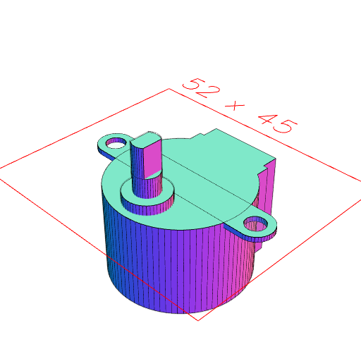

```JavaScript
export const bodyDiameter = 28;
```

```JavaScript
export const bodyHeight = 19;
```

```JavaScript
export const bodyPlay = 0.1;
```

```JavaScript
export const totalDiameter = 42;
```

```JavaScript
export const tabDiameter = 7;
```

```JavaScript
export const tabThickness = 1;
```

```JavaScript
export const holeDiameter = 4;
```

```JavaScript
export const shaftDiameter = 5;
```

```JavaScript
export const shaftFlats = 3;
```

```JavaScript
export const shaftFlatsLength = 6;
```

```JavaScript
export const shaftOffset = 6;
```

```JavaScript
export const shaftBaseDiameter = 9;
```

```JavaScript
export const shaftBaseHeight = 2;
```

```JavaScript
export const shaftLength = 10;
```

```JavaScript
export const shaftPlay = 0.2;
```

```JavaScript
export const connectorWidth = 15;
```

```JavaScript
export const connectorLength = 7;
```

```JavaScript
export const connectorBaseWidth = 17;
```

```JavaScript
export const connectorBaseHeight = 4;
```

```JavaScript
export const connectorHeight = 5;
```

```JavaScript
export const reelDiameter = 20;
```

```JavaScript
export const reelThickness = 4;
```

```JavaScript
export const stepperMotor28byj48 = Group(
  Arc(bodyDiameter)
    .add(Box(connectorLength, connectorWidth).x(bodyDiameter / -2))
    .add(Box(connectorBaseHeight, connectorBaseWidth).x(bodyDiameter / -2 + 2))
    .ez(-bodyHeight)
    .mask(grow(bodyPlay))
    .as('body'),
  Group(
    Arc(shaftBaseDiameter).ez(0, -shaftBaseHeight),
    Arc(shaftDiameter).ez(shaftLength - shaftFlatsLength),
    Arc(shaftDiameter)
      .clip(Box(shaftDiameter, shaftFlats))
      .ez(shaftLength, shaftLength - shaftFlatsLength)
  )
    .mask(grow(shaftPlay))
    .as('shaft')
    .x(bodyDiameter / 2 - shaftOffset)
    .z(shaftBaseHeight),
  Arc(tabDiameter)
    .y(totalDiameter / 2 - tabDiameter / 2)
    .rz(0, 1 / 2)
    .hull(noOp())
    .ez(-tabThickness)
    .fitTo(
      Arc(holeDiameter)
        .ez(-tabThickness)
        .void()
        .as('hole')
        .y(totalDiameter / 2 - tabDiameter / 2)
        .rz(0, 1 / 2)
    )
).view(rz(1 / 4));
```




