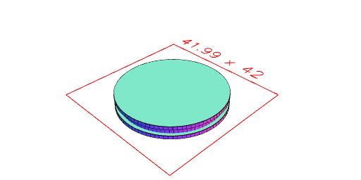
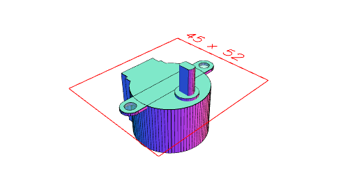
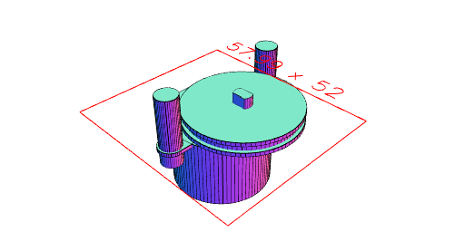
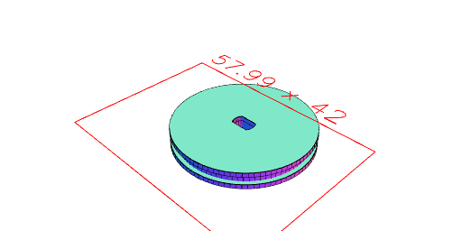
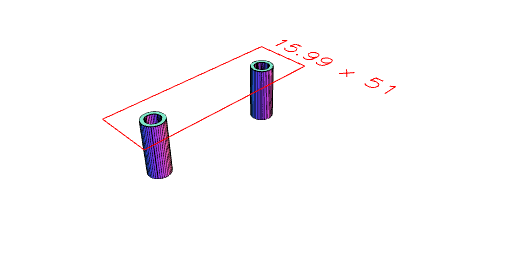
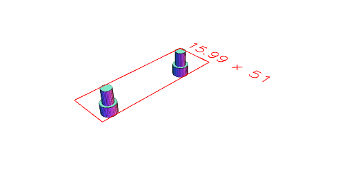

```JavaScript
const bodyDiameter = 28;
```

```JavaScript
const bodyHeight = 19;
```

```JavaScript
const totalDiameter = 42;
```

```JavaScript
const tabDiameter = 7;
```

```JavaScript
const tabThickness = 1;
```

```JavaScript
const holeDiameter = 4;
```

```JavaScript
const shaftDiameter = 5;
```

```JavaScript
const shaftFlats = 3;
```

```JavaScript
const shaftOffset = 6;
```

```JavaScript
const shaftBaseDiameter = 8;
```

```JavaScript
const shaftBaseHeight = 1;
```

```JavaScript
const shaftLength = 10;
```

```JavaScript
const connectorWidth = 15;
```

```JavaScript
const connectorLength = 7;
```

```JavaScript
const connectorBaseWidth = 17;
```

```JavaScript
const connectorBaseHeight = 4;
```

```JavaScript
const connectorHeight = 5;
```

```JavaScript
export const stepperMotor28byj48 = Group(
  Arc(bodyDiameter)
    .add(Box(connectorLength, connectorWidth).x(bodyDiameter / -2))
    .add(Box(connectorBaseHeight, connectorBaseWidth).x(bodyDiameter / -2 + 2))
    .ex(-bodyHeight)
    .as('body'),
  Group(
    Arc(shaftBaseDiameter).ex(0, -shaftBaseHeight),
    Arc(shaftDiameter).clip(Box(shaftDiameter, shaftFlats)).ex(shaftLength)
  )
    .mask(grow(0.1))
    .as('shaft')
    .x(bodyDiameter / 2 - shaftOffset)
    .z(shaftBaseHeight),
  Arc(tabDiameter)
    .y(totalDiameter / 2 - tabDiameter / 2)
    .rz(0, 1 / 2)
    .hull()
    .ex(-tabThickness)
    .fitTo(
      Arc(holeDiameter)
        .ex(-tabThickness)
        .void()
        .as('hole')
        .y(totalDiameter / 2 - tabDiameter / 2)
        .rz(0, 1 / 2)
    )
).view({ op: rz(1 / 4) });
```


```JavaScript
const reel = Group(Arc(32).ex(-2, -1), Arc(30).ex(-1, 1), Arc(32).ex(1, 2))
  .as('reel')
  .view();
```



```JavaScript
stepperMotor28byj48
  .view()
  .on(g('shaft'), fit(reel.z(5)))
  .on(
    g('hole'),
    Arc(6)
      .ex(15)
      .as('leg')
      .fitTo(Arc(4).ex(5, -1).add(Arc(6).ex(-1, -5)).as('peg').mask(grow(0.1)))
  )
  .view()
  .stl('reel', { op: g('reel') })
  .stl('leg', { op: (s) => s.g('leg').rx(1 / 2) })
  .stl('peg', { op: g('peg') });
```










