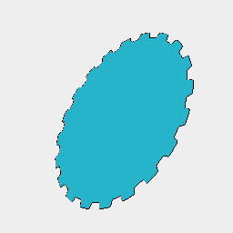
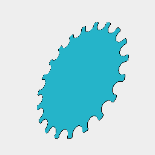
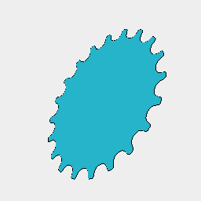

```JavaScript
import {
  Pulley,
  MXL,
  DP40,
  XL,
  H,
  T2_5,
  T5,
  T10,
  AT5,
  HTD_3mm,
  HTD_5mm,
  GTD2_5mm,
  HTD_8mm,
  GT2_2mm,
  GT2_3mm,
  GT2_5mm,
} from './belt_sprockets.nb';
```

```JavaScript
Pulley(MXL, 20).md('MXL').view();
```

MXL


```JavaScript
Pulley(DP40, 20).md('DP40').view();
```

DP40


```JavaScript
Pulley(XL, 20).md('XL').view();
```

XL


```JavaScript
Pulley(H, 20).md('H').view();
```

H



```JavaScript
Pulley(T2_5, 20).md('T2 5mm').view();
```

T2 5mm


```JavaScript
Pulley(T5, 20).md('T5').view();
```

T5


```JavaScript
Pulley(T10, 20).md('T10').view();
```

T10


```JavaScript
Pulley(AT5, 20).md('AT 5mm').view();
```

AT 5mm


```JavaScript
Pulley(HTD_3mm, 20).md('HTD 3mm').view();
```

HTD 3mm


```JavaScript
Pulley(HTD_5mm, 20).md('HTD 5mm').view();
```

HTD 5mm



```JavaScript
Pulley(GT2_5mm, 20).md('GT2 5mm').view();
```

GT2 5mm


```JavaScript
Pulley(HTD_8mm, 20).md('HTD 8mm').view();
```

HTD 8mm


```JavaScript
Pulley(GT2_2mm, 20).md('GT2 2mm').view();
```

GT2 2mm


```JavaScript
Pulley(GT2_3mm, 20).md('GT2 3mm').view();
```

GT2 3mm




