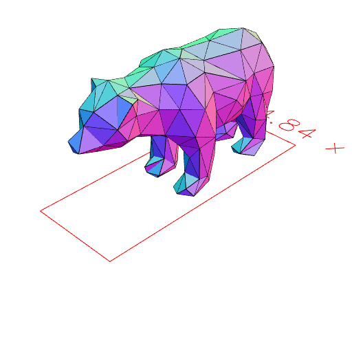
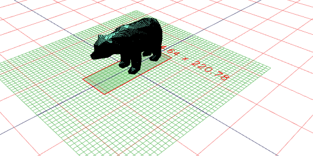

```JavaScript
const a = await readStl('https://jsxcad.js.org/stl/bear.stl');
```

```JavaScript
a.stl('bear');
```



[bear_0.stl](bear.bear_0.stl)

```JavaScript
a.section(seq({ to: 200, by: 1 }, XY, Group)).view();
```


