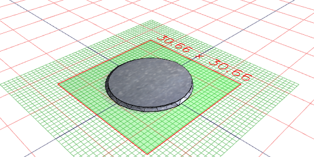
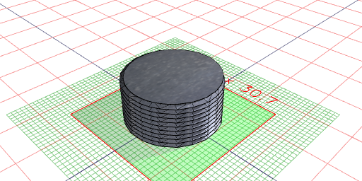
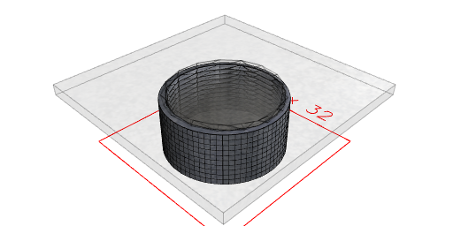
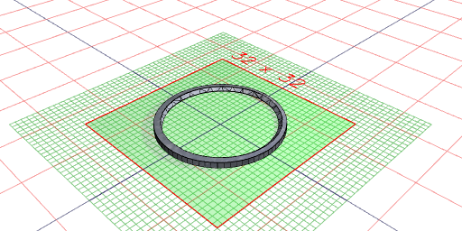
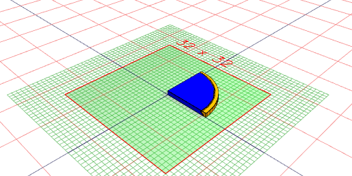
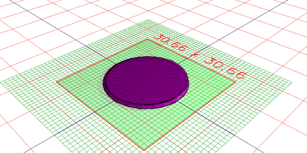

```JavaScript
import { NutThread, NutThreadSegment, ScrewThread, ScrewThreadSegment } from './bolt.nb';
```

```JavaScript
ScrewThreadSegment(20).material('steel').view().md(`ScrewThreadSegment(20)`);
```



ScrewThreadSegment(20)

```JavaScript
ScrewThread(20, 10).material('steel').view().md(`ScrewThread(20, 10)`);
```



ScrewThread(20, 10)

```JavaScript
NutThreadSegment(20).material('steel').view().md(`NutThreadSegment(20)`);
```



NutThreadSegment(20)

```JavaScript
NutThread(20, 10).material('steel').view().md(`NutThread(20, 10)`);
```



NutThread(20, 10)

```JavaScript
NutThreadSegment(20, { play: 0.1 })
  .color('orange')
  .and(ScrewThreadSegment(20, { play: 0.1 }).color('blue'))
  .clip(Box([0, 50], [0, 50], [0, 50]))
  .view()
  .md(`NutThread(20, 10).and(ScrewThread(20, 10))`);
```



NutThread(20, 10).and(ScrewThread(20, 10))

```JavaScript
ScrewThreadSegment(20, { turn: 'right' })
  .color('purple')
  .and(ScrewThreadSegment(20, { turn: 'left' }).color('green'))
  .view();
```


