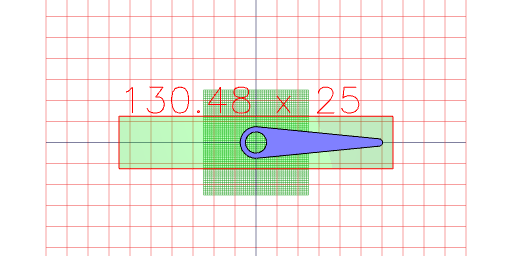
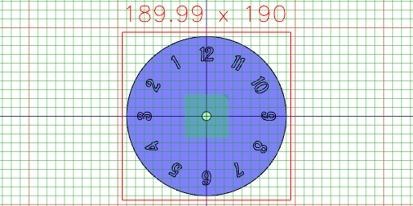
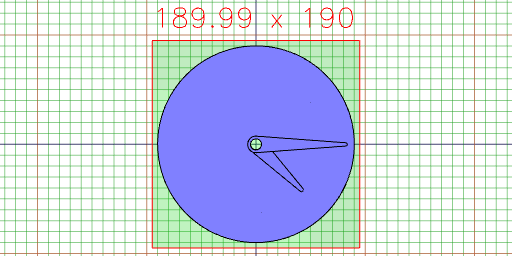

```JavaScript
import { Text, readFont } from '@jsxcad/api-v1-font';
```

### (Needs redesign)

# Clock

This is a simple project to produce a clock.

## Clock Display

We want to produce a display something like this.


## Parameters

```JavaScript
const faceRadius = control('face radius', 90, 'input');
```

```JavaScript
const axleRadius = control('axle radius', 5, 'input');
```

```JavaScript
const faceThickness = control('face thickness', 3, 'input');
```

```JavaScript
const fontSize = control('font size', 20, 'input');
```

## Parts

```JavaScript
const hourHand = { reach: 0.65, tipRadius: 1.75, thickness: 3 };
```

```JavaScript
const minuteHand = { reach: 0.9, tipRadius: 1.5, thickness: 3 };
```

```JavaScript
const clock = { hourHand, minuteHand };
```

```JavaScript
const Hand = ({ reach, tipRadius, thickness }) =>
  Hull(
    Arc().hasRadius(axleRadius + 2.5),
    Arc()
      .hasRadius(tipRadius)
      .move(reach * faceRadius)
  ).cut(Arc().hasRadius(axleRadius));
```

```JavaScript
Hand(hourHand).topView();
```



```JavaScript
const aladinRegular = await readFont(
  'https://jsxcad.js.org/ttf/Aladin-Regular.ttf'
);
```

The hour hand.

```JavaScript
const Face = ({ axleRadius, faceRadius, fontSize }) =>
  Arc()
    .hasRadius(faceRadius)
    .cut(Arc().hasRadius(axleRadius))
    .and(
      seq(
        (n) =>
          Text(aladinRegular, `${n}`, 20)
            .by(align('xy'))
            .y(faceRadius - fontSize)
            .rz(-n / 12),
        { from: 1, to: 12 }
      )
    );
```

```JavaScript
Hand(minuteHand).topView();
```


```JavaScript
Face({ axleRadius, faceRadius, fontSize }).md('The clock face').gridView();
```

The clock face



The minute hand.

```JavaScript
const Clock = ({ hourHand, minuteHand }) =>
  Group(
    Face({ axleRadius, faceRadius, faceThickness, fontSize }),
    Hand(hourHand)
      .rz(45 / 360)
      .z(faceThickness),
    Hand(minuteHand).z(faceThickness + hourHand.thickness)
  );
```

## Assembly

```JavaScript
Clock(clock).topView();
```



A complete clock.
