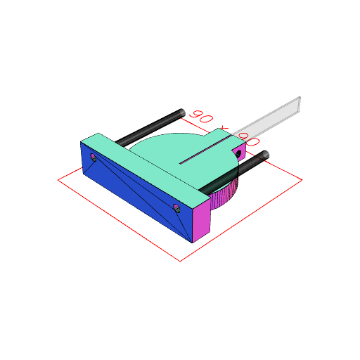

```JavaScript
Arc(44.5)
  .void()
  .ez(20)
  .fit(Arc(60).ez(10))
  .join(Box(20, [44.5 / 2 + 5, 40], [0, 10]))
  .cut(Box(1, [0, 100], [0, 10]))
  .cut(ArcX(20, [34 - 4.5 / 2, 34 + 4.5 / 2], [5 - 4.5 / 2, 5 + 4.5 / 2]))
  .fit(Box(80, [-20, -32], [0, 20]))
  .cut(ArcY(4.5, [32, -32], [15 - 4.5 / 2, 15 + 4.5 / 2]).x(30, -30))
  .stl('spindle_mount');
```



[spindle_mount_0.stl](spindle_mount.spindle_mount_0.stl)
