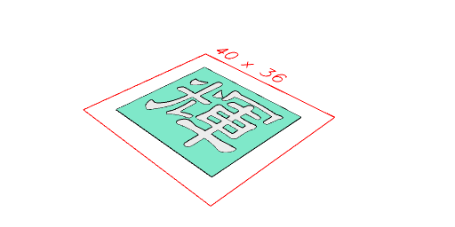
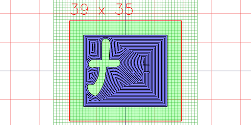

```JavaScript
import { Text, readFont } from '@jsxcad/api-v1-font';
```

```JavaScript
const tool = { grbl: { type: 'spindle', spindleRpm: 7000, feedRate: 650 } };
```

```JavaScript
const unYetGul = await readFont('https://jsxcad.js.org/ttf/UnYetgul.ttf');
```

```JavaScript
const text = await control('Engraving', '輝');
```

```JavaScript
const model = Text(unYetGul, text, 25)
  .align('xy')
  .cutFrom(Box(30, 26))
  .view()
  .md('Model');
```



Model

```JavaScript
const inset = model.inset(0.5, 0.5).gridView().md('Section Inset');
```



Section Inset
