```JavaScript
const numberOfTeeth = control('number of teeth', 16, 'input');
```

```JavaScript
import { Gear } from './gear.js';
```

```JavaScript
const mmPerTooth = control('mm per tooth', Math.PI, 'input');
```

```JavaScript
const teethToHide = control('teeth to hide', 0, 'input');
```

```JavaScript
const pressureAngle = control('pressure angle', 20, 'input');
```

```JavaScript
const clearance = control('clearance', 0, 'input');
```

```JavaScript
const backlash = control('backlash', 0, 'input');
```

```JavaScript
const thickness = control('thickness', 2, 'input');
```

```JavaScript
const toothResolution = control('toothResolution', 5, 'input');
```

```JavaScript
Gear()
  .hasTeeth(8)
  .and((s) => s.hasClearance(0.5).color('red'))
  .gridView()
  .md(`Clearance adds play to the gear tips`);
```

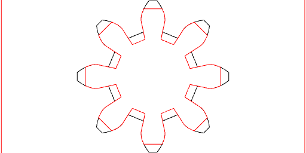

Clearance adds play to the gear tips

```JavaScript
Gear()
  .hasTeeth(numberOfTeeth)
  .hasMmPerTooth(mmPerTooth)
  .hasHiddenTeeth(teethToHide)
  .hasPressureAngle(pressureAngle)
  .hasClearance(clearance)
  .hasBacklash(backlash)
  .hasToothResolution(toothResolution)
  .fill()
  .ez(thickness)
  .material('wood')
  .stl(`gear_${numberOfTeeth}`);
```

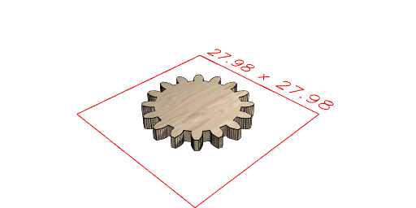

[gear_16_0.stl](gear.gear_16_0.stl)

```JavaScript
Gear()
  .hasTeeth(8)
  .and((s) => s.hasBacklash(1).color('red'))
  .gridView()
  .md(`Backlash adds play to the gear sides`);
```

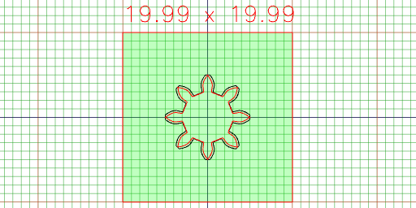

Backlash adds play to the gear sides

### Planetary Gears

```JavaScript
Gear()
  .hasTeeth(8)
  .and(
    (s) => s.hasPressureAngle(30).color('red'),
    (s) => s.hasPressureAngle(10).color('blue')
  )
  .material('glass')
  .gridView()
  .md(`Pressure Angle makes the tip sharper or blunter`);
```

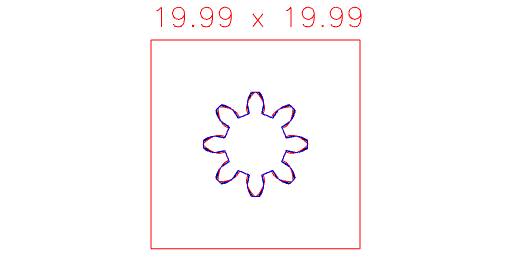

Pressure Angle makes the tip sharper or blunter

```JavaScript
const planetaryDesign1 = Arc(44)
  .ez(-4)
  .as('hoop')
  .fitTo(Octagon(42).ez(-2, -4))
  .clean();
```

```JavaScript
const planetary = Gear().hasTeeth(8).fill().md(`Our base involute gear.`);
```

Our base involute gear.

```JavaScript
const planetaryDesignAxle = Octagon(12)
  .fitTo(Arc(8).void())
  .ez(-4)
  .color('orange')
  .as('axle');
```

```JavaScript
const planetaryFootprint = planetary
  .offset(0.2)
  .view()
  .md(`We'll use an offset template to cut the other gears`);
```

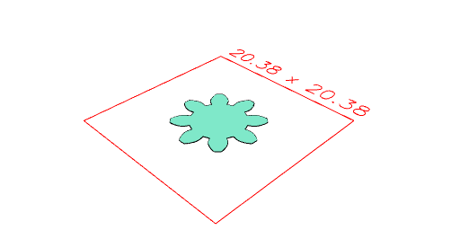

We'll use an offset template to cut the other gears

```JavaScript
const ring = Arc(50)
  .hasAngle(-1 / 64, 1 / 64)
  .hull(noOp(), Point())
  .cut(Arc(30))
  .cut(
    seq(
      { from: -1, by: 1 / 16, to: 1 },
      (a) =>
        planetaryFootprint
          .rz(a / -8)
          .y(12)
          .rz(a / 32)
    )
  )
  .clean()
  .seq({ by: 1 / 32 }, rz)
  .gridView()
  .md(
    `We simulate the gear motion to cut a single tooth, then rotate it around.`
  );
```

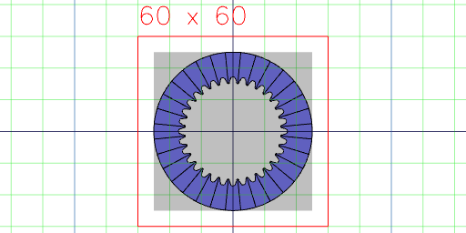

We simulate the gear motion to cut a single tooth, then rotate it around.

```JavaScript
const solar = Arc(20)
  .hasAngle(-1 / 30, 1 / 30)
  .hull(noOp(), Point())
  .cut(
    seq(
      { from: -1, by: 1 / 16, to: 1 },
      (a) =>
        planetaryFootprint
          .rz(a / 8)
          .y(12)
          .rz(a / 16)
    )
  )
  .clean()
  .seq({ by: 1 / 16 }, rz)
  .fuse()
  .gridView()
  .md(
    `We simulate the gear motion to cut a single tooth, then rotate it around.`
  )
  .clean();
```

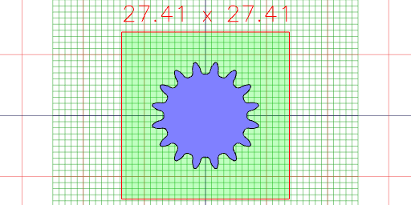

```JavaScript
const rack = Box(20, Math.PI)
  .by(align('x<'))
  .cut(
    seq(
{
      from: -1,
      by: 1 / 8,
      to: 1,
    },
(a) => planetaryFootprint.rz(-a / 8).y(Math.PI * a))
  )
  .seq({ to: 10 }, (a) => y(a * Math.PI))
  .gridView()
  .md(`We can do the same thing to cut a rack.`)
  .clean();
```

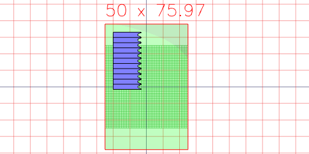

We can do the same thing to cut a rack.

```JavaScript
const planetaryDesign2 = planetaryDesign1
  .cut(Octagon(42).ez(-2))
  .and(ring.clip(Octagon(42)).ez(-2))
  .cut(Arc(24).ez(-2, -4))
  .color('blue')
  .as('ring')
  .clean();
```

```JavaScript
const planetaryDesign3 = planetaryDesign2
  .and(
    planetary
      .ez(-2)
      .cut(Arc(2).ez(-2))
      .color('red')
      .as('planetary')
      .x(12)
      .rz(1 / 4, 2 / 4, 3 / 4, 4 / 4)
  )
  .clean();
```

```JavaScript
const planetaryDesign4a = solar.ez(-2);
```

```JavaScript
const planetaryDesign4b = planetaryDesign4a.and(Arc(23.5).ez(-2, -4));
```

```JavaScript
const planetaryDesign4c = planetaryDesign4b.fitTo(planetaryDesignAxle);
```

```JavaScript
const planetaryDesign4 = planetaryDesign4c.color('green').as('solar');
```

```JavaScript
const planetaryDesign = planetaryDesign3
  .and(planetaryDesign4)
  .gridView()
  .stl(
    'hoop',
    get('ring')
      .get('hoop')
      .rx(0 / 2, 1 / 2)
  )
  .stl('ring', get('ring').getNot('hoop'))
  .stl(
    'planetary',
    get('planetary')
      .n(0)
      .y(12)
      .rx(0 / 2, 1 / 2)
  )
  .stl('solar', get('solar').getNot('axle'))
  .stl(
    'axle',
    get('solar')
      .get('axle')
      .rx(0 / 2, 1 / 2)
  );
```

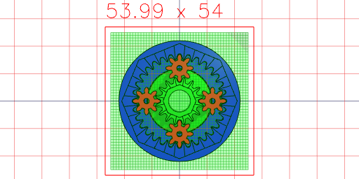

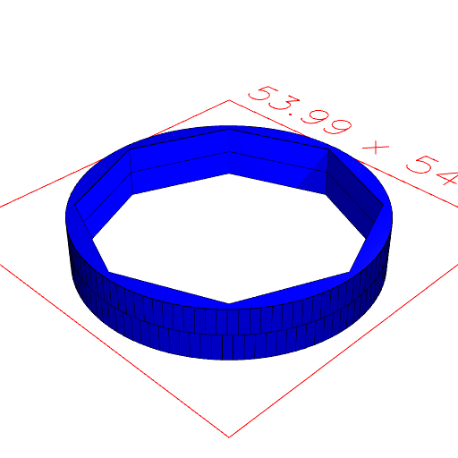

[ring_0.stl](gear.ring_0.stl)

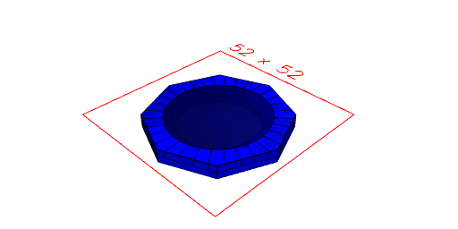

[planetary_0.stl](gear.planetary_0.stl)

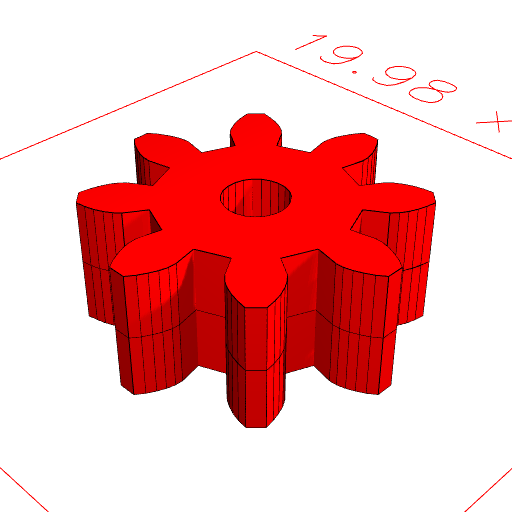

[solar_0.stl](gear.solar_0.stl)
