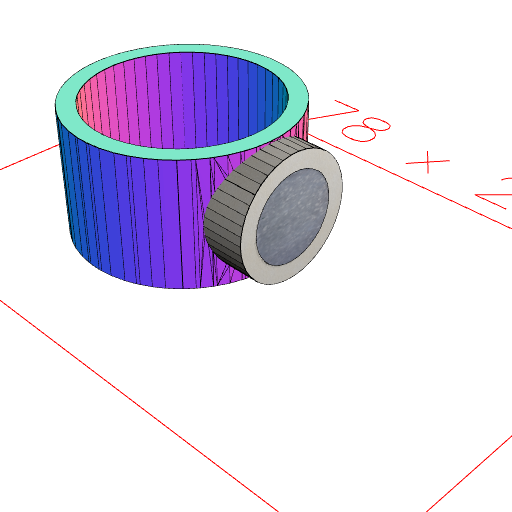
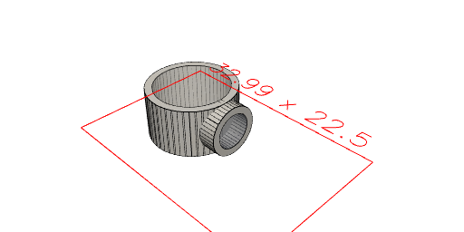

```JavaScript
const penDiameter = 10.5;
```

```JavaScript
const magnetDiameter = 5.0;
```

```JavaScript
const magnetHeight = 2.5;
```

```JavaScript
const magneticPenHolder = Arc(magnetDiameter)
  .material('steel')
  .ez(magnetHeight)
  .fit((s) =>
    Arc(magnetDiameter + 2)
      .material('plastic')
      .ez(magnetHeight)
  )
  .at(yz)
  .align('z>')
  .fit(
    Arc(penDiameter)
      .material('plastic')
      .voidIn(offset(1))
      .ez(magnetDiameter + 2 + 0.1, -0.1)
      .align('x<')
      .x(1.1)
  )
  .view()
  .stl('holder', drop('material:steel'));
```





[holder_0.stl](holder.holder_0.stl)
