```JavaScript
import { Block, SocketBoard } from './lego.nb';
```

```JavaScript
export const socketBoard16x16x2 = SocketBoard(2, 2, 2)
  .as('SocketBoard 16x16x2')
  .md('SocketBoard 16x16x2')
  .view();
```

SocketBoard 16x16x2

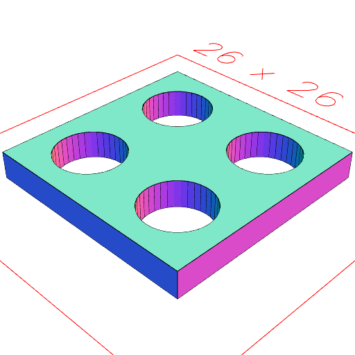

```JavaScript
export const socketBoard32x8x3_2 = SocketBoard(4, 1, 3.2)
  .as('SocketBoard 32x32x3.2')
  .md('SocketBoard 32x32x3.2')
  .view();
```

SocketBoard 32x32x3.2

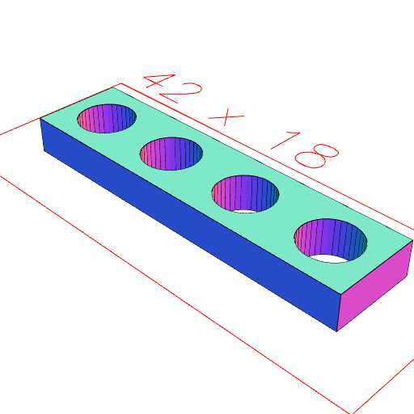

```JavaScript
export const axleHole = Arc()
  .hasApothem(5.2 / 2)
  .add(
    Arc()
      .hasApothem(4 / 2)
      .y(1.5 / 2)
  )
  .ez(4.00001, -4.00001)
  .rx(1 / 4)
  .z(5.6)
  .view();
```

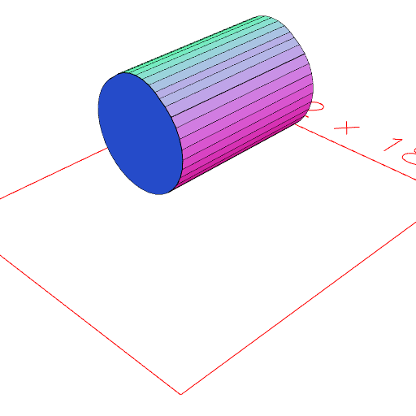

```JavaScript
export const block8x8x3_2 = Block(1, 1, 3.2).as('lego block 8x8x3.2').view();
```

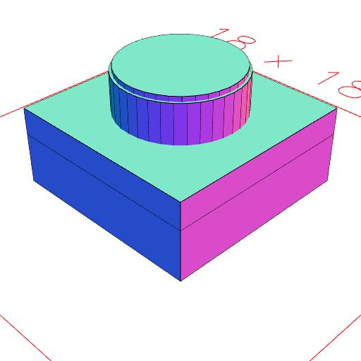

```JavaScript
export const block8x8x6_4 = Block(1, 1, 6.4).as('lego block 8x8x6.4').view();
```

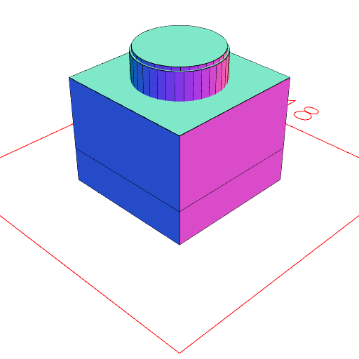

```JavaScript
export const block16x16x3_2 = Block(2, 2, 3.2)
  .as('lego block 16x16x3.2')
  .view();
```

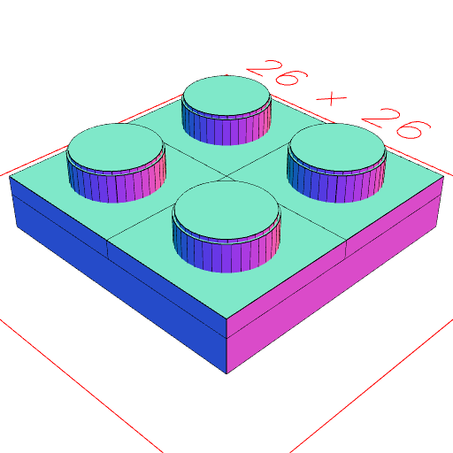

```JavaScript
export const block16x16x6_4 = Block(2, 2, 6.4)
  .as('lego block 24x24x6.4')
  .view();
```

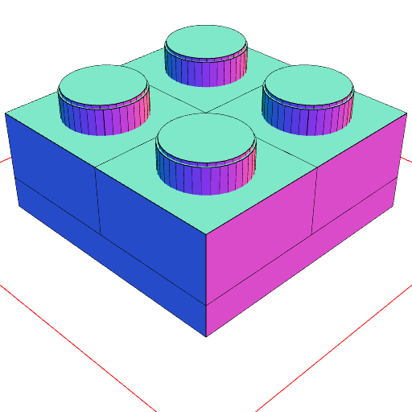

```JavaScript
export const socket24x24x1_6 = SocketBoard(3, 3, 1.6)
  .as('lego socket 24x24x1.6')
  .view();
```

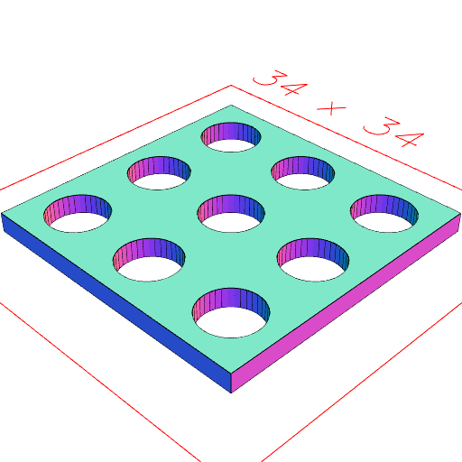

```JavaScript
export const socket24x24x3_2 = SocketBoard(3, 3, 3.2)
  .as('lego socket 24x24x3.2')
  .view();
```

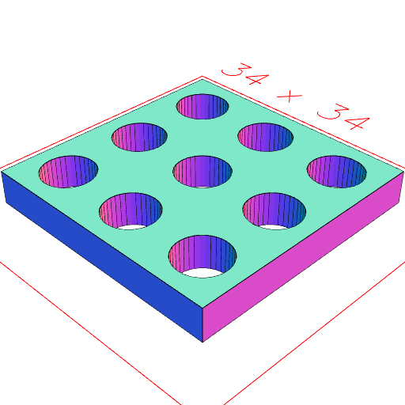

```JavaScript
export const block24x24x3_2 = Block(3, 3, 3.2)
  .as('lego block 24x24x3.2')
  .view();
```

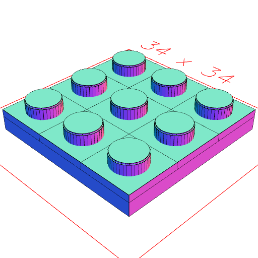

```JavaScript
export const block24x24x6_4 = Block(3, 3, 6.4)
  .as('lego block 24x24x6.4')
  .view();
```

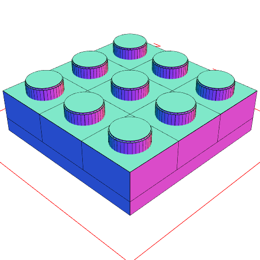

```JavaScript
export const block16x8x9_6 = Block(2, 1, 3.2 * 3)
  .cut(axleHole)
  .view();
```

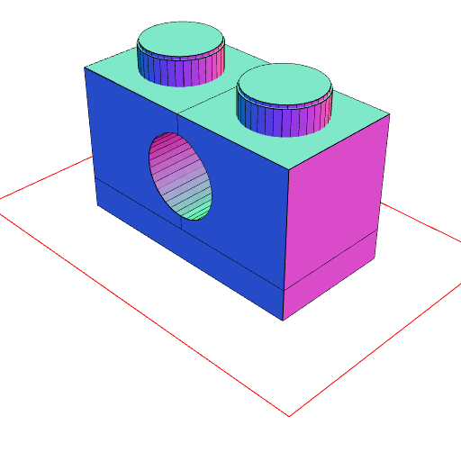

```JavaScript
export const AxleProfile = () => {
  const length = 4.8 + 0.1;
  const width = 1.8 + 0.1;
  const diameter = 5 + 0.1;
  const line = Line(length / 2, length / -2);
  const bar = Group(
    line.y(width / 2),
    line.y(width / -2),
    Arc(diameter)
      .hasAngle(1 / 4)
      .rz(50 / 360),
    Arc(diameter)
      .hasAngle(1 / 4)
      .rz((50 + 180) / 360)
  ).fill();
  return bar.add(bar.rz(90 / 360));
};
```

```JavaScript
export const block32x8x9_6 = Block(4, 1, 3.2 * 3)
  .cut(axleHole)
  .as('block32x8x9_6e')
  .stl('block32x8x9_6e');
```

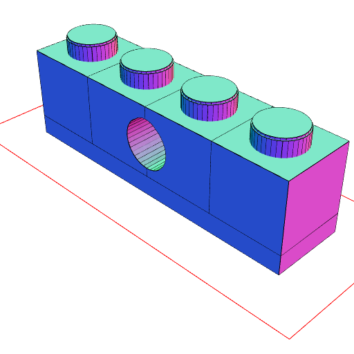

[block32x8x9_6e_0.stl](examples.block32x8x9_6e_0.stl)

```JavaScript
export const axleProfile = AxleProfile().md('Axle Profile').topView();
```

Axle Profile

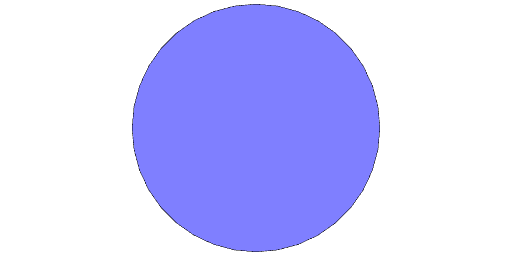

```JavaScript
const box = Box(8, 3.2 * 4).y(3.2 * 2);
```

```JavaScript
export const AxleJoiner = (length) => Arc(8).cut(axleProfile).ez(length);
```

```JavaScript
const technic = Group(box, Arc(4.8 + 0.2).y(5.6))
  .fill()
  .ez(8 - 0.8, 0.8)
  .and(
    Group(box, Arc(6.2 + 0.2).y(5.6))
      .fill()
      .ez(0.8)
  )
  .and(
    Group(box, Arc(6.2 + 0.2).y(5.6))
      .fill()
      .ez(8, 8 - 0.8)
  )
  .stl('technic');
```

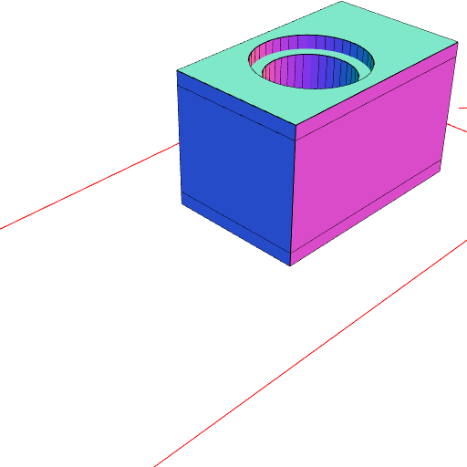

[technic_0.stl](examples.technic_0.stl)

```JavaScript
export const axleJoiner16 = AxleJoiner(16)
  .md('Axle Joiner 16mm')
  .stl('AxleJoiner16');
```

Axle Joiner 16mm


[AxleJoiner16_0.stl](examples.AxleJoiner16_0.stl)

```JavaScript
const technic_1x6 = Group(seq((n) => technic.x(n), { upto: 48, by: 8 }))
  .by(align())
  .view();
```

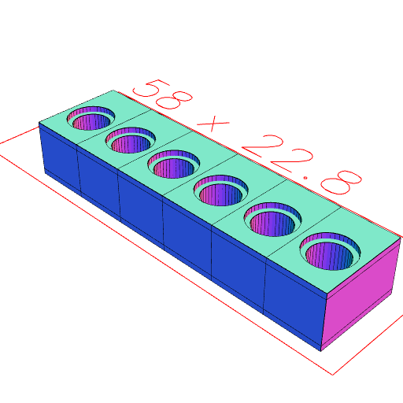

```JavaScript
const technicConnector = Arc(4.8)
  .ez(8, -8)
  .to(XZ())
  .add(
    Arc(6.2)
      .ez(0.8 - 0.2)
      .to(XZ())
  )
  .add(
    Arc(5.5)
      .ez(0.4)
      .to(XZ())
      .y(-8 + 0.2)
  )
  .add(
    Arc(5.5)
      .ez(0.4)
      .to(XZ())
      .y(8 - 0.2)
  )
  .cut(
    YZ()
      .Box(10, 6, 0.5)
      .y(-8 + 3)
  )
  .cut(
    YZ()
      .Box(10, 6, 0.5)
      .y(8 - 3)
  )
  .clip(XZ().Box(4.5, 6.2, 16))
  .material('plastic')
  .stl('technicConnector');
```

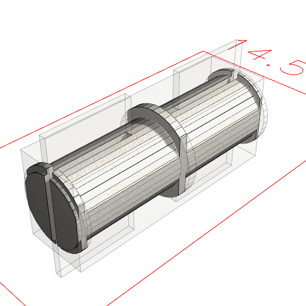

[technicConnector_0.stl](examples.technicConnector_0.stl)

```JavaScript
const halfTechnicConnector = Arc(4.8)
  .ez(8)
  .to(XZ())
  .add(
    Arc(6.2)
      .ez(0.8 - 0.2)
      .to(XZ())
  )
  .add(
    Arc(5.5)
      .ez(0.4)
      .to(XZ())
      .y(8 - 0.2)
  )
  .cut(
    YZ()
      .Box(10, 6, 0.5)
      .y(-8 + 3)
  )
  .cut(
    YZ()
      .Box(10, 6, 0.5)
      .y(8 - 3)
  )
  .clip(XZ().Box(4.5, 6.2, [0, 8]))
  .material('plastic')
  .stl('halfTechnicConnector');
```

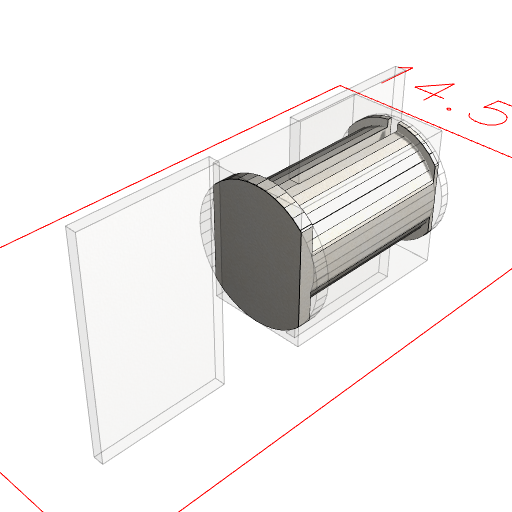

[halfTechnicConnector_0.stl](examples.halfTechnicConnector_0.stl)

```JavaScript
const technicPlug5mm = halfTechnicConnector
  .and(Arc(5).clip(Box(4.5, 5)).ez(-8).to(XZ()))
  .stl('technicPlug5mm');
```

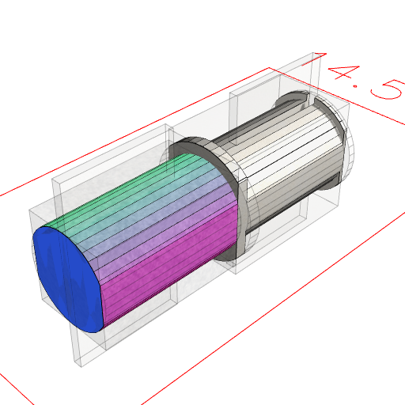

[technicPlug5mm_0.stl](examples.technicPlug5mm_0.stl)
