export const SocketBoard = (length, width, height, { sockets = [] } = {}) => {
  const isFlat = (x, y) => {
    if (sockets === undefined) return false;
    if (sockets[y] === undefined) return false;
    return sockets[y][x] === '_';
  };
  const pieces = [];
  const socket = Arc(5).x(4).y(4);
  for (let x = 0; x < length; x++) {
    for (let y = 0; y < width; y++) {
      if (!isFlat(x, y)) {
        pieces.push(socket.x(x * 8).y(y * 8));
      }
    }
  }
  return Weld(Box(length * 8, width * 8).align('x>y>'), ...pieces)
    .ex(height)
    .align('xy')
    .as(`SocketBoard ${length} x ${width} x ${height}`);
};

export const StudBoard = (length, width, height, { studs = [] } = {}) => {
  const isFlat = (x, y) => {
    if (studs === undefined) return false;
    if (studs[y] === undefined) return false;
    return studs[y][x] === '_';
  };
  const board = [];
  const flat = Box(8).ex(height);
  const stud = Box(8)
    .ex(height)
    .add(Arc(5).ex(height, height + 1.6))
    .add(Arc(4.8).ex(height + 1.6, height + 1.8));
  for (let x = 0; x < length; x++) {
    for (let y = 0; y < width; y++) {
      const part = isFlat(x, y) ? flat : stud;
      board.push(part.x(x * 8).y(y * 8));
    }
  }
  return Group(...board)
    .align('xy')
    .as(`StudBoard ${length} x ${width} x ${height}`);
};

export const Block = (
  length,
  width,
  height,
  { sockets = [], studs = [] } = {}
) =>
  Group(
    SocketBoard(length, width, 2.1, { sockets }),
    StudBoard(length, width, height - 2.1, { studs }).z(2.1)
  );

export const AxleProfile = () => {
  const length = 4.8 + 0.1;
  const width = 1.8 + 0.1;
  const diameter = 5 + 0.1;
  const line = Line(length / 2, length / -2);
  const bar = Weld(
    line.y(width / 2),
    line.y(width / -2),
    Arc(diameter)
      .hasAngle(1 / 4)
      .rotate(50),
    Arc(diameter)
      .hasAngle(1 / 4)
      .rotate(50 + 180)
  ).fill();
  return bar.add(bar.rotate(90));
};

export const AxleJoiner = (length) => Arc(8).cut(axleProfile).ex(length);

export const socketBoard16x16x2 = SocketBoard(2, 2, 2)
  .as('SocketBoard 16x16x2')
  .md('SocketBoard 16x16x2')
  .view();

SocketBoard 16x16x2

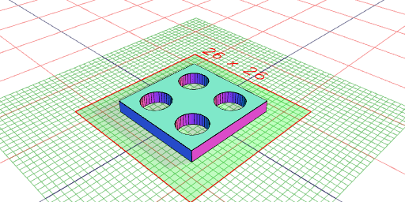

export const socketBoard32x8x3_2 = SocketBoard(4, 1, 3.2)
  .as('SocketBoard 32x32x3.2')
  .md('SocketBoard 32x32x3.2')
  .view();

SocketBoard 32x32x3.2

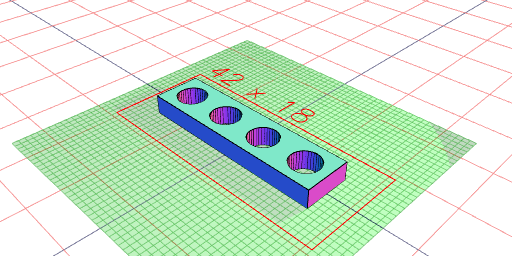

export const axleHole = Arc()
  .hasApothem(5.2 / 2)
  .add(
    Arc()
      .hasApothem(4 / 2)
      .y(1.5 / 2)
  )
  .ex(4.00001, -4.00001)
  .rx(90)
  .z(5.6)
  .view();

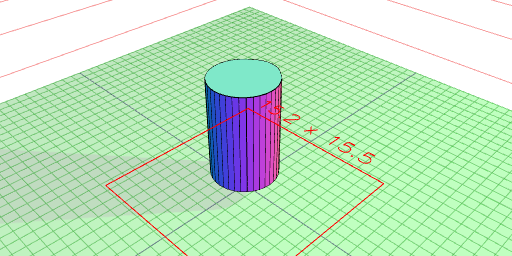

export const block8x8x3_2 = Block(1, 1, 3.2).as('lego block 8x8x3.2').view();

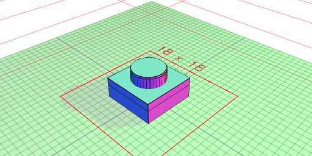

export const block8x8x6_4 = Block(1, 1, 6.4).as('lego block 8x8x6.4').view();

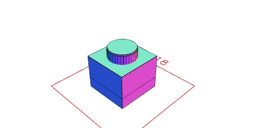

export const block16x16x3_2 = Block(2, 2, 3.2)
  .as('lego block 16x16x3.2')
  .view();

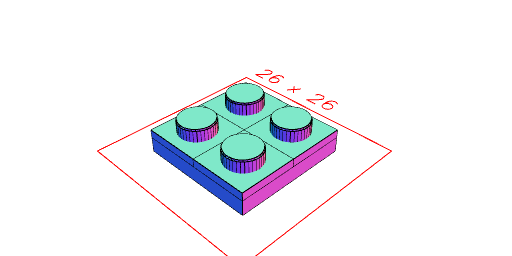

export const block16x16x6_4 = Block(2, 2, 6.4)
  .as('lego block 24x24x6.4')
  .view();

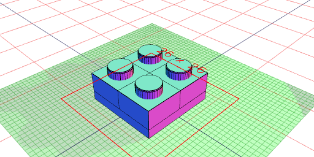

export const socket24x24x1_6 = SocketBoard(3, 3, 1.6)
  .as('lego socket 24x24x1.6')
  .view();

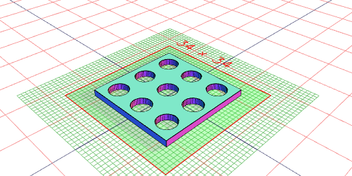

export const socket24x24x3_2 = SocketBoard(3, 3, 3.2)
  .as('lego socket 24x24x3.2')
  .view();

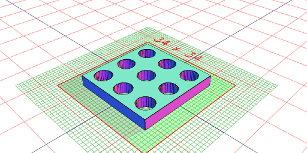

export const block24x24x3_2 = Block(3, 3, 3.2)
  .as('lego block 24x24x3.2')
  .view();

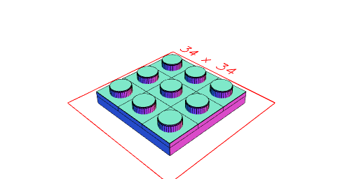

export const block24x24x6_4 = Block(3, 3, 6.4)
  .as('lego block 24x24x6.4')
  .view();

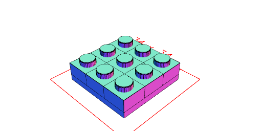

export const block16x8x9_6 = Block(2, 1, 3.2 * 3)
  .cut(axleHole)
  .view();

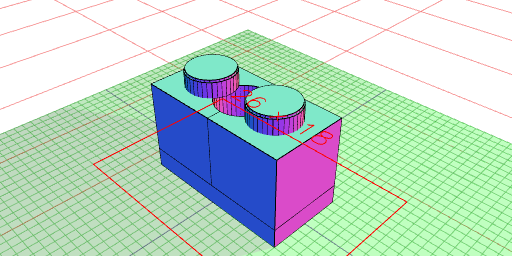

export const block32x8x9_6 = Block(4, 1, 3.2 * 3)
  .cut(axleHole)
  .as('block32x8x9_6e')
  .stl('block32x8x9_6e');

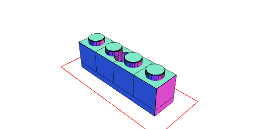

export const axleProfile = AxleProfile().md('Axle Profile').topView();

Axle Profile

export const axleJoiner16 = AxleJoiner(16)
  .md('Axle Joiner 16mm')
  .stl('AxleJoiner16');

Axle Joiner 16mm

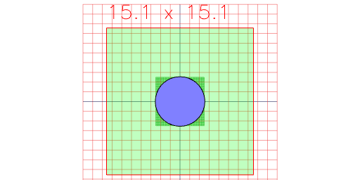

const box = Box(8, 3.2 * 4).y(3.2 * 2);

const technic = Weld(box, Arc(4.8 + 0.2).y(5.6))
  .ex(8 - 0.8, 0.8)
  .and(Weld(box, Arc(6.2 + 0.2).y(5.6)).ex(0.8))
  .and(Weld(box, Arc(6.2 + 0.2).y(5.6)).ex(8, 8 - 0.8))
  .stl('technic');

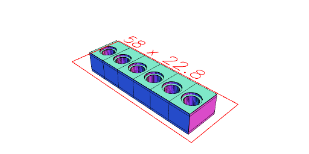

const technicConnector = xz
  .Arc(4.8)
  .ex(8, -8)
  .add(xz.Arc(6.2).ex(0.8 - 0.2))
  .add(
    xz
      .Arc(5.5)
      .ex(0.4)
      .y(-8 + 0.2)
  )
  .add(
    xz
      .Arc(5.5)
      .ex(0.4)
      .y(8 - 0.2)
  )
  .cut(yz.Box(10, 6, 0.5).y(-8 + 3))
  .cut(yz.Box(10, 6, 0.5).y(8 - 3))
  .clip(xz.Box(4.5, 6.2, 16))
  .material('plastic')
  .stl('technicConnector');

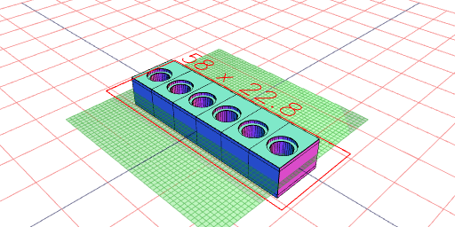

const technic_1x6 = Group(...seq((n) => technic.x(n), { upto: 48, by: 8 }))
  .align()
  .view();

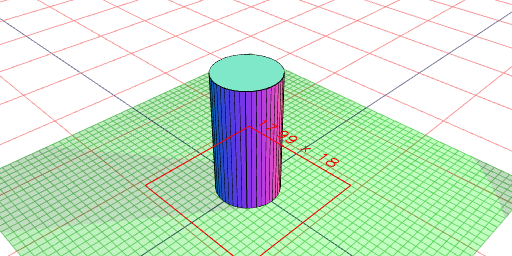

const halfTechnicConnector = xz
  .Arc(4.8)
  .ex(8)
  .add(xz.Arc(6.2).ex(0.8 - 0.2))
  .add(
    xz
      .Arc(5.5)
      .ex(0.4)
      .y(8 - 0.2)
  )
  .cut(yz.Box(10, 6, 0.5).y(-8 + 3))
  .cut(yz.Box(10, 6, 0.5).y(8 - 3))
  .clip(xz.Box(4.5, 6.2, 16))
  .material('plastic')
  .stl('halfTechnicConnector');

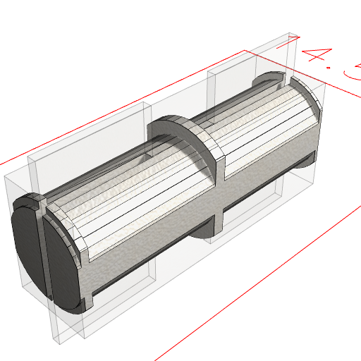

const technicPlug5mm = halfTechnicConnector
  .and(xz.Arc(5).clip(xz.Box(4.5, 5)).ex(-8))
  .stl('technicPlug5mm');

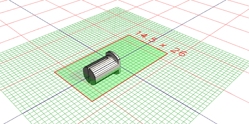
