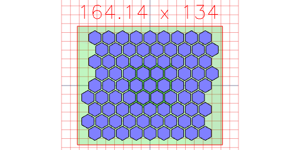
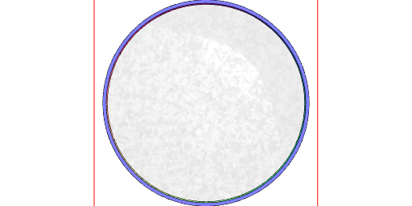
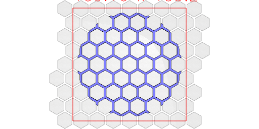
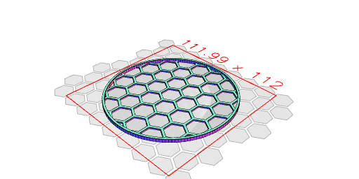
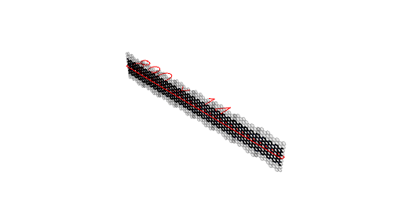
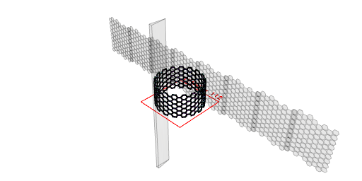
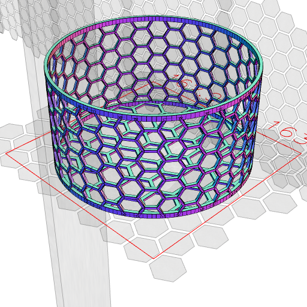
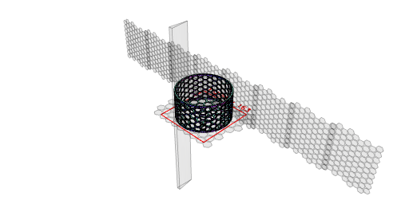

```JavaScript
const grid = Hexagon(16)
  .seq(
    { from: -4, to: 4 },
    { from: -4, to: 4 },
    (i, j) =>
      move((i + (j % 2) * 0.5) * 18 * Math.sqrt(3) * 0.5, j * 18 * 0.75),
    Group
  )
  .gridView();
```



```JavaScript
const ring = Arc(99).cutFrom(Arc(102)).ez(2.5).gridView();
```



```JavaScript
const base = grid.cutFrom(Arc(100)).ez(1).gridView();
```



```JavaScript
const wall1 = grid
  .cutFrom(Box(80, 110))
  .rz(1 / 4)
  .ez(2)
  .rx(1 / 4);
```

```JavaScript
const sorter = ring.and(base).stl('sorter');
```



[sorter_0.stl](lego_sorter.sorter_0.stl)

```JavaScript
const wall = wall1
  .by(align('x<'))
  .and(by(align('x>')))
  .by(align('x<'))
  .and(by(align('x>')))
  .by(align('x<'))
  .and(by(align('x>')))
  .view();
```



```JavaScript
const bentWall = wall
  .clip(Box(475, 50, 500))
  .scale(1 / 1.5)
  .by(align('z>'))
  .y(51)
  .bend(50)
  .view();
```



```JavaScript
bentWall.and(ring, base, ring.z(52)).scale(1.5).view().stl('tall_sorter');
```





[tall_sorter_0.stl](lego_sorter.tall_sorter_0.stl)
