import { Gear } from '../gear/gear.js';

import { Block, SocketBoard, StudBoard, block16x8x9_6 } from '../lego/lego.nb';

const wireThickness = 0.8;

## Gear Motor and Sheath

const motorProfile = Arc(12).clip(Box(9.8, 12)).md('Motor Profile').gridView();

Motor Profile

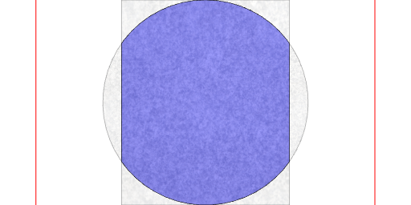

const gearboxProfile = Box(9.8, 11.8).md('Gearbox Profile').gridView();

Gearbox Profile

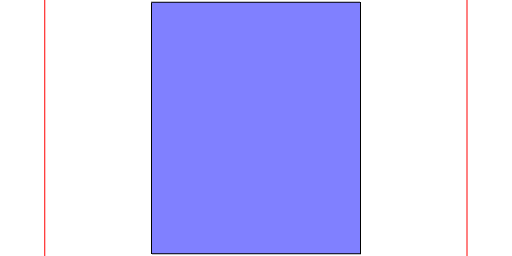

const axleProfile = Arc(3.2).md('Axle Profile').gridView();

Axle Profile

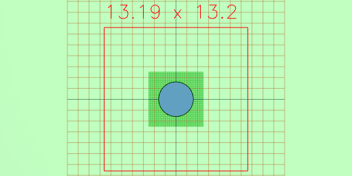

const axleFlatProfile = axleProfile
  .clip(Box(3.2).x(0.5))
  .md('Flat Axle Profile')
  .gridView();

Flat Axle Profile

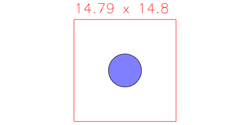

const rearHubProfile = Arc(4.8).md('Rear Hub Profile').gridView();

Rear Hub Profile

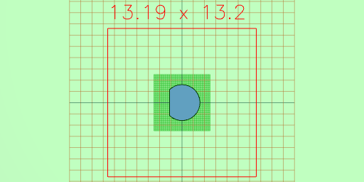

const motor = Group(
  axleFlatProfile.ex(13.5 + 9.1, 13.5 + 9.1 + 10.8),
  gearboxProfile.ex(13.5, 13.5 + 9.1),
  motorProfile.ex(13.5, 0)
)
  .md('Motor')
  .view();

Motor

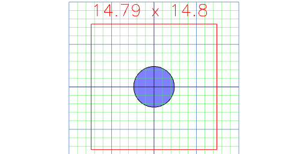

const wireChannelProfile = Box(wireThickness, wireThickness * 5)
  .x(5.3)
  .md('Wire Channel Profile')
  .gridView();

Wire Channel Profile

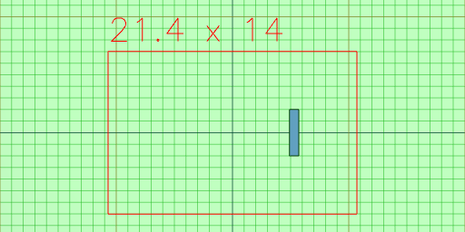

const capProfile = Box(9.8 + 2, 12 + 2)
  .add(Box(wireThickness * 2, wireThickness * 7).x(5.3 + 0.4))
  .md('Cap Profile')
  .gridView();

Cap Profile

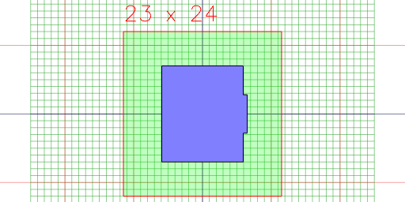

const gearProfile = Gear(20).md('Gear Profile').gridView();

Gear Profile

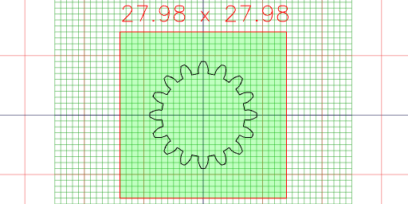

const sheath = capProfile
  .cut(motorProfile, wireChannelProfile)
  .ex(0, 5)
  .md('Sheath')
  .stl('sheath1');

Sheath

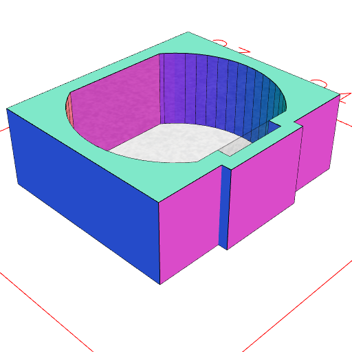

const gear = Gear(20)
  .cut(axleFlatProfile)
  .ex(4)
  .md('Gear')
  .gridView()
  .stl('gear2');

Gear

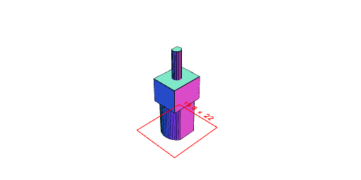

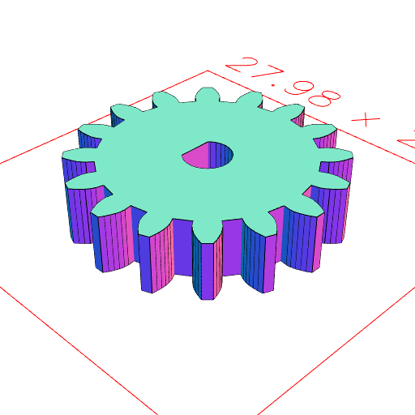

const cap = Group(capProfile.ex(-2, -0.0), sheath).md('Cap').stl('cap');

Cap

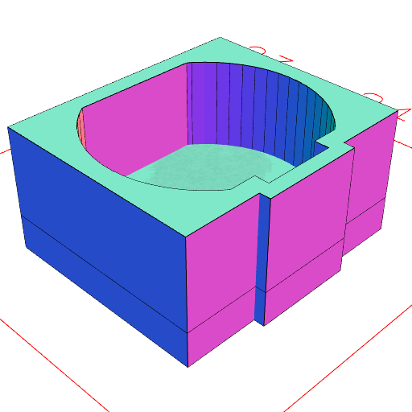

const gearCutout = Gear(20)
  .op((s) => s.and(s.cutFrom(Arc(12)).inset(0.5)))
  .as('gear cutout')
  .md('Gear Cutout')
  .gridView();

Gear Cutout

## Motor Driver Bracket

const motorDriverHolder = Block(4, 4, 3.2 * 5)
  .cut(Box(20.7, 24.7).ex(2, 100))
  .as('motor driver holder')
  .md('Motor Driver Holder')
  .stl('motor_driver_holder_3');

Motor Driver Holder

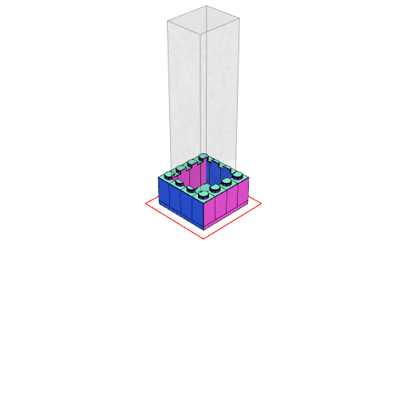

## Wemos Bracket

const wemosDriverHolder = Block(4, 5, 3.2 * 11)
  .cut(Box(25.7 + 0.2, 34.5 + 0.2).ex(2, 100))
  .cut(xz.Box(3 * 8, 2.5 * 8).ex(3.2 * (4 + 1.5), 100))
  .cut(yz.Box(3.2 * 8, 4 * 8).ex(3.2 * (4 + 1.5), 100))
  .cut(
    xz
      .flip()
      .Box(3 * 8, 2.5 * 8)
      .ex(3.2 * (4 + 1.5), 100)
  )
  .cut(
    yz
      .flip()
      .Box(3.2 * 8, 4 * 8)
      .ex(3.2 * (4 + 1.5), 100)
  )
  .as('wemos holder')
  .md('Wemos Driver Holder')
  .rz(1 / 2)
  .stl('wemos_holder_2');

Wemos Driver Holder

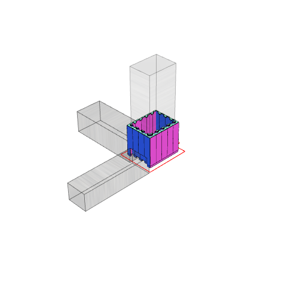

## Gear Motor Bracket

const motorHolderLegoBoard = Block(1, 4, 3.2).y(6);

const motorHolderMotor = Group(motor, sheath.z(9.1 - 0.7), cap)
  .rx(1 / 4)
  .ry(-1 / 4)
  .move(0, 14, 5.6 + 3.2 - 0.7)
  .as('motor')
  .md('Motor holder moter')
  .view();

Motor holder moter

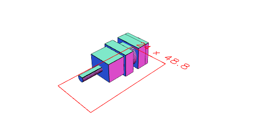
