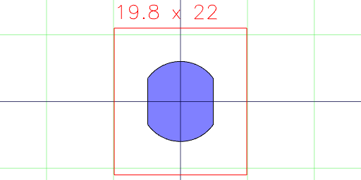
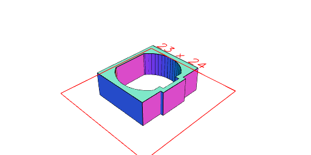

## Gear Motor and Sheath

Motor Profile

Gearbox Profile

Axle Profile

Axle Profile

Flat Axle Profile

Rear Hub Profile

Axle Profile

Flat Axle Profile

Gearbox Profile

Motor Profile

Motor

Wire Channel Profile

Cap Profile

Cap Profile

Motor Profile

Wire Channel Profile

Sheath

Cap Profile

Motor Profile

Wire Channel Profile

Sheath

Cap

