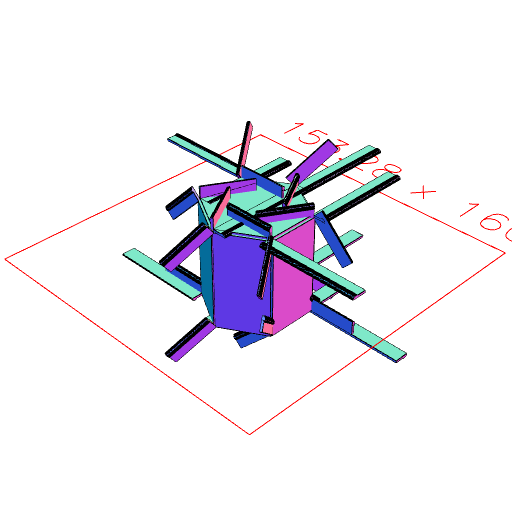
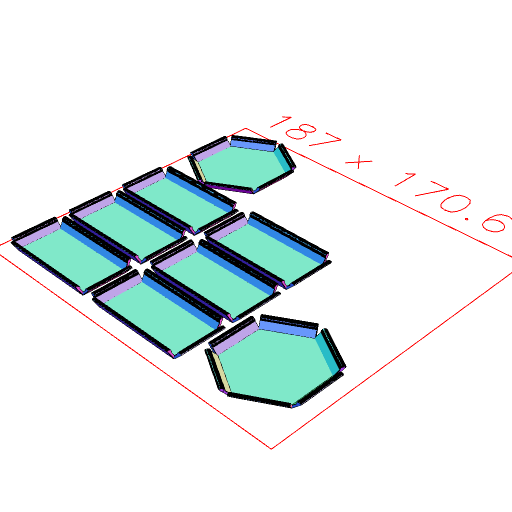

```JavaScript
const assembled = Hexagon(50, 50, 50)
  .eachEdge(
    (e, l) =>
      Box([0, 5], [0, -1], [0, l])
        .join(Arc([4, 7.0], 3, [0, l]).hasAngle(1 / 4, 3 / 4))
        .to(e),
    (e, f) => f.e(1).join(e)
  )
  .view();
```



```JavaScript
const disassembled = assembled.each(to(XY())).pack().view();
```


