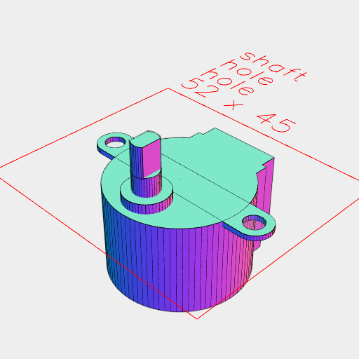
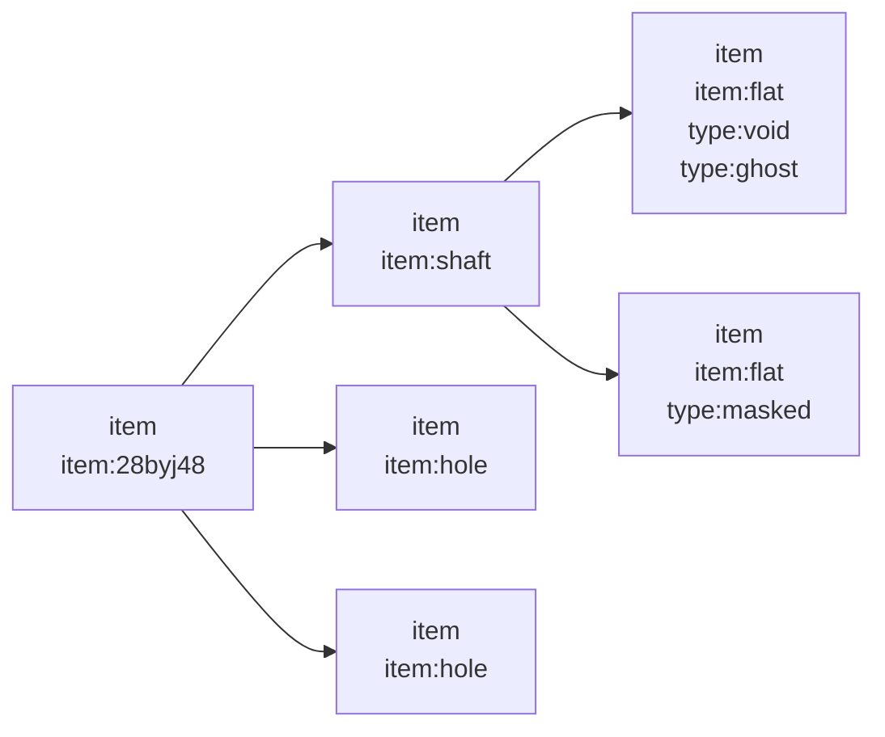

### 28BYJ-48

This is a common and cheap stepper motor with reasonable torque.


```JavaScript
import { FlatShaft } from 'https://raw.githubusercontent.com/jsxcad/JSxCAD/master/nb/components/shaft.nb';
```

##### Body

```JavaScript
const bodyDiameter = control('body diameter', 28, 'input');
```

```JavaScript
const bodyHeight = control('body height', 19, 'input');
```

```JavaScript
const bodyPlay = control('body play', 0.1, 'input');
```

```JavaScript
const totalDiameter = control('total diameter', 42, 'input');
```

##### Tab

```JavaScript
const tabDiameter = control('tab diameter', 7, 'input');
```

```JavaScript
const tabThickness = control('tab thickness', 1, 'input');
```

```JavaScript
const holeDiameter = control('hole diameter', 4, 'input');
```

##### Shaft

```JavaScript
const shaftDiameter = control('shaft diameter', 5, 'input');
```

```JavaScript
const shaftFlats = control('shaft flats', 3, 'input');
```

```JavaScript
const shaftFlatsLength = control('shaft flats length', 6, 'input');
```

```JavaScript
const shaftOffset = control('shaft offset', 6, 'input');
```

```JavaScript
const shaftBaseDiameter = control('shaft base diameter', 9, 'input');
```

```JavaScript
const shaftBaseHeight = control('shaft base height', 2, 'input');
```

```JavaScript
const shaftLength = control('shaft length', 10, 'input');
```

```JavaScript
const shaftPlay = control('shaft play', 0.2, 'input');
```

##### Connector

```JavaScript
const connectorWidth = control('connector width', 15, 'input');
```

```JavaScript
const connectorLength = control('connector length', 7, 'input');
```

```JavaScript
const connectorBaseWidth = control('connector base width', 17, 'input');
```

```JavaScript
const connectorBaseHeight = control('connector base height', 4, 'input');
```

```JavaScript
const connectorHeight = control('connector height', 5, 'input');
```

```JavaScript
export const StepperMotor28byj48 = ({
  bodyDiameter = 28,
  bodyHeight = 19,
  bodyPlay = 0.1,
  totalDiameter = 42,
  tabDiameter = 7,
  holeDiameter = 4,
  shaftDiameter = 5,
  shaftFlats = 3,
  shaftOffset = 6,
  shaftBaseDiameter = 9,
  shaftBaseHeight = 2,
  shaftLength = 10,
  shaftPlay = 0.2,
  connectorWidth = 15,
  connectorLength = 7,
  connectorBaseWidth = 17,
  connectorBaseHeight = 4,
  connectorHeight = 5,
} = {}) =>
  Group(
    Arc(bodyDiameter)
      .add(Box(connectorLength, connectorWidth).x(bodyDiameter / -2))
      .add(
        Box(connectorBaseHeight, connectorBaseWidth).x(bodyDiameter / -2 + 2)
      )
      .ez(-bodyHeight)
      .mask(grow(bodyPlay)),
    Group(
      Arc(shaftBaseDiameter).ez(0, -shaftBaseHeight),
      FlatShaft({
        diameter: shaftDiameter,
        length: shaftLength,
        flatLength: shaftFlatsLength,
        flatThickness: shaftFlats,
        play: 0.2,
      })
    )
      .x(bodyDiameter / 2 - shaftOffset)
      .z(shaftBaseHeight),
    Arc(tabDiameter)
      .y(totalDiameter / 2 - tabDiameter / 2)
      .rz(0, 1 / 2)
      .hull(noOp())
      .ez(-tabThickness)
      .fitTo(
        Arc(holeDiameter)
          .ez(-tabThickness)
          .void()
          .as('hole')
          .y(totalDiameter / 2 - tabDiameter / 2)
          .rz(0, 1 / 2)
      )
  ).as('28byj48');
```

```JavaScript
StepperMotor28byj48({
  bodyDiameter,
  bodyHeight,
  bodyPlay,
  totalDiameter,
  tabDiameter,
  holeDiameter,
  shaftDiameter,
  shaftFlats,
  shaftOffset,
  shaftBaseDiameter,
  shaftBaseHeight,
  shaftLength,
  shaftPlay,
  connectorWidth,
  connectorLength,
  connectorBaseWidth,
  connectorBaseHeight,
  connectorHeight,
})
  .note('### Example')
  .view(rz(1 / 4))
  .note('#### Invocation')
  .note(
    "import { StepperMotor28byj48 } from 'https://raw.githubusercontent.com/jsxcad/JSxCAD/master/nb/projects/pentacular/28BYJ-48/28BYJ-48.nb';"
  )
  .note(
    `StepperMotor28byj48({ bodyDiameter: ${bodyDiameter}, bodyHeight: ${bodyHeight}, bodyPlay: ${bodyPlay}, totalDiameter: ${totalDiameter}, tabDiameter: ${tabDiameter}, holeDiameter: ${holeDiameter}, shaftDiameter: ${shaftDiameter}, shaftFlats: ${shaftFlats}, shaftOffset: ${shaftOffset}, shaftBaseDiameter: ${shaftBaseDiameter}, shaftBaseHeight: ${shaftBaseHeight}, shaftLength: ${shaftLength}, shaftPlay: ${shaftPlay}, connectorWidth: ${connectorWidth}, connectorLength: ${connectorLength}, connectorBaseWidth: ${connectorBaseWidth}, connectorBaseHeight: ${connectorBaseHeight}, connectorHeight: ${connectorHeight} })`
  )
  .abstract();
```

### Example



#### Invocation

import { StepperMotor28byj48 } from 'https://raw.githubusercontent.com/jsxcad/JSxCAD/master/nb/projects/pentacular/28BYJ-48/28BYJ-48.nb';

StepperMotor28byj48({ bodyDiameter: 28, bodyHeight: 19, bodyPlay: 0.1, totalDiameter: 42, tabDiameter: 7, holeDiameter: 4, shaftDiameter: 5, shaftFlats: 3, shaftOffset: 6, shaftBaseDiameter: 9, shaftBaseHeight: 2, shaftLength: 10, shaftPlay: 0.2, connectorWidth: 15, connectorLength: 7, connectorBaseWidth: 17, connectorBaseHeight: 4, connectorHeight: 5 })


