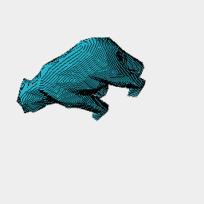

### Bear model sliced

```JavaScript
const url = control('url', 'https://jsxcad.js.org/stl/bear.stl', 'input');
```

```JavaScript
const height = control('height', 200, 'input');
```

```JavaScript
const spacing = control('spacing', 2, 'input');
```

```JavaScript
const a = (await readStl(url)).by(align('z>'));
```

```JavaScript
a.stl('bear').note('This is a low-poly model of a bear.');
```


[bear_0.stl](bear.bear_0.stl)

This is a low-poly model of a bear.

```JavaScript
a.section(seq({ to: height, by: spacing }, XY, Group))
  .note(`Stl sliced each ${spacing}mm up to ${height}mm.`)
  .view()
  .note('Laid out on a single sheet for cutting.')
  .pdf('slices', each(flat()).page('pack'));
```

Stl sliced each 2mm up to 200mm.



Laid out on a single sheet for cutting.


[slices_0.pdf](bear.slices_0.pdf)
