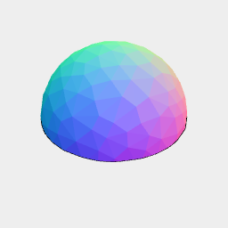
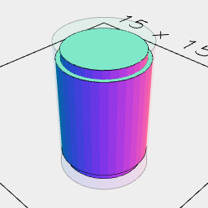

# Bearings

Bearing are a bit tricky to print so that both poles are smooth.

Here we break the bearing at the equator and pin the hemispheres together.

```JavaScript
const Bearing = (diameter) =>
  Orb(diameter)
    .cutOut(
      Box(diameter).ez([diameter / 2]),
      cut => cut,
      clipped => clipped.as('top')
    )
    .fitTo(
      Arc(4.5)
        .ez([3.5, 3.0], [-3.0, -3.5])
        .and(Arc(5).ez([3, -3]))
        .masked(Arc(5.2).ez([4, -4]))
        .as('pin')
    );
```


You'll need to print two of these



[bearing_10_7_top.stl](bearing.bearing_10_7_top.stl)

And one of these



[bearing_10_7_pin.stl](bearing.bearing_10_7_pin.stl)

```JavaScript
const bearing_10_7 = await Bearing(10.7)
  .view(material('glass'))
  .md(`You'll need to print two of these`)
  .stl('bearing_10_7_top', get('top'))
  .md(`And one of these`)
  .stl('bearing_10_7_pin', get('pin'));
```
