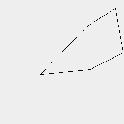

# Bolts

This project allows you to design bolts and nuts.

[See examples](../../../../nb/projects/pentacular/bolt/examples.md)

```JavaScript
const Profile = (pitch = 1, depth = 4 / 3) =>
  Polygon(
    Point(0, depth / -2),
    Point(pitch / -2, depth / 2),
    Point(pitch / -2, depth),
    Point(pitch / 2, depth),
    Point(pitch / 2, depth / 2)
  ).inset(0.01);
```



```JavaScript
Profile().topView();
```

```JavaScript
export const ScrewThreadSegmentBuilder = Cached(
  'nb/projects/bolt/bolt.nb/ScrewThreadSegmentBuilder',
  (diameter, pitch, angle, play, turn) => {
    const depth = pitch / 2 / Math.tan(angle * Math.PI);
    return Profile(pitch, (pitch * 0.5) / Math.tan(angle * Math.PI))
      .y(diameter / -2 + play)
      .ry(1 / 4)
      .seq({ from: -1, by: 1 / 32, to: 1 }, (t) => rz(t).z(pitch * t), Loft)
      .scale(1, 1, turn === 'right' ? 1 : -1)
      .simplify(0.01)
      .add(Arc(diameter - depth).ez([pitch, -pitch]))
      .clip(Box(diameter * 2).ez(pitch))
      .z(pitch / 2);
  }
);
```

```JavaScript
export const ScrewThreadSegment = Shape.registerMethod('ScrewThreadSegment', (
  diameter,
  { pitch = 1, angle = 60 / 360, play = 0.1, turn = 'right' } = {}
) => (shape) => ScrewThreadSegmentBuilder(diameter, pitch, angle, play, turn));
```

```JavaScript
export const ScrewThreadBuilder = Cached(
  'nb/projects/bolt/bolt.nb/ScrewThread',
  (diameter, height, pitch, angle, play, turn) =>
    ScrewThreadSegment(diameter, { pitch, angle, play, turn })
      .seq({ from: 0, to: height, by: pitch }, z)
      .cut('fastx', Box(diameter * 2).ez([height, height + pitch * 2]))
      .clean()
);
```

```JavaScript
export const ScrewThread = Shape.registerMethod('ScrewThread', (
  diameter,
  height,
  { pitch = 1, angle = 60 / 360, play = 0.1, turn = 'right' } = {}
) => (shape) => ScrewThreadBuilder(diameter, height, pitch, angle, play, turn));
```

```JavaScript
export const NutThreadSegmentBuilder = Cached(
  'nb/projects/bolt/bolt.nb/NutThreadSegment',
  (diameter, pitch, thickness, angle, play, turn) => {
    const depth = pitch / 2 / Math.tan(angle * Math.PI);
    return ScrewThreadSegment(diameter, {
      pitch,
      angle,
      play: -play,
      turn,
    }).cutFrom(
      'fastx',
      Arc(diameter + thickness)
        .cut('fastx', Arc(diameter - depth))
        .ez([pitch])
    );
  }
);
```

```JavaScript
export const NutThreadSegment = Shape.registerMethod('NutThreadSegment', (
  diameter,
  {
    pitch = 1,
    thickness = pitch * 2,
    angle = 60 / 360,
    play = 0.1,
    turn = 'right',
  } = {}
) => (shape) => NutThreadSegmentBuilder(diameter, pitch, thickness, angle, play, turn));
```

```JavaScript
export const NutThreadBuilder = Cached(
  'nb/projects/bolt/bolt.nb/NutThread',
  (diameter, height, pitch, angle, play, turn) =>
    NutThreadSegment(diameter, { pitch, angle, play, turn })
      .seq({ from: 0, to: height, by: pitch }, z)
      .cut('fastx', Box(diameter * 2).ez([height, height + pitch * 2]))
);
```

```JavaScript
export const NutThread = Shape.registerMethod('NutThread', (
  diameter,
  height,
  { pitch = 1, angle = 60 / 360, play = 0.1, turn = 'right' } = {}
) => (shape) => NutThreadBuilder(diameter, height, pitch, angle, play, turn));
```
