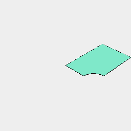
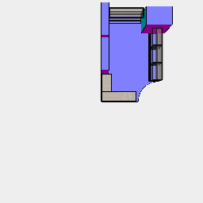
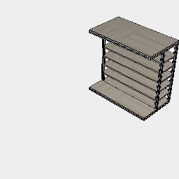
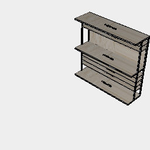
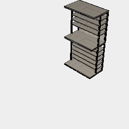
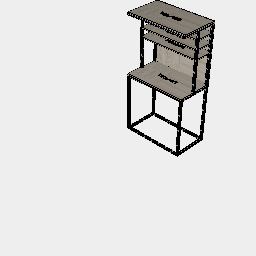
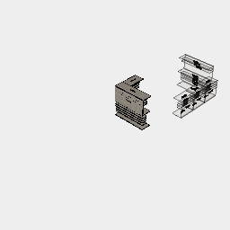

```JavaScript
const Beam = (length) =>
  Box(20)
    .cut(
      Box(5, 5)
        .x(7.5)
        .rz({ by: 1 / 4 })
    )
    .ez([length])
    .material('aluminium')
    .x(10)
    .y(10)
    .maskedBy(Box([20], [20], [length]))
    .rx(1 / 4)
    .asPart(`Beam${length}`)
    .rx(-1 / 4)
    .clean();
```

```JavaScript
const DeskBase = ({ width = 700, height = 660, depth = 400 } = {}) =>
  Assembly(
    Plywood({ width, depth, height: 10 }).z(height),
    Beam(height - 40)
      .x(0, width - 20)
      .y(0, depth - 20)
      .z(20)
      .as('uprights'),
    Beam(width - 20 * 2)
      .ry(1 / 4)
      .x(width - 20)
      .y(0, depth - 20)
      .z(0, height - 20)
      .as('beams'),
    Beam(depth)
      .rx(1 / 4)
      .y(depth)
      .x(0, width - 20)
      .z(0, height - 20)
      .as('rafters')
  );
```

```JavaScript
const DeskTop = ({
  width = 700,
  height = 640,
  depth = 400,
  shelves = [],
} = {}) =>
  Assembly(
    Plywood({ width, depth, height: 10 }).z(height),
    Plywood({ width, depth: depth / 2 + 20, height: 10 })
      .y(depth / 2 - 20)
      .z(...shelves),
    Plywood({ width, depth: height + 20 + 10 })
      .rx(1 / 4)
      .y(400 + 10)
      .z(-20),
    Beam(height - 20)
      .x(0, width - 20)
      .y(depth / 2 - 20, depth - 20),
    Beam(depth)
      .rx(1 / 4)
      .y(depth)
      .x(0, width - 20)
      .z(height - 20),
    Beam(width - 20 * 2)
      .ry(1 / 4)
      .x(width - 20)
      .y(0, depth - 20)
      .z(height - 20)
  );
```

```JavaScript
const Desk = ({ width = 700, height = 660, depth = 400, shelves = [] } = {}) =>
  Assembly(
    DeskBase({ width, height, depth }),
    DeskTop({ width, height, depth, shelves }).z(height)
  );
```

```JavaScript
const Plywood = ({ width = 700, height = 10, depth = 400 } = {}) =>
  Box([width], [depth], [height])
    .material('wood')
    .asPart('Plywood', `Plywood ${width}x${depth}x${height}`);
```



```JavaScript
const room = Box([870 + 1580], [3800])
  .cut(Arc(870 * 2).x(1580 + 875))
  .clean()
  .view();
```



```JavaScript
const cornerDesign3 = And(
  desk700b
    .rz(-1 / 4)
    .align('x>y>')
    .y(400),
  desk1400b.rz(1 / 2).align('x>y>'),
  desk1400b
    .x(280 + 25)
    .y(870 + 700 * 3 + 400)
    .ghost(),
  desk
    .rz(1 / 4)
    .align('x>y>')
    .x(870 + 1580 - 400)
    .y(870 + 700 * 0, 870 + 700 * 1, 870 + 700 * 2)
    .ghost(),
  Box([1000], [700], [2000])
    .x(870 + 1580 - 1000 + 280)
    .y(870 + 700 * 3),
  Box([280], [1200], [2500]).y(400 + 700 + 100, 400 + 700 + 1200 + 200),
  room
).view('top');
```

```JavaScript
const DeskHalfBase = ({
  width = 700,
  height = 660,
  depth = 400,
  shelves = [],
} = {}) =>
  Assembly(
    Plywood({ width, depth, height: 10 }).z(height),
    Plywood({ width, depth, height: 10 }).z(20),
    Plywood({ width, depth: depth / 2 + 20, height: 10 })
      .y(depth / 2 - 20)
      .z(...shelves),
    Beam(height - 40)
      .x(0, width - 20)
      .y(depth - 20, depth / 2 - 20)
      .z(20)
      .as('uprights'),
    Beam(width - 20 * 2)
      .ry(1 / 4)
      .x(width - 20)
      .y(0, depth - 20)
      .z(0, height - 20)
      .as('beams'),
    Beam(depth)
      .rx(1 / 4)
      .y(depth)
      .x(0, width - 20)
      .z(0, height - 20)
      .as('rafters')
  );
```



```JavaScript
const deskHalfBase = DeskHalfBase({
  shelves: [20, 120, 220, 320, 420, 520],
}).view();
```



```JavaScript
const desk1400b = Assembly(
  DeskHalfBase({
    width: 1400,
    shelves: [220, 320, 420, 520],
  }),
  DeskTop({ width: 1400, shelves: [420, 520] }).z(660)
).view();
```



```JavaScript
const desk700b = Assembly(
  DeskHalfBase({
    width: 700,
    shelves: [120, 220, 320, 420, 520],
  }),
  DeskTop({ width: 700, shelves: [220, 320, 420, 520] }).z(660)
).view();
```



```JavaScript
const desk = Desk({ width: 700, shelves: [350, 450, 550] }).view();
```



```JavaScript
const parts = cornerDesign3
  .get('part:Plywood')
  .each(flat())
  .sort(area(), 'max')
  .pack(Box(2440, 1200).copy(10), 0, 1 / 4, { margin: 5 })
  .pack({ margin: 100 })
  .view();
```
