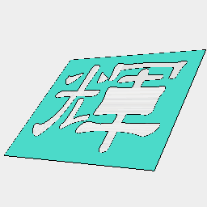
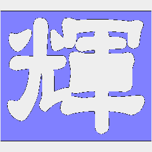

```JavaScript
import { Text, readFont } from '@jsxcad/api-v1-font';
```

```JavaScript
const unYetGul = 'https://jsxcad.js.org/ttf/UnYetgul.ttf';
```

```JavaScript
const text = await control('Engraving', '輝');
```



Model

```JavaScript
const model = await Text(unYetGul, text, 25)
  .align('xy')
  .cutFrom(Box(30, 26))
  .view()
  .note('Model');
```



Section Inset

```JavaScript
const inset = await model.inset(0.5).gridView().note('Section Inset');
```
