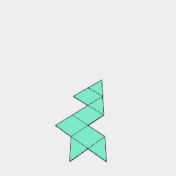
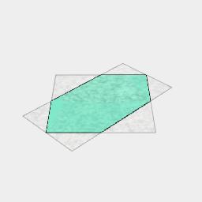
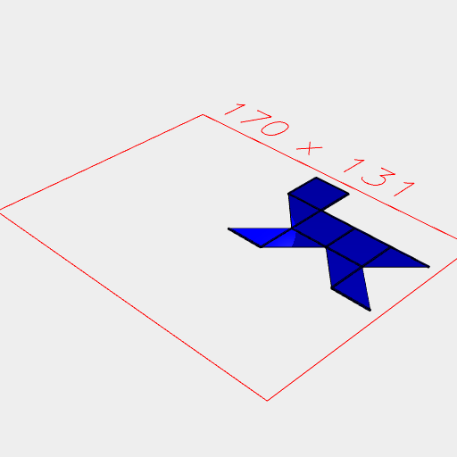
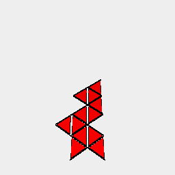
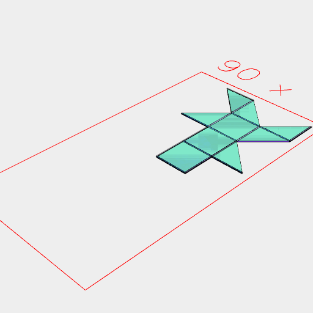

```JavaScript
const r = await Box(20).ez([20]).unfold().clean().view();
```



```JavaScript
const p = await Arc({ radius: 0.5, sides: 4 }).clip(Box(0.5, 1)).view();
```



```JavaScript
const e = await r
  .on(get('unfold:edge'), (e) => p.ez([e.diameter()]))
  .color('blue')
  .view(4);
```



```JavaScript
await r
  .on(get('unfold:faces'), inset(1).ez([-0.5]).color('red'))
  .view();
```



[cube.stl](fold.cube.stl)

```JavaScript
r.ez([-0.5]).cut(e).stl('cube');
```
