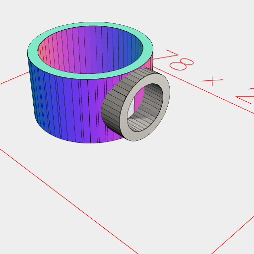

```JavaScript
const penDiameter = 10.5;
```

```JavaScript
const magnetDiameter = 5.0;
```

```JavaScript
const magnetHeight = 2.5;
```

```JavaScript
const magneticPenHolder = Arc(magnetDiameter)
  .material('steel')
  .ez(magnetHeight)
  .fit(
    'exact',
    Arc(magnetDiameter + 2)
      .material('plastic')
      .ez(magnetHeight)
  )
  .to(YZ(0))
  .by(align('z>'))
  .fit(
    'exact',
    Arc(penDiameter)
      .material('plastic')
      .op((s) => s.offset(1).fitTo(s.void()))
      .ez(magnetDiameter + 2 + 0.1, -0.1)
      .by(align('x<'))
      .x(1.1)
  )
  .view()
  .stl('holder', drop(get('material:steel')));
```




[holder_0.stl](holder.holder_0.stl)
