```JavaScript
import { Block, SocketBoard } from './lego.nb';
```

SocketBoard 16x16x2

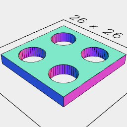

```JavaScript
export const socketBoard16x16x2 = await SocketBoard(2, 2, 2)
  .as('SocketBoard 16x16x2')
  .note('SocketBoard 16x16x2')
  .view();
```

SocketBoard 32x32x3.2

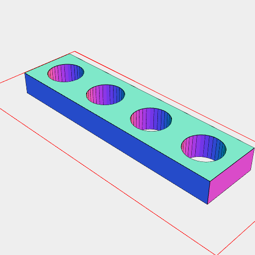

```JavaScript
export const socketBoard32x8x3_2 = await SocketBoard(4, 1, 3.2)
  .as('SocketBoard 32x32x3.2')
  .note('SocketBoard 32x32x3.2')
  .view();
```

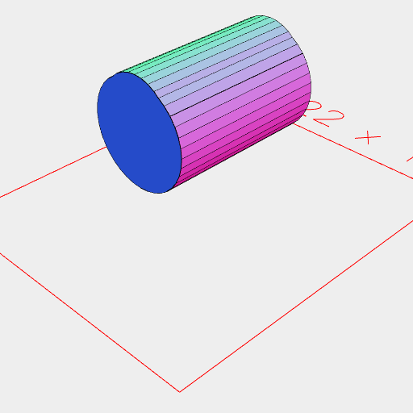

```JavaScript
export const axleHole = await Arc({ apothem: 5.2 })
  .add(
    Arc({ apothem: 4 })
      .y(1.5 / 2)
  )
  .ez([4.00001, -4.00001])
  .rx(1 / 4)
  .z(5.6)
  .view();
```


```JavaScript
export const block8x8x3_2 = await Block(1, 1, 3.2).as('lego block 8x8x3.2').view();
```

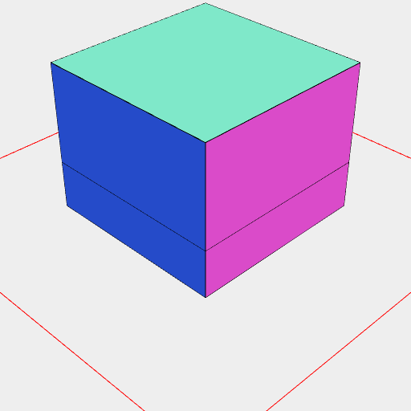

```JavaScript
export const block8x8x6_4 = await Block(1, 1, 6.4).as('lego block 8x8x6.4').view();
```

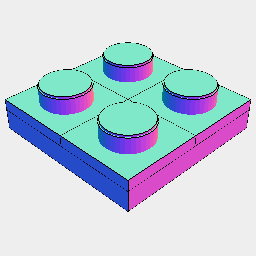

```JavaScript
export const block16x16x3_2 = await Block(2, 2, 3.2)
  .as('lego block 16x16x3.2')
  .view();
```

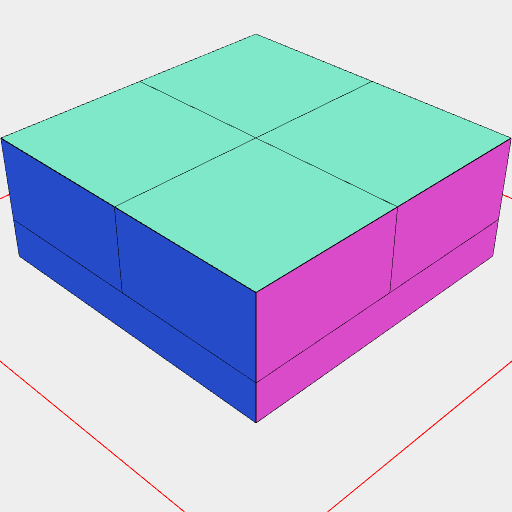

```JavaScript
export const block16x16x6_4 = await Block(2, 2, 6.4)
  .as('lego block 24x24x6.4')
  .view();
```

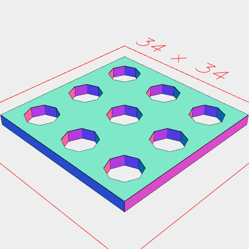

```JavaScript
export const socket24x24x1_6 = await SocketBoard(3, 3, 1.6)
  .as('lego socket 24x24x1.6')
  .view();
```

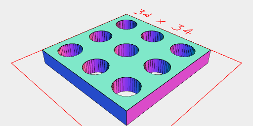

```JavaScript
export const socket24x24x3_2 = await SocketBoard(3, 3, 3.2)
  .as('lego socket 24x24x3.2')
  .view();
```

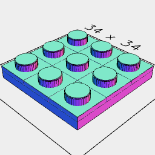

```JavaScript
export const block24x24x3_2 = await Block(3, 3, 3.2)
  .as('lego block 24x24x3.2')
  .view();
```

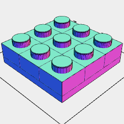

```JavaScript
export const block24x24x6_4 = await Block(3, 3, 6.4)
  .as('lego block 24x24x6.4')
  .view();
```

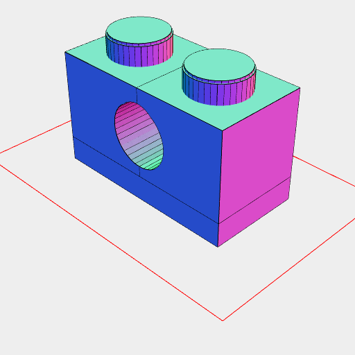

```JavaScript
export const block16x8x9_6 = await Block(2, 1, 3.2 * 3)
  .cut(axleHole)
  .view();
```

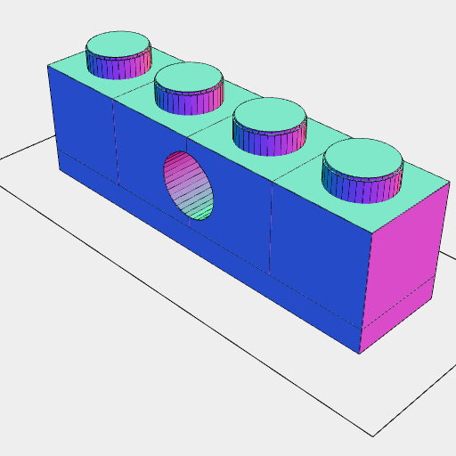

[block32x8x9_6e.stl](examples.block32x8x9_6e.stl)

```JavaScript
export const block32x8x9_6 = await Block(4, 1, 3.2 * 3)
  .cut(axleHole)
  .as('block32x8x9_6e')
  .stl('block32x8x9_6e');
```

```JavaScript
export const AxleProfile = () => {
  const length = 4.8 + 0.1;
  const width = 1.8 + 0.1;
  const diameter = 5 + 0.1;
  const line = Line(length);
  const bar = Group(
    line.y(width / 2),
    line.y(width / -2),
    Arc(diameter, { start: 1 / 4 })
      .rz(50 / 360),
    Arc(diameter, { start: 1 / 4 })
      .rz((50 + 180) / 360)
  ).fill();
  return bar.add(bar.rz(90 / 360));
};
```

Axle Profile

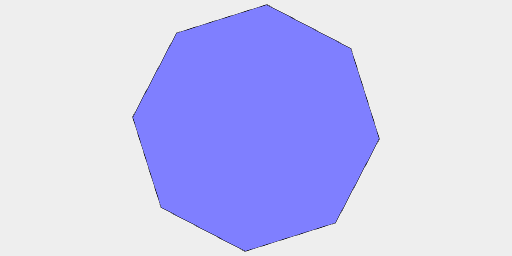

```JavaScript
export const axleProfile = await AxleProfile().note('Axle Profile').topView();
```

```JavaScript
export const AxleJoiner = (length) => Arc(8).cut(axleProfile).ez([length]);
```

Axle Joiner 16mm

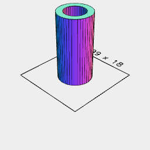

[AxleJoiner16.stl](examples.AxleJoiner16.stl)

```JavaScript
export const axleJoiner16 = await AxleJoiner(16)
  .note('Axle Joiner 16mm')
  .stl('AxleJoiner16');
```

```JavaScript
const box = await Box(8, 3.2 * 4).y(3.2 * 2);
```

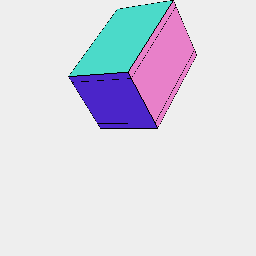

[technic.stl](examples.technic.stl)

```JavaScript
const technic = await Group(box, Arc(4.8 + 0.2).y(5.6))
  .fill()
  .ez([8 - 0.8, 0.8])
  .and(
    Group(box, Arc(6.2 + 0.2).y(5.6))
      .fill()
      .ez([0.8])
  )
  .and(
    Group(box, Arc(6.2 + 0.2).y(5.6))
      .fill()
      .ez([8, 8 - 0.8])
  )
  .stl('technic');
```

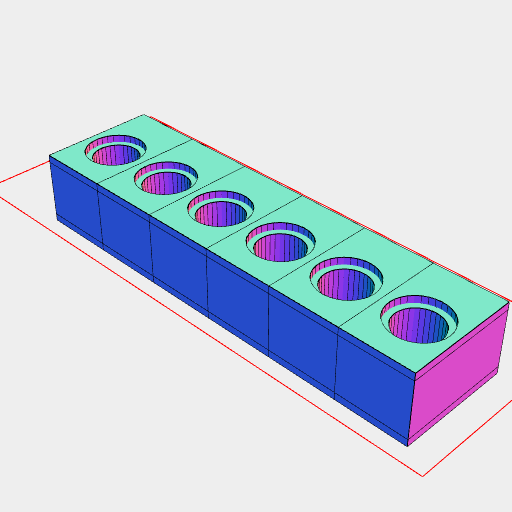

```JavaScript
const technic_1x6 = await Group(seq((n) => technic.x(n), { upto: 48, by: 8 }))
  .align()
  .view();
```

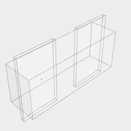

[technicConnector.stl](examples.technicConnector.stl)

```JavaScript
const technicConnector = await Arc(4.8)
  .ez([8, -8])
  .to(XZ())
  .add(
    Arc(6.2)
      .ez([0.8 - 0.2])
      .to(XZ())
  )
  .add(
    Arc(5.5)
      .ez([0.4])
      .to(XZ())
      .y(-8 + 0.2)
  )
  .add(
    Arc(5.5)
      .ez([0.4])
      .to(XZ())
      .y(8 - 0.2)
  )
  .cut(
    Box(10, 6, 0.5)
      .to(YZ())
      .y(-8 + 3)
  )
  .cut(
    Box(10, 6, 0.5)
      .to(YZ())
      .y(8 - 3)
  )
  .clip(Box(4.5, 6.2, 16).to(XZ()))
  .material('plastic')
  .stl('technicConnector');
```

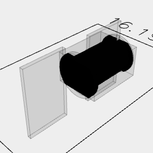

[halfTechnicConnector.stl](examples.halfTechnicConnector.stl)

```JavaScript
const halfTechnicConnector = await Arc(4.8)
  .ez([8])
  .to(XZ())
  .add(
    Arc(6.2)
      .ez([0.8 - 0.2])
      .to(XZ())
  )
  .add(
    Arc(5.5)
      .ez([0.4])
      .to(XZ())
      .y(8 - 0.2)
  )
  .cut(
    Box(10, 6, 0.5)
      .to(YZ())
      .y(-8 + 3)
  )
  .cut(
    Box(10, 6, 0.5)
      .to(YZ())
      .y(8 - 3)
  )
  .clip(Box(4.5, 6.2, [0, 8]).to(XZ()))
  .material('plastic')
  .stl('halfTechnicConnector');
```

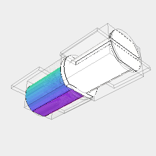

[technicPlug5mm.stl](examples.technicPlug5mm.stl)

```JavaScript
const technicPlug5mm = await halfTechnicConnector
  .and(Arc(5).clip(Box(4.5, 5)).ez([-8]).to(XZ()))
  .stl('technicPlug5mm');
```
