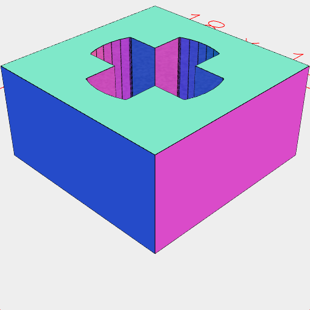

# Lego compatible blocks

[Examples](../../../../nb/projects/lego/examples.md)

```JavaScript
export const Socket = (height = 2) =>
  Arc({ apothem: 5 / 2 })
    .ez([-height])
    .void();
```

```JavaScript
export const Stud = (height = 1.6) =>
  Join(Arc(5).ez([height]), Arc(4.8).ez([height, height + 0.2]));
```

```JavaScript
export const SocketBoard = (length, width, height, { sockets = [] } = {}) => {
  const isFlat = (x, y) => {
    if (sockets === undefined) return false;
    if (sockets[y] === undefined) return false;
    return sockets[y][x] === '_';
  };
  const pieces = [];
  const socket = Arc(5).x(4).y(4);
  for (let x = 0; x < length; x++) {
    for (let y = 0; y < width; y++) {
      if (!isFlat(x, y)) {
        pieces.push(socket.x(x * 8).y(y * 8));
      }
    }
  }
  return Group(Box(length * 8, width * 8).align('x>y>'), ...pieces)
    .fill()
    .ez([height])
    .align('xy')
    .as(`SocketBoard ${length} x ${width} x ${height}`);
};
```

```JavaScript
export const StudBoard = (length, width, height, { studs = [] } = {}) => {
  const isFlat = (x, y) => {
    if (studs === undefined) return false;
    if (studs[y] === undefined) return false;
    return studs[y][x] === '_';
  };
  const board = [];
  const flat = Box(8).ez([height]);
  const stud = Box(8)
    .ez([height])
    .add(Arc(5).ez([height, height + 1.6]))
    .add(Arc(4.8).ez([height + 1.6, height + 1.8]));
  for (let x = 0; x < length; x++) {
    for (let y = 0; y < width; y++) {
      const part = isFlat(x, y) ? flat : stud;
      board.push(part.x(x * 8).y(y * 8));
    }
  }
  return Group(...board)
    .align('xy')
    .as(`StudBoard ${length} x ${width} x ${height}`);
};
```

```JavaScript
const legoify = () => (shape) =>
  shape
    .and(
      faces().op(
        sort('z>').n(0).put(Stud().x(-4, 4).y(-4, 4)),
        sort('z<').n(0).put(Socket().x(-4, 4).y(-4, 4))
      )
    )
    .disjoint()
    .fuse()
    .view();
```

```JavaScript
export const Block = (
  length,
  width,
  height,
  { sockets = [], studs = [] } = {}
) =>
  Group(
    SocketBoard(length, width, 2.1, { sockets }),
    StudBoard(length, width, height - 2.1, { studs }).z(2.1)
  );
```

```JavaScript
export const bushingHoleProfile = await Arc({ apothem: 5 / 2 });
```

```JavaScript
export const AxleProfile = () => {
  const length = 4.8 + 0.1;
  const width = 1.8 + 0.1;
  const diameter = 5 + 0.1;
  const line = Line(length);
  const bar = Group(
    line.y(width / 2),
    line.y(width / -2),
    Arc(diameter, { start: 3 / 16, end: 5 / 16 }).rz(0, 1 / 2)
  ).fill();
  return bar.rz(0 / 4, 1 / 4).fuse();
};
```

```JavaScript
export const axleProfile = AxleProfile();
```

```JavaScript
export const axleHoleProfile = axleProfile.offset(0.1);
```



[axle_hole.stl](lego.axle_hole.stl)

```JavaScript
export const axleHole = await Box(8)
  .cut(axleProfile.offset(0.1))
  .ez([4])
  .stl('axle_hole');
```

```JavaScript
export const verticalBushingHole = Join(
  bushingHoleProfile.ez([0.6, 7.4]),
  bushingHoleProfile.offset(0.4).ez([0, 0.6], [7.4, 8.0])
)
  .void()
  .view(and(Point()));
```

```JavaScript
export const horizontalBushingHole = verticalBushingHole
  .rx(1 / 4)
  .y(4)
  .z(5.6)
  .view(and(Point()));
```


[verticalConnector.stl](lego.verticalConnector.stl)

```JavaScript
export const verticalConnector = await Arc(4.8)
  .ez([8])
  .add(Arc(5.8).ez([0.8 - 0.2]))
  .add(Arc(5.5).ez([8 - 0.4, 8]))
  .cut(Box(10, 1, [8, 1]))
  .material('plastic')
  .stl('verticalConnector');
```


[horizontalConnector.stl](lego.horizontalConnector.stl)

```JavaScript
export const horizontalConnector = await verticalConnector
  .ry(-1 / 4)
  .clip(Box([0, 8], 8, 4))
  .material('plastic')
  .stl('horizontalConnector');
```
