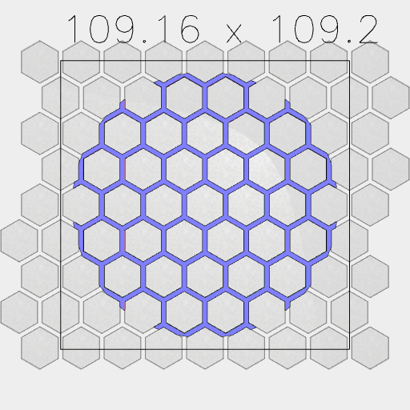
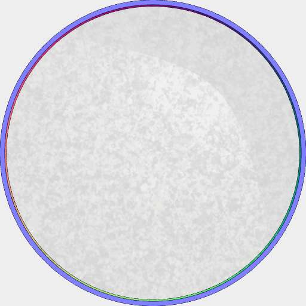
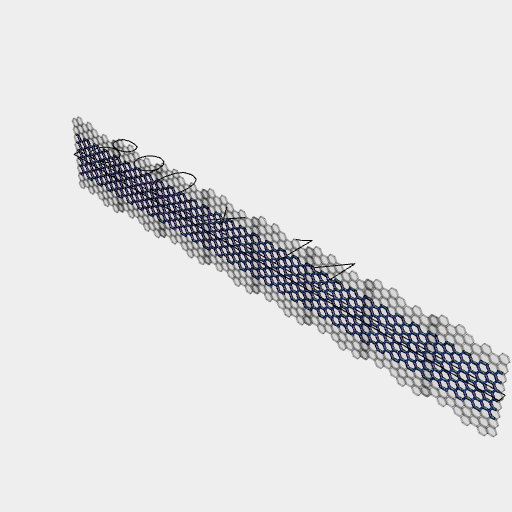
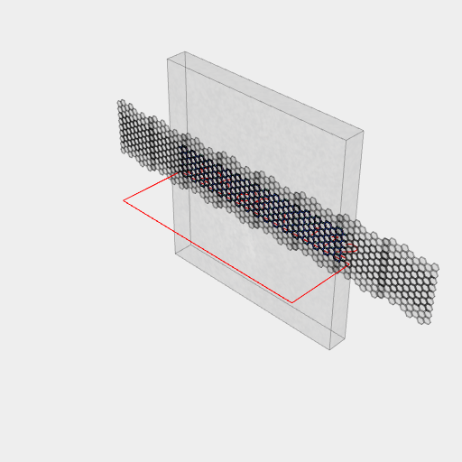
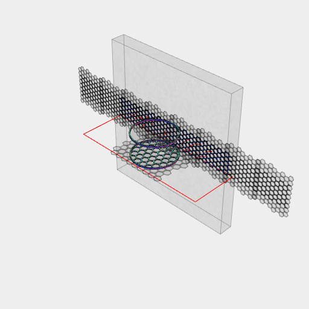
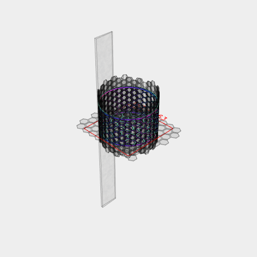

```JavaScript
const grid = Hexagon(16)
  .seq(
    { from: -4, to: 4 },
    { from: -4, to: 4 },
    (i, j) =>
      move((i + (j % 2) * 0.5) * 18 * Math.sqrt(3) * 0.5, j * 18 * 0.75),
    Group
  )
  .gridView();
```



```JavaScript
const base = await grid.cutFrom(Arc(100)).ez([1]).gridView();
```



```JavaScript
const ring = await Arc(99).cutFrom(Arc(102)).ez([2.5]).gridView();
```


[sorter.stl](lego_sorter.sorter.stl)

```JavaScript
const sorter = await ring.and(base).stl('sorter');
```

```JavaScript
const wall1 = await grid
  .cutFrom(Box(80, 110))
  .rz(1 / 4)
  .ez([2])
  .rx(1 / 4);
```



```JavaScript
const wall = await wall1
  .align('x<')
  .and(align('x>'))
  .align('x<')
  .and(align('x>'))
  .align('x<')
  .and(align('x>'))
  .view();
```



```JavaScript
const bentWall = await wall
  .clip(Box(475, 50, 500))
  .scale(1 / 1.5)
  .align('z>')
  .y(51)
  .bend(50)
  .view();
```





[tall_sorter.stl](lego_sorter.tall_sorter.stl)

```JavaScript
await bentWall.and(ring, base, ring.z(52)).scale(1.5).view().stl('tall_sorter');
```
