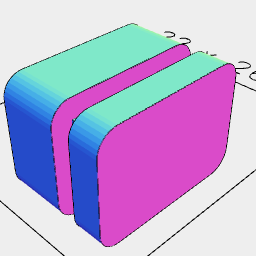
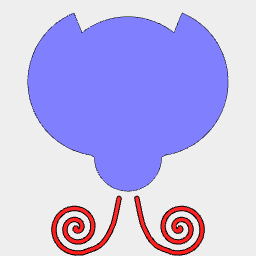
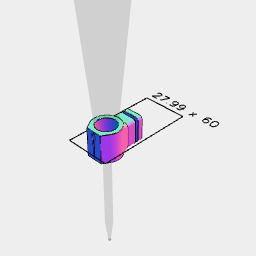
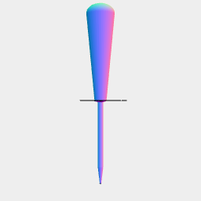
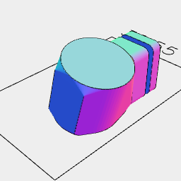
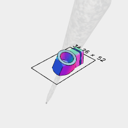
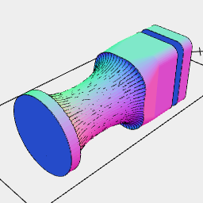

[peg.stl](makerspace.peg.stl)

```JavaScript
const peg = Box(7.5, 12)
  .Loft(
    offset(2).z(-5),
    offset(2).z(-2),
    z(-2),
    z(0),
    offset(2).z(0),
    offset(2).z(6)
  )
  .rx(1 / 4)
  .as('peg')
  .stl('peg', rx(-1 / 4).ry(1 / 4));
```



```JavaScript
const bug = And(
  Arc(20, { end: 1 / 2 })
    .loop()
    .fill()
    .as('wing')
    .and(
      Group(
        Arc(2).x(1.6).y(0.5),
        Arc(3).x(2.5).y(-3.8),
        Arc(2).x(1.7).y(-8),
        Arc(2.3).x(5).y(-0.8),
        Arc(2.3).x(5).y(-6.5),
        Arc(2).x(7.25).y(-3.5),
        Arc(2.2).x(8).y(1.2),
        Arc(3).x(5.5).y(3.5),
        Arc(2.3).x(1.8).y(5.8),
        Arc(2).x(4.5).y(7)
      )
        .color('black')
        .as('spots')
    )
    .rz(TILT)
    .y(6.25)
    .x(3.5)
    .sx(1, -1),
  Arc(9).y(-4).as('head'),
  Arc(20).as('body').y(5),
  Link(
    Spiral({ by: 1 / 32, to: 2.3 })
      .scale(1.5)
      .y(-13.5)
      .x(7),
    Curve([6, -16.8], [4, -16], [3, -15], [2, -13], [1.2, -9.5])
  )
    .stroke(0.6)
    .as('antenna')
    .color('red')
    .sx(1, -1)
)
  .view('top')
  .and(get('head', 'body', 'wing').offset(1).fuse().as('shell').color('green'))
  .rz(1 / 2)
  .svg('ladybird_body', get('shell', 'antenna').fuse().outline())
  .svg('ladybird_wings', get('wing', 'spots').outline())
  .v(5);
```



[awl_holder.stl](makerspace.awl_holder.stl)

```JavaScript
const awlHolder = Arc(18)
  .ez([-8, 10])
  .y(-16)
  .clean()
  .hull(peg.faces().sort('y<').n(0), Box(10, [-25, -25], [-8, 10]))
  .join(peg)
  .cut(
    awl
      .section(XZ())
      .scale(1 / 10)
      .e([0.5])
      .y(-25)
  )
  .clean()
  .cut(awl.y(-16))
  .stl('awl_holder')
  .v(2);
```



```JavaScript
const awl = Arc(5)
  .Loft(z(-76).inset(1.8), z(-76 + 15), z(0))
  .join(Hull(Orb(26, 26, 18).z(80), Orb(11, 11, 3).z(0)))
  .fuse()
  .view('side');
```



[holder.stl](makerspace.holder.stl)

```JavaScript
const holder = Arc(18)
  .ez([-8, 10])
  .ry(-TILT)
  .hull(peg.y(16).faces().sort('y<').n(0), Box(10, [-9, -9], [-6, 8]).ry(-TILT))
  .join(peg.y(16))
  .cut(XY(-8))
  .stl('holder')
  .v(2);
```



[awl_holder_tilt.stl](makerspace.awl_holder_tilt.stl)

```JavaScript
const awlHolderTilt = holder.cut(awl.ry(-TILT)).stl('awl_holder_tilt');
```



[peg_holder.stl](makerspace.peg_holder.stl)

```JavaScript
const pegHolder = ChainHull(
  Arc(16).to(XZ(-15)),
  Arc(16).to(XZ(0)),
  peg.y(16).faces().sort('y<').n(0)
)
  .cut(Arc(16).to(XZ(-4)).eachPoint(Orb(6, 18, 6).to))
  .join(peg.y(16))
  .cut(XY(-8))
  .clean()
  .stl('peg_holder')
  .v(2);
```

```JavaScript
const SimpleInset = (diameter = 14) =>
  Arc(diameter).Join(ez([10]), inset(1).ez([0, -60]));
```

```JavaScript
const TILT = 3 / 48;
```


[simple_inset.stl](makerspace.simple_inset.stl)

```JavaScript
const simpleInset = SimpleInset(13.75)
  .fitTo(SimpleInset(12.75).z(1).gap())
  .masked(SimpleInset(14))
  .stl('simple_inset');
```
