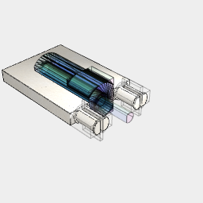

```JavaScript
import { MicroGearMotor } from './micro_gear_motor.nb';
```

```JavaScript
import { horizontalConnector } from '../lego/lego.nb';
```

```JavaScript
await Assembly(
  horizontalConnector.y(-8, 8).join(Box([-4 * 8], 3 * 8, 4)),
  MicroGearMotor()
    .ry(-1 / 4)
    .rx(1 / 4)
    .grow(0.1)
    .void()
).stl('motor case');
```



[motor case.stl](examples.motor%20case.stl)
