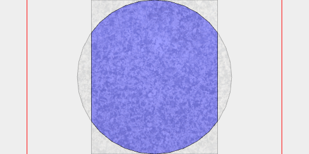
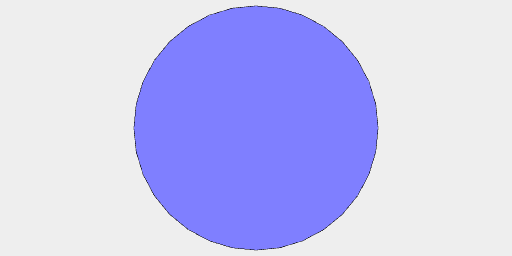
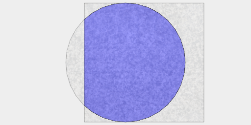
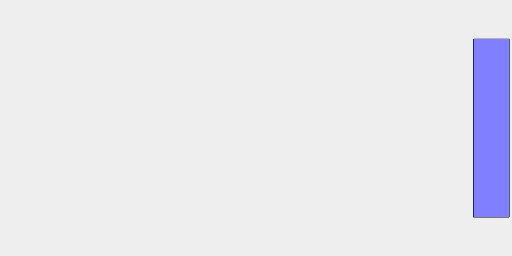
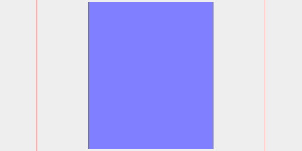
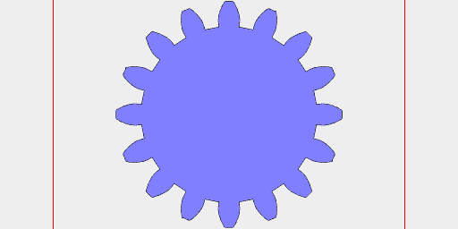
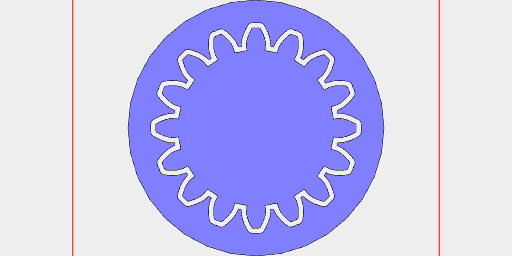
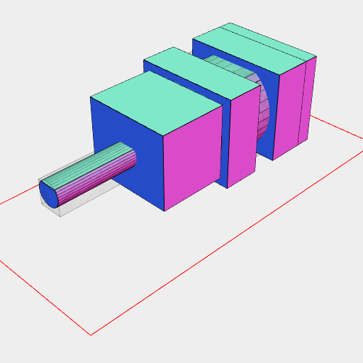

```JavaScript
import { Gear } from '../gear/gear.nb';
```

```JavaScript
import { Block, SocketBoard, StudBoard, block16x8x9_6 } from '../lego/lego.nb';
```

## Gear Motor and Sheath

```JavaScript
const motorProfile = await Arc(12).clip(Box(9.8, 12)).md('Motor Profile').gridView();
```

Motor Profile



```JavaScript
const gearboxProfile = await Box(9.8, 11.8).md('Gearbox Profile').gridView();
```

Gearbox Profile


```JavaScript
const axleProfile = await Arc(3.2).md('Axle Profile').gridView();
```

Axle Profile



```JavaScript
const axleFlatProfile = await axleProfile
  .clip(Box(3.2).x(0.5))
  .md('Flat Axle Profile')
  .gridView();
```

Flat Axle Profile



```JavaScript
const rearHubProfile = await Arc(4.8).md('Rear Hub Profile').gridView();
```

Rear Hub Profile


```JavaScript
const motor = await Group(
  axleFlatProfile.ez(13.5 + 9.1, 13.5 + 9.1 + 10.8),
  gearboxProfile.ez(13.5, 13.5 + 9.1),
  motorProfile.ez(13.5, 0)
)
  .md('Motor')
  .view();
```

Motor


```JavaScript
const wireThickness = 0.8;
```

```JavaScript
const wireChannelProfile = await Box(wireThickness, wireThickness * 5)
  .x(5.3)
  .md('Wire Channel Profile')
  .gridView();
```

Wire Channel Profile



```JavaScript
const capProfile = await Box(9.8 + 2, 12 + 2)
  .add(Box(wireThickness * 2, wireThickness * 7).x(5.3 + 0.4))
  .md('Cap Profile')
  .gridView();
```

Cap Profile



```JavaScript
const sheath = await capProfile
  .cut(motorProfile, wireChannelProfile)
  .ez(0, 5)
  .md('Sheath')
  .stl('sheath1');
```

Sheath

[sheath1_1.stl](micro_gear_motor.sheath1_1.stl)

```JavaScript
const cap = await Group(capProfile.ez(-2, -0.0), sheath).md('Cap').stl('cap');
```

Cap

[cap_1.stl](micro_gear_motor.cap_1.stl)

```JavaScript
const gearProfile = await Gear(20).md('Gear Profile').gridView();
```

Gear Profile



```JavaScript
const gear = await Gear(20)
  .fill()
  .cut(axleFlatProfile)
  .ez(4)
  .md('Gear')
  .gridView()
  .stl('gear2');
```

Gear


[gear2_1.stl](micro_gear_motor.gear2_1.stl)

```JavaScript
const gearCutout = await Gear(20).fill()
  .and(cutFrom(Arc(24)).inset(0.5))
  .as('gear cutout')
  .md('Gear Cutout')
  .gridView();
```

Gear Cutout



## Motor Driver Bracket

```JavaScript
const motorDriverHolder = await Block(4, 4, 3.2 * 5)
  .cut(Box(20.7, 24.7).ez(2, 100))
  .as('motor driver holder')
  .md('Motor Driver Holder')
  .stl('motor_driver_holder_3');
```

Motor Driver Holder

[motor_driver_holder_3_1.stl](micro_gear_motor.motor_driver_holder_3_1.stl)

## Wemos Bracket

```JavaScript
const wemosDriverHolder = await Block(4, 5, 3.2 * 11)
  .cut(Box(25.7 + 0.2, 34.5 + 0.2).ez(2, 100))
  .cut(Box(3 * 8, 2.5 * 8).to(XZ()).extrudeAlong(normal(), 3.2 * (4 + 1.5), 100))
  .cut(Box(3.2 * 8, 4 * 8).to(YZ()).extrudeAlong(normal(), 3.2 * (4 + 1.5), 100))
  .cut(
    Box(3 * 8, 2.5 * 8)
      .to(XZ().involute())
      .extrudeAlong(normal(), 3.2 * (4 + 1.5), 100)
  )
  .cut(
    Box(3.2 * 8, 4 * 8)
      .to(YZ().involute())
      .extrudeAlong(normal(), 3.2 * (4 + 1.5), 100)
  )
  .as('wemos holder')
  .md('Wemos Driver Holder')
  .rz(1 / 2)
  .stl('wemos_holder_2');
```

Wemos Driver Holder

[wemos_holder_2_1.stl](micro_gear_motor.wemos_holder_2_1.stl)

## Gear Motor Bracket

```JavaScript
const motorHolderLegoBoard = await Block(1, 4, 3.2).y(6);
```

```JavaScript
const motorHolderMotor = await Group(motor, sheath.z(9.1 - 0.7), cap)
  .rx(1 / 4)
  .ry(-1 / 4)
  .move(0, 14, 5.6 + 3.2 - 0.7)
  .as('motor')
  .md('Motor holder moter')
  .view();
```

Motor holder moter


