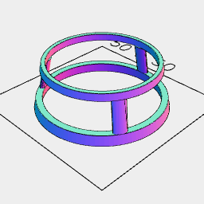
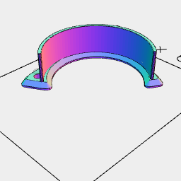
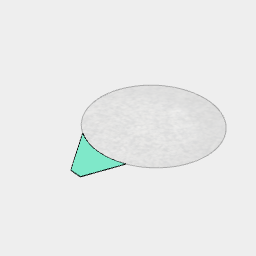

[mono40e.stl](monocle.mono40e.stl)

```JavaScript
const mono40e = And(
  Loft(Arc(40), Arc(34).z(14.5))
    .cut(Loft(Arc(40).inset(2), Arc(31.75).z(12.5), Arc(31.75).z(14.5)))
    .cut(Arc(40).ez([3, 12.5])),
  Loft(
    Arc(4, 2)
      .y((40 - 2) / 2 - 0.6)
      .z(3),
    Arc(4, 2)
      .y((34 - 2) / 2 + 0.4)
      .z(12.5)
  ).seq({ by: 1 / 3 }, rz)
)
  .fuse()
  .stl('mono40e');
```






[circlet.stl](monocle.circlet.stl)

```JavaScript
const circlet = Arc(30)
  .cutFrom(offset(2))
  .as('base')
  // .ez([5])
  .fitTo(As('beam', Box([7, 17], 3, 0)).seq({ by: 1 / 12 }, rz))
  .fitTo(As('beam2', Box([7, 17], 3, 0)).seq({ from: 1 / 24, by: 1 / 12 }, rz))
  .view('circlet')
  .on(get('beam').n(1), color('red').x(4.5))
  .on(get('beam').n(12), color('red').x(3.6))
  .on(get('beam').n(11), color('green').x(3.6 + 0.4 + 1.4))
  .on(get('beam').n(10), color('pink').x(7.5 + 0.25 + 1 + 2))
  .on(get('beam').n(9), color('green').x(6.4 + 0.4))
  .on(get('beam').n(8), color('red').x(5.7))
  .on(get('beam').n(7), color('red').x(5))
  .on(get('beam2').n(9), color('orange').x(7 + 0.25 + 1.5))
  .on(get('beam2').n(10), color('orange').x(7 + 0.25 + 1))
  .And(get('beam').n(1, 12, 11, 10, 9, 8), get('beam2').n(9, 10))
  .hull()
  .cut(Arc(34).x(2.5).y(6))
  .as('grip')
  .view('flat')
  .Loft(offset(1.5).z(-0.5), offset(1.5).z(0), offset(0.5).z(1), z(1.5))
  .cut(Arc(3).ez([-0.5, 3.5]).x(16.5).y(-8))
  .sz(-1)
  .ry(1 / 2)
  .and(
    Arc(36, { start: 5 / 8 - 1 / 64, end: 9 / 8 + 1 / 256 })
      .stroke(1)
      .x(-2)
      .y(5)
      .z(12)
      .ez([-10.5])
  )
  .stl('circlet', getNot('beam'));
```
