```JavaScript
const Base = (l = SIZE, w = SIZE) =>
  Box(l, w)
    .op(Loft(inset(1), z(1)), cut(inset(1)).ez([1, 6 + 1]))
    .clean();
```

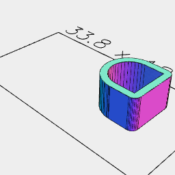

```JavaScript
const magnet = Box([3], 6)
  .join(Arc(6))
  .cutFrom(offset(1))
  .ez([1, 6.1])
  .and(Arc(4).Loft(z(0), z(1).offset(1)).gap())
  .x((SIZE - 8.2) / 2)
  .view(1);
```

```JavaScript
const Top = (l = SIZE, w = SIZE) => Box(l, w).inset(1).ez([-1]);
```


[base2x1.stl](openforge.base2x1.stl)

```JavaScript
const base2x1 = Base(SIZE * 2 - 0.2)
  .fitTo(
    Core('tlb')
      .x(-SIZE / 2)
      .sx(1, -1)
  )
  .stl('base2x1', fuse());
```

```JavaScript
const Connector = (play = 0.25) =>
  And(
    Box(SIZE / 2)
      .cut(inset(2))
      .op(ez([2.8]), offset(play).ez([3]).gap()),
    Box(SIZE / 2 + 8)
      .cut(inset(2))
      .op(ez([2.8]), offset(play).ez([3]).gap())
  );
```

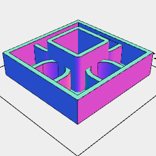

[base1x1.stl](openforge.base1x1.stl)

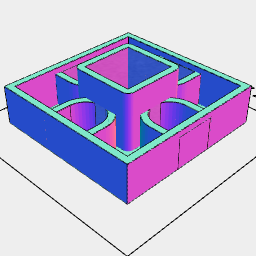

```JavaScript
const base1x1 = Base(SIZE - 0.2)
  .fitTo(Core())
  .stl('base1x1', fuse())
  .view();
```

```JavaScript
const Core = (magnets = 'tlrb') =>
  Box(8.2)
    .op(
      cutFrom(offset(1)).ez([1, 6 + 4]),
      ez([0, 6 + 4 + 0.25 - 0.15])
        .color('green')
        .gap()
    )
    .fit(
      (magnets.includes('r') ? magnet : spar).rz(0 / 4),
      (magnets.includes('b') ? magnet : spar).rz(1 / 4),
      (magnets.includes('l') ? magnet : spar).rz(2 / 4),
      (magnets.includes('t') ? magnet : spar).rz(3 / 4)
    );
```

```JavaScript
const hole = Box(8).Loft(z(0), z(0.5), offset(0.5).z(1)).gap();
```

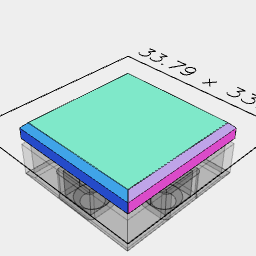

[tightTile.stl](openforge.tightTile.stl)

```JavaScript
const tightTile = Box(SIZE - 0.2)
  .Loft(inset(1).z(0), z(1), z(3), inset(1).z(4))
  .cut(base1x1.gap().z(-7.1), Connector(0.15))
  .z(-3)
  .stl('tightTile')
  .v(1);
```


[tile1x1.stl](openforge.tile1x1.stl)

```JavaScript
export const tile1x1 = Box(SIZE - 0.2)
  .Loft(inset(0.5).z(0), z(1), z(3), inset(1).z(4))
  .cut(base1x1.gap().z(-7.1), Connector(0.25))
  .z(-3)
  .stl('tile1x1')
  .v(1);
```

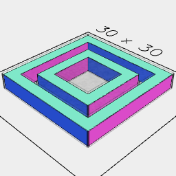

[connector.stl](openforge.connector.stl)

```JavaScript
const connector = Connector(0.25).stl('connector');
```

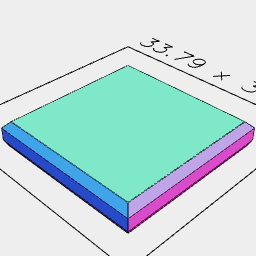

[looseTile.stl](openforge.looseTile.stl)

```JavaScript
const looseTile = Box(SIZE - 0.2)
  .Loft(inset(0.5).z(0), z(1), z(3), inset(1).z(4))
  .cut(base1x1.gap().z(-7.1), Connector(0.35))
  .z(-3)
  .stl('looseTile', fuse())
  .v(1);
```

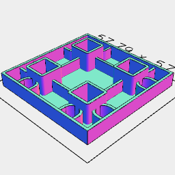

[base2x2.stl](openforge.base2x2.stl)

```JavaScript
const base2x2 = Base(SIZE * 2 - 0.2, SIZE * 2 - 0.2)
  .fitTo(
    Core('tr')
      .x(SIZE / 2)
      .y(SIZE / 2)
      .rz(0 / 4, 1 / 4, 2 / 4, 3 / 4)
  )
  .stl('base2x2', fuse());
```

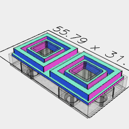

[top2x1.stl](openforge.top2x1.stl)

```JavaScript
const top2x1 = Top(SIZE * 2 - 0.2, SIZE - 0.2)
  .and(Connector().x(SIZE / 2, -SIZE / 2))
  .cut(base2x1.z(-7.1))
  .stl('top2x1');
```


[top1x1.stl](openforge.top1x1.stl)

```JavaScript
const top1x1 = Top(SIZE - 0.2)
  .and(Connector())
  .cut(base1x1.z(-7.1))
  .stl('top1x1');
```


[top2x2.stl](openforge.top2x2.stl)

```JavaScript
const top2x2 = Top(SIZE * 2 - 0.2, SIZE * 2 - 0.2)
  .join(
    Connector()
      .x(SIZE / 2, -SIZE / 2)
      .y(SIZE / 2, -SIZE / 2)
  )
  .cut(base2x2.z(-7.1))
  .stl('top2x2');
```


```JavaScript
Core().view().v(2);
```

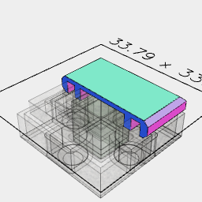

[tight_half_tile.stl](openforge.tight_half_tile.stl)

```JavaScript
const tightHalfTile = tightTile
  .clip(Box(SIZE, [0.1, SIZE / 2], SIZE))
  .clean()
  .stl('tight_half_tile')
  .v(1);
```


[tile2x2.stl](openforge.tile2x2.stl)

```JavaScript
export const tile2x2 = Box((SIZE - 0.1) * 2)
  .Loft(inset(0.5).z(0), z(1), z(3), inset(1).z(4))
  .cut(
    base1x1
      .gap()
      .z(-7.1)
      .x(SIZE / 2, -SIZE / 2)
      .y(SIZE / 2, -SIZE / 2),
    Connector(0.35)
      .x(SIZE / 2, -SIZE / 2)
      .y(SIZE / 2, -SIZE / 2)
  )
  .z(-3)
  .stl('tile2x2', fuse())
  .v(1);
```

```JavaScript
export const SIZE = 24;
```


```JavaScript
const spar = Box([3 + 2.2, -3 - 2, 2], 1)
  .ez([1, 6.1])
  .x((SIZE - 8.2) / 2)
  .view(1);
```

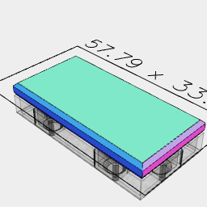

[tile2x1.stl](openforge.tile2x1.stl)

```JavaScript
const tile2x1 = Box(SIZE * 2 - 0.2, SIZE - 0.2)
  .Loft(inset(0.5).z(0), z(1), z(3), inset(1).z(4))
  .cut(base2x1.gap().z(-7.1), Connector(0.25).x(SIZE / 2, -SIZE / 2))
  .z(-3)
  .stl('tile2x1')
  .v(1);
```

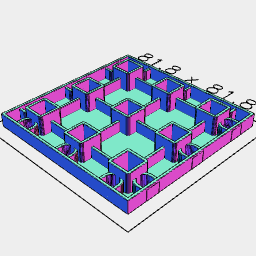

[base3x3.stl](openforge.base3x3.stl)

```JavaScript
const base3x3 = Base(SIZE * 3 - 0.2, SIZE * 3 - 0.2)
  .fitTo(
    Core('tr')
      .x(SIZE)
      .y(SIZE)
      .rz(0 / 4, 1 / 4, 2 / 4, 3 / 4),
    Core('r')
      .x(SIZE)
      .rz(0 / 4, 1 / 4, 2 / 4, 3 / 4),
    Core('')
  )
  .stl('base3x3', fuse());
```

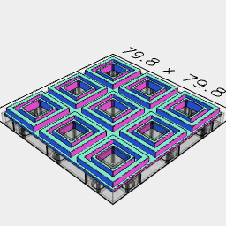

[top3x3.stl](openforge.top3x3.stl)

```JavaScript
const top3x3 = Top(SIZE * 3 - 0.2, SIZE * 3 - 0.2)
  .join(Connector().x(SIZE, 0, -SIZE).y(SIZE, 0, -SIZE))
  .cut(base3x3.z(-7.1))
  .stl('top3x3');
```
