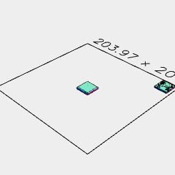
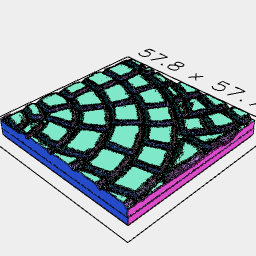
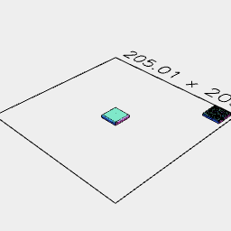
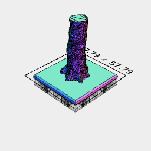

```JavaScript
import { SIZE, tile1x1, tile2x2 } from './openforge.nb';
```

```JavaScript
const treeTrunk = LoadStl(
  'https://jsxcad.js.org/stl/openforge/Terrain4Print/giant-1-12cm.stl'
).align('xyz>');
```

```JavaScript
const mud = LoadStl(
  'https://jsxcad.js.org/stl/openforge/mud-2x2.stl'
).align('xyz>');
```

```JavaScript
const stoneFloor = LoadStl(
  'https://jsxcad.js.org/stl/openforge/stone_floor.stl'
).align('z>');
```

```JavaScript
const brokenStoneFloor = LoadStl(
  'https://jsxcad.js.org/stl/openforge/broken_stone_floor.stl'
).align('z>');
```

```JavaScript
const cobbleFanRoad = LoadStl(
  'https://jsxcad.js.org/stl/openforge/cobble_fan_road.stl'
).align('xyz>');
```



[stone_floor_tile.stl](tiles.stone_floor_tile.stl)

```JavaScript
const stoneFloorTile = tile1x1
  .join(stoneFloor.scaleToFit(SIZE - 1 - 0.2, SIZE - 1 - 0.2))
  .fuse()
  .stl('stone_floor_tile');
```



[cobble_fan_road_tile.stl](tiles.cobble_fan_road_tile.stl)

```JavaScript
const cobbleFanRoadTile = tile2x2
  .join(cobbleFanRoad.scaleToFit((SIZE - 0.1) * 2, (SIZE - 0.1) * 2))
  .fuse()
  .stl('cobble_fan_road_tile');
```



[broken_stone_floor_1x1.stl](tiles.broken_stone_floor_1x1.stl)

```JavaScript
const brokenStoneFloorTile = tile1x1
  .join(brokenStoneFloor.scaleToFit(SIZE - 0.2, SIZE - 0.2))
  .fuse()
  .stl('broken_stone_floor_1x1');
```



[tree_trunk_tile.stl](tiles.tree_trunk_tile.stl)

```JavaScript
const treeTrunkTile = tile2x2
  .and(
    mud.scaleToFit((SIZE - 0.1) * 2, (SIZE - 0.1) * 2),
    treeTrunk.scaleToFit(SIZE - 0.2, SIZE - 0.2, 50)
  )
  .stl('tree_trunk_tile');
```
