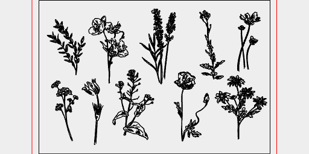

```JavaScript
await LoadSvg('https://jsxcad.js.org/svg/flowers.svg', { fill: false })
  .scale(1 / 60)
  .by(align())
  .and(toolpath())
  .gcode('flowers');
```



[flowers.gcode](flowers.flowers.gcode)
