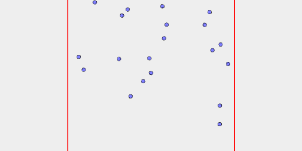

```JavaScript
const star = await Triangle(5)
  .seq({ upto: 120 / 360, by: 30 / 360 }, rz, Join)
  .view();
```


```JavaScript
const r = Random();
```

```JavaScript
const stars = await star
  .seq(
    { upto: 20 },
    () => x(r.in(-100, 100)).y(r.in(-100, 100)),
    Group
  )
  .and(toolpath())
  .gcode('stars');
```



[stars.gcode](stars.stars.gcode)
