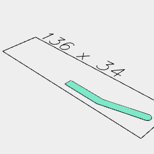
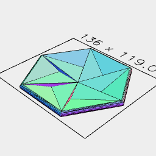

```JavaScript
const profile = await Arc(1, { start: 0 / 4, end: 2 / 4 })
  .x(10)
  .and(Point(5, -2), Point(0.001, -2), Point(0.001, -1), Point(5, -1))
  .loop()
  .fill()
  .scale(6)
  .view();
```



```JavaScript
const saucer = await profile
  .rx(1 / 4)
  .seq({ by: 1 / 6 }, rz, Loft)
  .view(2);
```

```JavaScript
const knob = await Loft(
  Hexagon(60)
    .rz(1 / 12)
    .z(-6.05),
  Hexagon(65)
    .rz(1 / 12)
    .z(5),
  Hexagon(60)
    .rz(1 / 12)
    .z(5),
  Hexagon(55)
    .rz(1 / 12)
    .z(-4),
  Hexagon(10).z(-4),
  Hexagon(12).z(0),
  Hexagon(18).z(3, 7),
  Hexagon(4).z(9)
)
  .masked(
    Loft(
      Hexagon(60)
        .rz(1 / 12)
        .z(-6.05),
      Hexagon(65)
        .rz(1 / 12)
        .z(5)
    ).grow(0.1, 'xy')
  )
  .as('knob')
  .view();
```

```JavaScript
const base = await saucer.lowerEnvelope('face').loft(Box(150).z(-12.01)).as('base');
```
