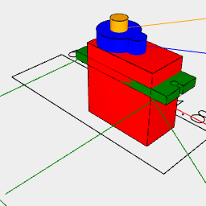

```JavaScript
const Sg90 = ({ length = 22.5, width = 11.8 } = {}) =>
  As(
    'sg90',
    As('body', Label('body', 50), Box(length, width, 22.7))
      .color('red')
      .align('x>z>y'),
    As(
      'bracket',
      Label('bracket', 50).rz(1 / 12),
      Box(length + 4.7 * 2, width, 2.5).fitTo(
        As(
          'hole',
          Label('hole', 50).rz(1 / 4),
          Arc(2)
            .join(Box([2.3], 1.3))
            .ez(2.5)
            .gap()
        )
          .x(length / 2 + 4.7 - 2.3)
          .sx(1, -1)
      )
    )
      .align('x>z>y')
      .x(-4.7)
      .z(15.9)
      .color('green'),
    As(
      'hub',
      Label('hub', 50).rz(-1 / 12),
      Arc(width)
        .ez([4])
        .join(Arc([8.8 - 5, 8.8], 5, [4]))
    )
      .align('x>z>y')
      .z(22.7)
      .color('blue'),
    As('axle', Label('Axle', 50).rz(-1 / 6), Arc(4.6).ez([3.2]))
      .align('z>y')
      .x(5.9)
      .z(26.7)
      .color('orange')
  )
    .to(get('axle').origin());
```



```JavaScript
export const sg90 = Sg90().view();
```
