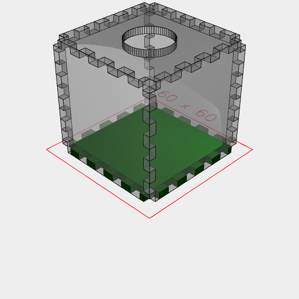
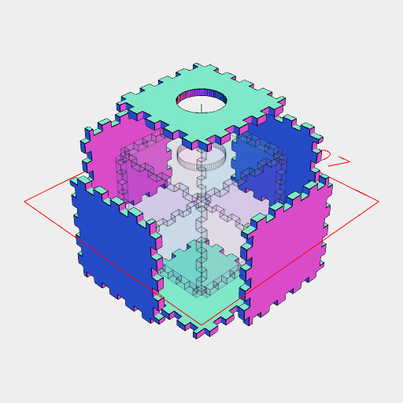

```JavaScript
const length = control('box length', 50, 'input');
```

```JavaScript
const width = control('box width', 50, 'input');
```

```JavaScript
const height = control('box height', 50, 'input');
```

```JavaScript
const thickness = control('pane thickness', 3, 'input');
```

```JavaScript
const hingeLength = control('hinge length', 5, 'input');
```

```JavaScript
const kerf = control('kerf', 0.09, 'input');
```

```JavaScript
const holeDiameter = control('hole diameter', 20, 'input');
```

```JavaScript
const Hinge = (l, thickness, hingeLength) =>
  Seq(
    { from: 0, by: hingeLength * 2, upto: l / 2 },
    (offset) =>
      Group(
        Box(
          [0, -thickness],
          [0, -thickness],
          [l / 2 - offset - hingeLength * 2, l / 2 - offset - hingeLength]
        ),
        Box(
          [0, -thickness],
          [0, -thickness],
          [l / 2 + offset, l / 2 + offset + hingeLength]
        )
      ),
    Group
  ).clip(Box([0, -thickness], [0, -thickness], [0, l]));
```

```JavaScript
const Terrarium = (length, width, height, thickness, hingeLength) =>
  Box(length, width, [0, height])
    .faces()
    .eachEdge(
      (e, l) => Hinge(l, thickness, hingeLength).to(e),
      (e, f) => f.e(-thickness).cut(e)
    )
    .cut(Arc(holeDiameter, holeDiameter, [height - thickness, height]))
    .material('glass')
    .on(n(0), material('plastic').color('green'))
    .clean()
    .view(1)
    .note(
      `Terrarium: ${length}x${width}x${height} thickness ${thickness} hinge length ${hingeLength} hole diameter ${holeDiameter}`
    )
    .each(flat())
    .section()
    .offset(kerf)
    .pack()
    .pdf('faces');
```

```JavaScript
Terrarium(length, width, height, thickness, hingeLength);
```



Terrarium: 50x50x50 thickness 3 hinge length 5 hole diameter 20



[faces_0.pdf](terrarium.faces_0.pdf)
