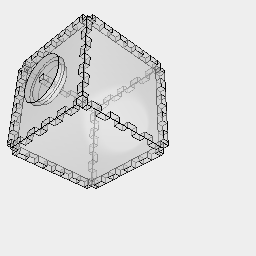
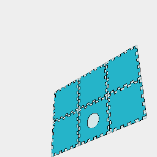
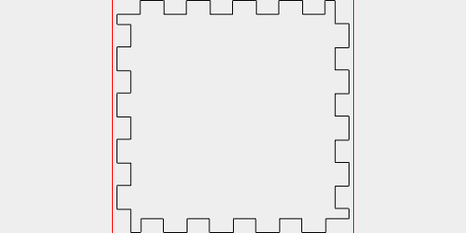
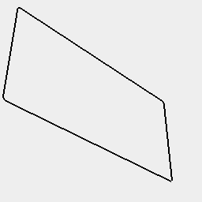

```JavaScript
const length = control('box length', 50, 'input');
```

```JavaScript
const width = control('box width', 50, 'input');
```

```JavaScript
const height = control('box height', 50, 'input');
```

```JavaScript
const thickness = control('pane thickness', 3, 'input');
```

```JavaScript
const hingeLength = control('hinge length', 5, 'input');
```

```JavaScript
const kerf = control('kerf', 0.09, 'input');
```

```JavaScript
const holeDiameter = control('hole diameter', 20, 'input');
```

```JavaScript
const Hinge = (l, thickness, hingeLength) =>
  Seq(
    { from: 0, by: hingeLength * 2, upto: l / 2 },
    (offset) =>
      Group(
        Box(
          [0, -thickness],
          [0, -thickness],
          [l / 2 - offset - hingeLength * 2, l / 2 - offset - hingeLength]
        ),
        Box(
          [0, -thickness],
          [0, -thickness],
          [l / 2 + offset, l / 2 + offset + hingeLength]
        )
      ),
    Group
  ).clip(Box([0, -thickness], [0, -thickness], [0, l]));
```

```JavaScript
const Lid = (holeDiameter, thickness, kerf) =>
  Arc(holeDiameter)
    .op(ez(-thickness), offset(2).ez(thickness))
    .fitTo(
      Box(thickness - kerf * 2, thickness - kerf * 2, thickness * 2).as('pin')
    )
    .material('glass')
    .as('lid');
```

```JavaScript
const makeLid = () => (shape) =>
  shape
    .get('lid')
    .in()
    .pdf(
      'lid_base',
      z(-thickness / 2)
        .section()
        .outline()
        .clean(1)
    )
    .pdf(
      'lid_top',
      z(thickness / 2)
        .section()
        .clean()
        .outline()
    )
    .pdf(
      'lid_pin',
      get('pin')
        .rx(1 / 4)
        .section()
        .flat()
        .offset(kerf)
        .clean()
        .outline()
    );
```

```JavaScript
const Terrarium = (
  length,
  width,
  height,
  thickness,
  hingeLength,
  holeDiameter,
  kerf
) =>
  Box(length, width, [0, height])
    .faces()
    .eachEdge(
      (e, l) => Hinge(l, thickness, hingeLength).to(e),
      (e, f) => f.e(-thickness).cut(e)
    )
    .cut(Arc(holeDiameter, holeDiameter, [height - thickness, height]))
    .material('glass')
    .on(n(0), material('plastic').color('green'))
    .clean()
    .as('terrarium');
```

```JavaScript
const makeTerrarium = () => (shape) =>
  shape
    .get('terrarium')
    .in()
    .note(
      `Terrarium: ${length}x${width}x${height} thickness ${thickness} hinge length ${hingeLength} hole diameter ${holeDiameter}`
    )
    .each(flat())
    .section()
    .offset(kerf)
    .pdf('faces', outline().page('pack', { itemsPerPage: 1 }));
```

```JavaScript
Terrarium(length, width, height, thickness, hingeLength, holeDiameter, kerf)
  .and(Lid(holeDiameter, thickness, kerf).z(height))
  .view()
  .z(-height)
  .op(makeTerrarium(), makeLid());
```


Terrarium: 50x50x50 thickness 3 hinge length 5 hole diameter 20


[faces_0.pdf](terrarium.faces_0.pdf)



[faces_1.pdf](terrarium.faces_1.pdf)


[faces_2.pdf](terrarium.faces_2.pdf)



[faces_3.pdf](terrarium.faces_3.pdf)



[faces_4.pdf](terrarium.faces_4.pdf)


[faces_5.pdf](terrarium.faces_5.pdf)



[lid_base_0.pdf](terrarium.lid_base_0.pdf)


[lid_top_0.pdf](terrarium.lid_top_0.pdf)


[lid_pin_0.pdf](terrarium.lid_pin_0.pdf)
