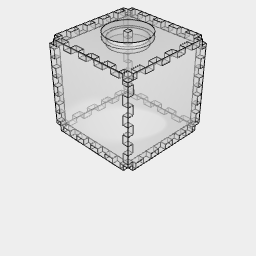
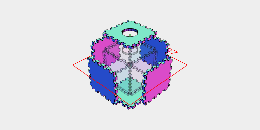
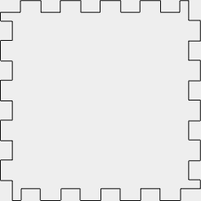
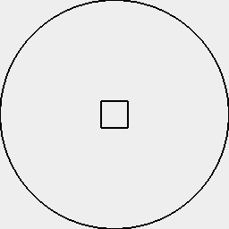
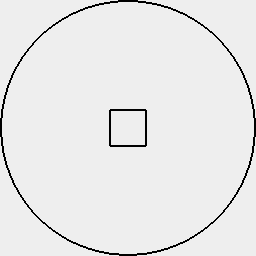
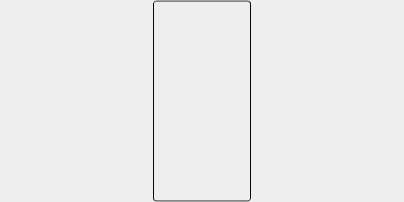

# Terrarium

This is a simple terrarium design intended to be cut from transparent acrylic.

* The terrarium forms a box with the corners removed, allowing for excess water drainage.
* A hole is provided in the top to allow the top panel to be removed or water to be added.
* A lid is provided for the hole to minimize moisture loss.

This terrarium was designed for growing moss, but might be useful for other kinds of plants as well.

### Parameters

```JavaScript
const length = control('box length', 50, 'input');
```

```JavaScript
const width = control('box width', 50, 'input');
```

```JavaScript
const height = control('box height', 50, 'input');
```

```JavaScript
const thickness = control('pane thickness', 3, 'input');
```

```JavaScript
const hingeLength = control('hinge length', 5, 'input');
```

```JavaScript
const kerf = control('kerf', 0.09, 'input');
```

```JavaScript
const holeDiameter = control('hole diameter', 20, 'input');
```

```JavaScript
const Hinge = (l, thickness, hingeLength) =>
  Seq(
    { from: 0, by: hingeLength * 2, upto: l / 2 },
    (offset) =>
      Group(
        Box(
          [0, -thickness],
          [0, -thickness],
          [l / 2 - offset - hingeLength * 2, l / 2 - offset - hingeLength]
        ),
        Box(
          [0, -thickness],
          [0, -thickness],
          [l / 2 + offset, l / 2 + offset + hingeLength]
        )
      ),
    Group
  ).clip(Box([0, -thickness], [0, -thickness], [0, l]));
```

```JavaScript
const Lid = (holeDiameter, thickness, kerf) =>
  Arc(holeDiameter)
    .op(ez([-thickness]), offset(2).ez([thickness]))
    .fitTo(
      Box(thickness - kerf * 2, thickness - kerf * 2, thickness * 2).as('pin')
    )
    .material('acrylic')
    .as('lid');
```

```JavaScript
const makeLid = () => (shape) =>
  shape
    .get('lid')
    .in()
    .note('#### Lid')
    .note('These profiles assemble to form the lid')
    .pdf(
      'lid_base',
      z(-thickness / 2)
        .section()
        .outline()
        .clean(1)
    )
    .pdf(
      'lid_top',
      z(thickness / 2)
        .section()
        .clean()
        .outline()
    )
    .pdf(
      'lid_pin',
      get('pin')
        .rx(1 / 4)
        .section()
        .flat()
        .offset(kerf)
        .clean()
        .outline()
    )
    .note(
      'Stack the larger disc on the smaller and then push the rectangular pin through to connect them.'
    );
```

```JavaScript
const Terrarium = (
  length,
  width,
  height,
  thickness,
  hingeLength,
  holeDiameter,
  kerf
) =>
  Box(length, width, [0, height])
    .faces()
    .eachEdge(
      (e, l) => s => Hinge(l, thickness, hingeLength).to(e),
      (e, f) => s => f.e([-thickness]).cut(e)
    )
    .cut(Arc(holeDiameter, holeDiameter, [height - thickness, height]))
    .material('acrylic')
    .clean()
    .as('terrarium');
```

```JavaScript
const makeTerrarium = () => (shape) =>
  shape
    .get('terrarium')
    .in()
    .each(flat().section().offset(kerf))
    .note('#### Panels')
    .note(
      "These are the profiles you'll need to cut out to assemble the terrarium."
    )
    .pdf('faces', outline().page('pack', { itemsPerPage: 1 }))
    .note('Fit the profiles together to form a box with the hole on the top.');
```

### Preview

This is a preview of the assembled 50x50x50mm terrarium formed from 3mm acrylic with a 5mm hinge length and a 20mm diameter hole in the top with matching plug, cut with a 0.09mm laser beam.

```JavaScript
const terrarium = await Terrarium(
  length,
  width,
  height,
  thickness,
  hingeLength,
  holeDiameter,
  kerf
)
  .and(Lid(holeDiameter, thickness, kerf).z(height))
  .view(1)
  .view(
    2,
    get('terrarium')
      .by(align())
      .in()
      .untag('material:acrylic')
      .each((s) =>
        s
          .ghost()
          .and(
            Edge(s.center(), s.center().moveAlong(s.center(), 1)).color(
              'green'
            ),
            s.moveAlong(s.center(), 1)
          )
      )
  );
```





### Instructions

Specify the dimensions of the terrarium you want, taking some care with the sheet thickness and kerf.

I recommend cutting two pieces to test how well they mesh with the kerf supplied.

The panels should have a snug fit, so that the assembly is solid without requiring glue.

The lid should have a snug fit internally, but a loose connection to the top panel so that it can be easily removed.

```JavaScript
await terrarium
  .z(-height)
  .note('### Laser cut profiles')
  .op(makeTerrarium(), makeLid());
```

### Laser cut profiles

#### Panels

These are the profiles you'll need to cut out to assemble the terrarium.



[faces.pdf](terrarium.faces.pdf)


[faces_2.pdf](terrarium.faces_2.pdf)


[faces_3.pdf](terrarium.faces_3.pdf)


[faces_4.pdf](terrarium.faces_4.pdf)


[faces_5.pdf](terrarium.faces_5.pdf)


[faces_6.pdf](terrarium.faces_6.pdf)

Fit the profiles together to form a box with the hole on the top.

#### Lid

These profiles assemble to form the lid



[lid_base.pdf](terrarium.lid_base.pdf)



[lid_top.pdf](terrarium.lid_top.pdf)



[lid_pin.pdf](terrarium.lid_pin.pdf)

Stack the larger disc on the smaller and then push the rectangular pin through to connect them.
