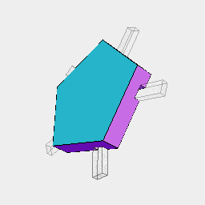
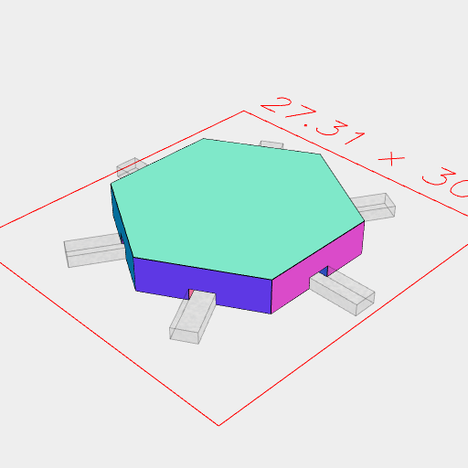

```JavaScript
const Tile = (sides, offset = 0) =>
  Arc(20)
    .hasSides(sides)
    .op(ez(3, 2), cut(inset(1)).ez(2, 1), cut(inset(2)).ez(1, 0))
    .fuse()
    .cut(
      Box(10, 2, [0, 1])
        .x(8)
        .seq({ by: 1 / sides, upto: 1 }, (t) => rz(t + offset))
    );
```

```JavaScript
const squareTile = Tile(4, 1 / 8).view();
```


```JavaScript
const fiveTile = Tile(5).view();
```



```JavaScript
const hexagonalTile = Tile(6).stl('hex');
```



[hex_0.stl](map.hex_0.stl)
