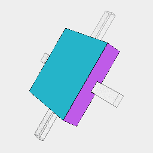
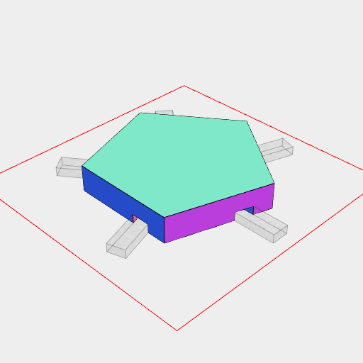
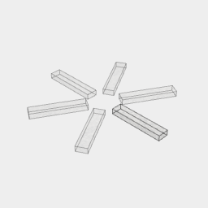

```JavaScript
const Tile = (sides, offset = 0) =>
  Arc(20, { sides })
    .op(ez([3, 2]), cut(inset(1)).ez([2, 1]), cut(inset(2)).ez([1, 0]))
    .fuse()
    .cut(
      Box(10, 2, [0, 1])
        .x(8)
        .seq({ by: 1 / sides, upto: 1 }, (t) => rz(t + offset))
    );
```



```JavaScript
const squareTile = await Tile(4, 1 / 8).view();
```



```JavaScript
const fiveTile = await Tile(5).view();
```



[hex.stl](map.hex.stl)

```JavaScript
const hexagonalTile = await Tile(6).stl('hex');
```
