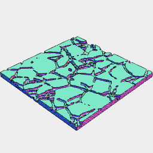
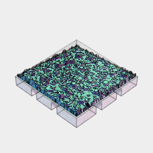
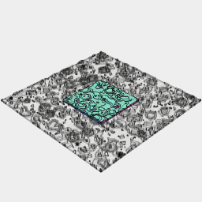
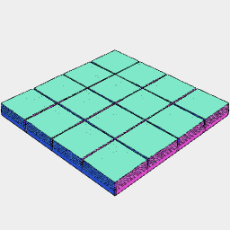
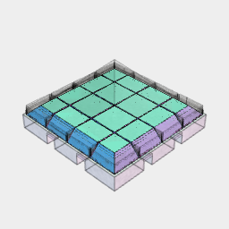
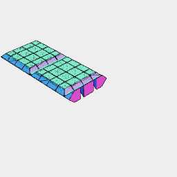

```JavaScript
const Tile = (play) =>
  Box(24 - play, 24 - play, [3])
    .cut(
      Box(2 + play, [4, 12], [2 + play * 2])
        .x(4, -4)
        .rz({ by: 1 / 4 }),
      Arc(14 + play / 2)
        .cut(Arc(10 - play / 2))
        .ez([2 + play * 2])
    )
    .clean()
    .view();
```


```JavaScript
const tile = Tile(0.2).clip(py.z(3)).maskedBy(Tile(0)).view();
```

```JavaScript
const Grid = (l, w) =>
  Box(l * 24 - 0.2, w * 24 - 0.2, [3])
    .cut(
      tile
        .x({ from: l * -12, upto: l * 12, by: 24 })
        .y({ from: w * -12, upto: w * 12, by: 24 })
    )
    .view();
```


```JavaScript
const grid1x1 = Grid(1, 1).view();
```


```JavaScript
const grid2x2 = Grid(2, 2).view();
```


[grid3x3.stl](tile6.grid3x3.stl)

```JavaScript
const grid3x3 = Grid(3, 3).stl('grid3x3');
```



```JavaScript
const contourFlagstone1 = LoadPng(
  'https://jsxcad.js.org/png/flagstone1.png',
  100,
  ez([0, 1]),
  150,
  ez([1, 2]),
  200,
  ez([2, 3]),
  250
)
  .align('xyz>')
  .view()
  .v(11);
```


```JavaScript
const contourRiverbed1 = LoadPng(
  'https://jsxcad.js.org/png/riverbed1.png',
  0,
  ez([0, 0.25]),
  25,
  ez([0, 0.5]),
  50,
  ez([0, 0.75]),
  75,
  ez([0, 1.0]),
  100,
  ez([0, 1.25]),
  125,
  ez([0, 1.5]),
  150,
  ez([0, 1.75]),
  175
)
  .align('xy')
  .v(7)
  .view();
```



[riverbed1a.stl](tile6.riverbed1a.stl)

```JavaScript
const tileRiverbed1a = tile
  .align('z<')
  .and(contourRiverbed1.scaleToFit(23, 23).clip(py.sz(-1)))
  .stl('riverbed1a')
  .v(2);
```



```JavaScript
contourRiverbed1.clip(Box(23.8, 23.8, [3])).view();
```


```JavaScript
Box(10).ez(1).view().v(9);
```



```JavaScript
const contourTile1 = LoadPng(
  'https://jsxcad.js.org/png/tile1.png',
  0,
  ez([0, 0.25]),
  25,
  ez([0, 0.5]),
  50,
  ez([0, 0.75]),
  75,
  ez([0, 1.0]),
  100,
  ez([0, 1.25]),
  125,
  ez([0, 1.5]),
  150,
  ez([0, 1.75]),
  175,
  ez([0, 2]),
  200
)
  .align('xyz>')
  .scaleToFit(23, 23, 2)
  .v(7)
  .view();
```



[tile1a.stl](tile6.tile1a.stl)

```JavaScript
const tileTile1a = tile
  .align('z<')
  .and(contourTile1.scaleToFit(23, 23).clip(py.sz(-1)))
  .stl('tile1a')
  .v(2);
```

```JavaScript
const py = Box(23).hull(Point(0, 0, -11.5));
```

```JavaScript
const Wall = (tile) =>
  grid1x1
    .noGap()
    .y(12, -12)
    .cutFrom(
      tile
        .align('z>')
        .and(rz(1 / 4).sz(-1))
        .ry(-1 / 4)
        .align('z>')
        .z(3, 3 + 24)
        .and(Box(7, 23, [3]))
        .clip(
          py
            .sz(1, -1)
            .ry(-1 / 4)
            .align('z>')
            .z(3, 4 - 24, 3 + 24)
            .fuse()
        )
        .and(Box(0.8, 22, [2, 24 * 2]))
    )
    .clean();
```

```JavaScript
const wallBrick1a = Wall(contourBrick1).stl('wall_brick', ry(1 / 4));
```



[wall_tile.stl](tile6.wall_tile.stl)

```JavaScript
const wallTile1a = Wall(contourTile1).stl('wall_tile', ry(1 / 4));
```

```JavaScript
const wallWood1a = Wall(contourWood1).stl('wall_wood', ry(1 / 4));
```
