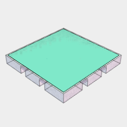
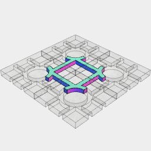
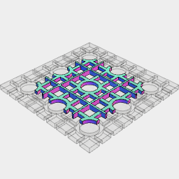
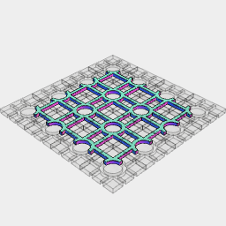
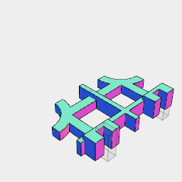
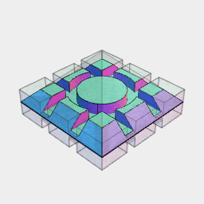

```JavaScript
const reliefFlagstone1 = LoadPngAsRelief('t/flagstone1.png')
  .align('xyz>')
  .scaleToFit(23.8, 23.8, 2)
  .view()
  .v(3);
```

```JavaScript
const Tile = (play) =>
  Box(23 - play, 23 - play, [3])
    .cut(
      Box(2 + play, [4, 12], [2 + play * 2])
        .x(4, -4)
        .rz({ by: 1 / 4 }),
      Arc(14 + play / 2)
        .cut(Arc(10 - play / 2))
        .ez([2 + play * 2])
    )
    .clean()
    .view();
```




```JavaScript
const tile = Tile(0.2).clip(py.z(3)).maskedBy(Tile(0)).view();
```

```JavaScript
const Grid = (l, w) =>
  Box(l * 24 - 0.2, w * 24 - 0.2, [3])
    .cut(
      tile
        .x({ from: l * -12, upto: l * 12, by: 24 })
        .y({ from: w * -12, upto: w * 12, by: 24 })
    )
    .view();
```




```JavaScript
const grid1x1 = Grid(1, 1).view();
```




```JavaScript
const grid2x2 = Grid(2, 2).view();
```




[grid3x3.stl](tile6.grid3x3.stl)

```JavaScript
const grid3x3 = Grid(3, 3).stl('grid3x3');
```

```JavaScript
const reliefRiverbed1 = LoadPngAsRelief('t/riverbed1.png')
  .align('xyz>')
  .scaleToFit(23.8, 23.8, 2)
  .view()
  .v(3);
```

```JavaScript
const reliefLeaf3 = LoadPngAsRelief('t/leaf3.png', { minimumValue: 25 })
  .align('xyz>')
  .scaleToFit(8, 8, 1)
  .view()
  .v(3);
```

```JavaScript
const contourFlagstone1 = LoadPng(
  't/flagstone1.png',
  100,
  ez([0, 1]),
  150,
  ez([1, 2]),
  200,
  ez([2, 3]),
  250
)
  .align('xyz>')
  .view()
  .v(11);
```

```JavaScript
const contourRiverbed1 = LoadPng(
  't/riverbed1.png',
  0,
  ez([0, 0.25]),
  25,
  ez([0, 0.5]),
  50,
  ez([0, 0.75]),
  75,
  ez([0, 1.0]),
  100,
  ez([0, 1.25]),
  125,
  ez([0, 1.5]),
  150,
  ez([0, 1.75]),
  175
)
  .align('xy')
  .v(7)
  .view();
```


```JavaScript
Box(10).ez(1).view().v(9);
```

```JavaScript
const contourTile1 = LoadPng(
  't/tile1.png',
  0,
  ez([0, 0.25]),
  25,
  ez([0, 0.5]),
  50,
  ez([0, 0.75]),
  75,
  ez([0, 1.0]),
  100,
  ez([0, 1.25]),
  125,
  ez([0, 1.5]),
  150,
  ez([0, 1.75]),
  175,
  ez([0, 2]),
  200
)
  .align('xy')
  .v(7)
  .view();
```

```JavaScript
const contourWood1 = LoadPng(
  't/wood1.png',
  0,
  ez([0, 0.25]),
  25,
  ez([0, 0.5]),
  50,
  ez([0, 0.75]),
  75,
  ez([0, 1.0]),
  100,
  ez([0, 1.25]),
  125,
  ez([0, 1.5]),
  150,
  ez([0, 1.75]),
  175,
  ez([0, 2]),
  200
)
  .align('xy')
  .v(7)
  .view();
```

```JavaScript
const contourSoil1 = LoadPng(
  't/soil1.png',
  0,
  ez([0, 0.1]),
  0.1 * 256,
  ez([0, 0.2]),
  0.2 * 256,
  ez([0, 0.3]),
  0.3 * 256,
  ez([0, 0.4]),
  0.4 * 256,
  ez([0, 0.5]),
  0.5 * 256,
  ez([0, 0.6]),
  0.6 * 256,
  ez([0, 0.7]),
  0.7 * 256,
  ez([0, 0.8]),
  0.8 * 256,
  ez([0, 0.9]),
  0.9 * 256,
  ez([0, 1]),
  1 * 256
)
  .align('xy')
  .v(7)
  .view();
```

```JavaScript
const contourStone1 = LoadPng(
  't/stone1.png',
  0,
  ez([0, 0.1]),
  0.1 * 256,
  ez([0, 0.2]),
  0.2 * 256,
  ez([0, 0.3]),
  0.3 * 256,
  ez([0, 0.4]),
  0.4 * 256,
  ez([0, 0.5]),
  0.5 * 256,
  ez([0, 0.6]),
  0.6 * 256,
  ez([0, 0.7]),
  0.7 * 256,
  ez([0, 0.8]),
  0.8 * 256,
  ez([0, 0.9]),
  0.9 * 256,
  ez([0, 1]),
  1 * 256
)
  .align('xy')
  .v(7)
  .view();
```

```JavaScript
const contourRocks1 = LoadPng(
  't/rocks1.png',
  0,
  ez([0, 0.1]),
  0.1 * 256,
  ez([0, 0.2]),
  0.2 * 256,
  ez([0, 0.3]),
  0.3 * 256,
  ez([0, 0.4]),
  0.4 * 256,
  ez([0, 0.5]),
  0.5 * 256,
  ez([0, 0.6]),
  0.6 * 256,
  ez([0, 0.7]),
  0.7 * 256,
  ez([0, 0.8]),
  0.8 * 256,
  ez([0, 0.9]),
  0.9 * 256,
  ez([0, 1]),
  1 * 256
)
  .align('xy')
  .v(7)
  .view();
```

```JavaScript
const contourBrick1 = LoadPng(
  't/brick2.png',
  0,
  ez([0, 0.1]),
  0.1 * 256,
  ez([0, 0.2]),
  0.2 * 256,
  ez([0, 0.3]),
  0.3 * 256,
  ez([0, 0.4]),
  0.4 * 256,
  ez([0, 0.5]),
  0.5 * 256,
  ez([0, 0.6]),
  0.6 * 256,
  ez([0, 0.7]),
  0.7 * 256,
  ez([0, 0.8]),
  0.8 * 256,
  ez([0, 0.9]),
  0.9 * 256,
  ez([0, 1.0]),
  1 * 256
)
  .align('xyz>')
  .v(7)
  .view();
```

```JavaScript
const py = Box(23).hull(Point(0, 0, -11.5));
```



[wall.stl](tile6.wall.stl)

```JavaScript
const wall2 = grid1x1
  .And(
    ry(-1 / 4)
      .join(
        Box([0, 4], [5, 11], [-3, 1])
          .clip(RY(-1 / 32).x(3))
          .sy(1, -1)
      )
      .fuse()
      .cut(Box([-1, 5], [7 - 0.1, 9 - 0.1], [-4, -1]).sy(1, -1))
      .x(-12 - 3)
      .y(12)
      .z(3)
      .as('upright')
    //x(-12).y(12)
  )
  .cut(Z(0))
  .stl('wall', ry(1 / 4));
```



```JavaScript
const wall = tile.align('z<').sz(1, -1).view();
```
