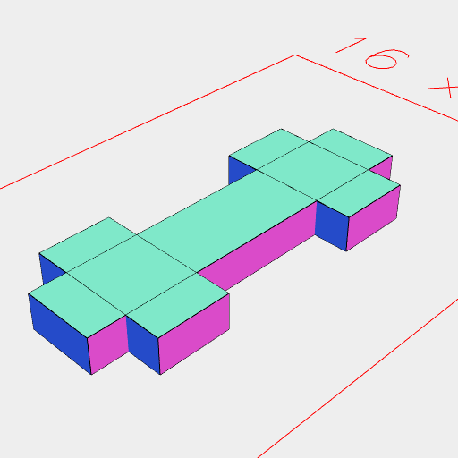
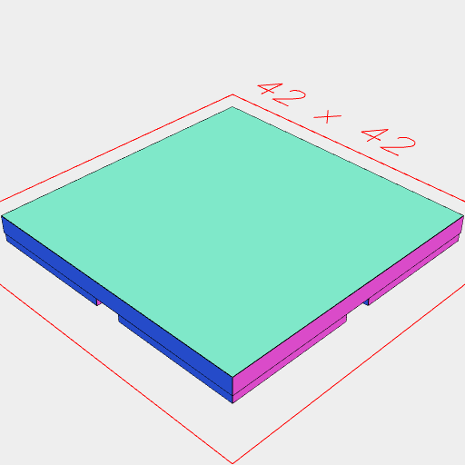
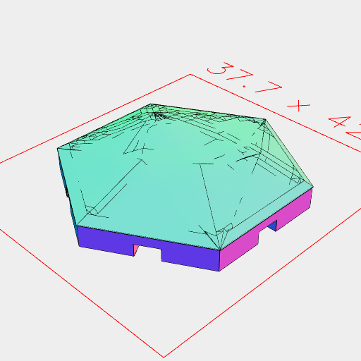

```JavaScript
const hex = Hexagon(32);
```

```JavaScript
const Tab = (thickness, tabLength) =>
  Box([0.5, -1], [thickness * 5, -thickness * 5], [thickness, -thickness])
    .and(
      Box(
        [0.5, -1],
        [thickness * 2, thickness * 4],
        [thickness * 2, thickness * -2]
      ),
      Box(
        [0.5, -1],
        [thickness * -2, thickness * -4],
        [thickness * 2, thickness * -2]
      )
    )
    .as('tab');
```

```JavaScript
const placeTab = (tab) => (e, l) => (s) =>
  tab
    .z(l * (1 / 2))
    .color('red')
    .mask(grow(0.1, 'yz').grow(0.2, 'x'))
    .to(e);
```

```JavaScript
const tab = Tab(1.5, 32 / 8);
```

```JavaScript
tab.stl('tab', ry(1 / 4));
```



[tab_1.stl](hex.tab_1.stl)

```JavaScript
const hexTile = hex
  .inset(0.1)
  .ez(2, -1)
  .cut(hex.eachEdge(placeTab(tab)))
  /*
  .cut(
    Hexagon(32).eachEdge(
      (e, l, o) => (s) => s.at(e.origin(), s.by(o.origin()).get('tab'))
    )
  )
*/
  .fuse()
  .clean()
  .stl('hex_tile');
```


[hex_tile_1.stl](hex.hex_tile_1.stl)

```JavaScript
const square = Box(32);
```

```JavaScript
const squareTile = square
  .eachEdge(placeTab(tab), (e, f) => (s) => f.inset(0.1).e(-1).fitTo(e.void()))
  .join(square.ez(2))
  .cut(
    Box(32).eachEdge(
      (e, l, o) => (s) => s.at(e.origin(), s.by(o.origin()).get('tab'))
    )
  )
  .fuse()
  .clean()
  .stl('square_tile');
```



[square_tile_1.stl](hex.square_tile_1.stl)

```JavaScript
const Tree = Cached('Tree', (seed = 0) => {
  const dx = random(seed).in(3, -3);
  const dy = random(seed + 1).in(3, -3);
  const dz = random(seed + 2).in(4, 8);
  return Hull(Orb(6), Point(dx(0), dy(0), dz(0)))
    .join(Arc(2, 2, [-4]))
    .by(align('z>'))
    .remesh(1)
    .smooth(Box(8, 8, [3, 20]))
    .clean();
});
```

```JavaScript
const Mountainous =
  (maxHeight = 13, minHeight = 1, peaks = 10) =>
  (seed = 0) => {
    const turn = random(seed + 1).in(0, 1);
    const distance = random(seed + 2).in(0, 13);
    const height = random(seed + 3).in(minHeight, maxHeight);
    return Seq({ upto: peaks }, (t) =>
      Hull(hex, Point(distance(t), 0, height(t)).rz(turn(t)))
    )
      .fuse()
      .remesh(1)
      .smooth(hex.ez(0.2, 21))
      .clean()
      .z(2)
      .and(hexTile);
  };
```

```JavaScript
const Mountain = Cached('Mountain', Mountainous(20, 1));
```

```JavaScript
const Hill = Cached('Hill', Mountainous(6));
```

```JavaScript
const Meadow = Cached('Meadow', Mountainous(2, 0));
```

```JavaScript
const Forest = Cached('Forest', (seed = 0, turn = 0, count = 40) => {
  console.log(`Forest: seed=${seed}, turn=${turn}, count=${count}`);
  const getAngle = random(seed + 1).in(0, 1);
  const getDistance = random(seed + 2).in(0, 13);
  const trees = [];
  for (let nth = 0; nth < count; nth++) {
    const angle = getAngle(nth);
    const distance = getDistance(nth);
    if (turn === 0) {
      if (distance >= 13 / 2) {
        continue;
      }
    } else if (
      angle < turn - 1 / 12 ||
      angle >= turn + 1 / 12 ||
      distance < 13 / 2
    ) {
      continue;
    }
    trees.push(
      Tree((seed + nth) % 10)
        .x(distance)
        .rz(angle)
    );
  }
  return Group(...trees).z(2);
});
```

```JavaScript
const River = Cached('River', (seed = 0, to = 3 / 6, from = 0 / 6) => {
  const dy1 = random(seed * 111).in(-18, 18);
  const dy2 = random(seed * 69).in(-18, 18);
  const dr = random(seed * 123).in(3, 6);
  return Curve(
    Point(16 - 2, 0, 0).rz(from),
    Point(8, dy1(0)).rz(from),
    Point(8, dy2(1)).rz(to),
    Point(16 - 2, 0, 0).rz(to)
  )
    .eachPoint((p, n) => (s) => Orb(2, dr(n), 4).hasZag(1).to(p), ChainHull)
    .z(3)
    .clean()
    .fuse();
});
```

```JavaScript
const Path = Cached('Path', (seed = 0, to = 3 / 6, from = 0 / 6) => {
  const dy1 = random(seed * 87).in(-20, 20);
  const dy2 = random(seed * 31).in(-20, 20);
  const curve =
    to === 0
      ? Curve(
          Point(16 - 2, 0, 0).rz(from),
          Point(11, dy1(0)).rz(from),
          Point(5, dy2(1)).rz(from),
          Point(0, 0, 0)
        )
      : Curve(
          Point(16 - 2, 0, 0).rz(from),
          Point(6, dy1(0)).rz(from),
          Point(6, dy2(1)).rz(to),
          Point(16 - 2, 0, 0).rz(to)
        );
  return curve
    .eachPoint(
      (p, n) => (s) =>
        Arc(2, 2, [0, 4])
          .and(Orb(2, 2, [3, 5]).hasZag(1))
          .to(p),
      ChainHull
    )
    .clean()
    .fuse();
});
```

```JavaScript
const Wall = Cached('Wall', (seed = 0, to = 3 / 6, from = 0 / 6) => {
  const dy1 = random(seed * 13).in(-10, 10);
  const dy2 = random(seed * 49).in(-10, 10);
  return Curve(
    Point(16 - 2, 0, 0).rz(from),
    Point(6, dy1(0)).rz(from),
    Point(6, dy2(0)).rz(to),
    Point(16 - 2, 0, 0).rz(to)
  )
    .eachPoint((p, n) => (s) => Arc(1.5, 1.5, [1, 10]).to(p), ChainHull)
    .clip(hex.ez(10))
    .clean()
    .fuse();
});
```

```JavaScript
const place = (turn) => {
  if (turn === 0) {
    return Point();
  } else {
    return Point()
      .x(13 / 2)
      .rz(turn);
  }
};
```

```JavaScript
const CityWall = (seed = 0, turn = 0) =>
  Arc(13).cut(inset(2)).ez(2, 5).to(place(turn));
```

```JavaScript
const City = (
  seed = 0,
  turn = 0,
  rd = random(seed * 27).in(2, 8),
  ra = random(seed * 54).in(0, 1),
  rl = random(seed * 71).in(1, 2),
  rw = random(seed * 81).in(1, 4),
  rh = random(seed * 59).in(2, 4)
) =>
  Arc(11)
    .op(ez(1, 2), ez(2, 10).void())
    .and(
      Seq({ to: 20 }, (n) =>
        Box(rl(n), rw(n), [1, rh(n)])
          .x(rd(n))
          .rz(ra(n))
      )
    )
    .to(place(turn));
```

```JavaScript
const Tile = (...args) => {
  console.log(`QQ/Tile: ${JSON.stringify(args)}`);
  const [seed = 0, { terrain, trees, river, path, wall, city }] = args;
  const tileTerrain = { meadow: Meadow, hill: Hill, mountain: Mountain }[
    terrain
  ](seed);
  let tile = tileTerrain;

  for (const turn of trees.split(',').map((value) => parseInt(value))) {
    if (!isFinite(turn)) {
      continue;
    }
    tile = tile.and(Forest(seed, turn / 6));
  }

  /*
  const wallTurns = wall
    .split(',')
    .map((value) => parseInt(value))
    .filter(isFinite);

  const walls = [];
  for (let nth = 1; nth < wallTurns.length; nth += 2) {
    walls.push(Wall(seed, wallTurns[nth] / 6, wallTurns[nth - 1] / 6));
  }

  if (walls.length > 0) {
    tile = tile.join(...walls);
  }
*/

  const riverTurns = river
    .split(',')
    .map((value) => parseInt(value))
    .filter(isFinite);

  for (let nth = 1; nth < riverTurns.length; nth += 2) {
    tile = tile.cut(River(seed, riverTurns[nth] / 6, riverTurns[nth - 1] / 6));
  }

  const cityTurns = city
    .split(',')
    .map((value) => parseInt(value))
    .filter(isFinite);

  for (const turn of cityTurns) {
    tile = tile.join(CityWall(seed, turn / 6));
  }

  const paths = [];
  const pathTurns = path
    .split(',')
    .map((value) => parseInt(value))
    .filter(isFinite);
  console.log(`QQQ/pathTurns: ${JSON.stringify(pathTurns)}`);
  for (let nth = 1; nth < pathTurns.length; nth += 2) {
    console.log(`QQQ/path: ${nth}`);
    paths.push(Path(seed, pathTurns[nth] / 6, pathTurns[nth - 1] / 6));
  }

  if (paths.length > 0) {
    tile = tile.cut(
      Join(...paths)
        .cut(tileTerrain)
        .z(-0.5)
    );
  }

  for (const turn of cityTurns) {
    tile = tile.fitTo(City(seed, turn / 6));
  }

  return tile.clean().fuse();
};
```

### Tile Generator

```JavaScript
const seed2 = control('seed', '0', 'input');
```

```JavaScript
const terrain = control('terrain', 'meadow', 'select', [
  'meadow',
  'hill',
  'mountain',
]);
```

```JavaScript
const trees2 = control('trees', '1', 'input');
```

```JavaScript
const river = control('river', '', 'input');
```

```JavaScript
const path = control('path', '', 'input');
```

```JavaScript
const city = control('city', '', 'input');
```

```JavaScript
Tile(seed2, { terrain, trees: trees2, river, path, city }).stl('tile');
```



[tile_1.stl](hex.tile_1.stl)
