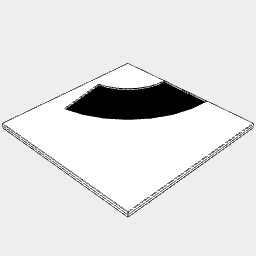
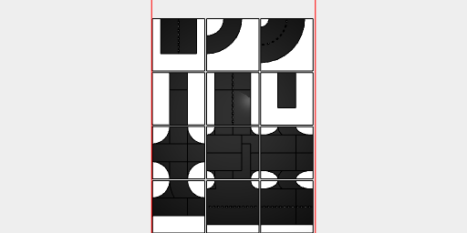
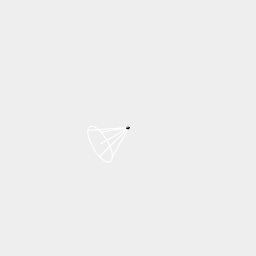

```JavaScript
const laneWidth = control('lane width', 3.5, 'input');
```

```JavaScript
const mm = 160 / 1000;
```

```JavaScript
const tileWidth = 64 * mm;
```

Each tile is 64mm

```JavaScript
const curve = await Line(laneWidth / -2, laneWidth / 2)
  .x(tileWidth / 2)
  .seq({ by: 1 / 32, to: 1 / 4 }, rz, ChainHull)
  .x(tileWidth / -2)
  .y(tileWidth / 2)
  .color('black')
  .tag('road_surface');
```

```JavaScript
const tightCurve = await Line(laneWidth / -2, laneWidth / 2)
  .x(tileWidth / 4)
  .seq({ by: 1 / 32, to: 1 / 4 }, rz, ChainHull)
  .x(tileWidth / -4)
  .y(tileWidth / 2)
  .color('black')
  .tag('road_surface');
```

```JavaScript
const doubleLaneCurve = await Line(-laneWidth, laneWidth)
  .x(tileWidth / 2)
  .seq({ by: 1 / 32, to: 1 / 4 }, rz, ChainHull)
  .x(tileWidth / -2)
  .y(tileWidth / 2)
  .color('black')
  .tag('road_surface');
```

```JavaScript
const doubleLaneCurveMarked = await doubleLaneCurve.fitTo(
  Box(0.2, 0.4)
    .x(tileWidth / 2)
    .color('white')
    .tag('road_marking')
    .seq({ from: 1 / 64, by: 1 / 32, to: 1 / 4 }, rz)
    .x(tileWidth / -2)
    .y(tileWidth / 2)
);
```

```JavaScript
const tile = await Box(tileWidth)
  .color('white')
  .tag('pavement')
  .and(outline().color('black'));
```

```JavaScript
const lane = await Box(laneWidth, [laneWidth / -2, tileWidth / 2])
  .color('black')
  .tag('road_surface');
```

```JavaScript
const doubleLane = await lane
  .x(laneWidth / -2, laneWidth / 2)
  .color('black')
  .tag('road_surface');
```

```JavaScript
const doubleLaneMarked = await doubleLane.fitTo(
  Box(0.2, 0.4)
    .color('white')
    .tag('road_marking')
    .seq({ from: laneWidth / -2 + 0.6, upto: tileWidth / 2 - 0.1, by: 0.8 }, y)
);
```

```JavaScript
const roadEndTile = await tile.fitTo(lane.rz(0 / 4)).as('road end');
```

```JavaScript
const doubleLaneRoadEndTile = await tile
  .fitTo(doubleLaneMarked.rz(0 / 4))
  .as('double lane road end');
```

```JavaScript
const curvedRoadTile = await tile.fitTo(curve).as('curved road');
```

```JavaScript
const doubleLaneCurvedRoadTile = await tile
  .fitTo(doubleLaneCurveMarked)
  .as('2 lane curved road');
```

```JavaScript
const roadCornerTile = await tile.fitTo(lane.rz(0 / 4, 1 / 4)).as('road corner');
```

```JavaScript
const threeWayIntersectionTile = await tile
  .fitTo(lane.rz(0 / 4, 1 / 4, 2 / 4))
  .as('3 way intersection');
```

```JavaScript
const curvedThreeWayIntersectionTile = await tile
  .fitTo(curve.rz(0 / 4, 1 / 4), lane.rz(1 / 4, 3 / 4))
  .as('curved 3 way intersection');
```

```JavaScript
const fourWayIntersectionTile = await tile
  .fitTo(lane.rz(0 / 4, 1 / 4, 2 / 4, 3 / 4))
  .as('4 way intersection');
```

```JavaScript
const curvedFourWayIntersectionTile = await tile
  .fitTo(
    curve.rz(0 / 4, 1 / 4, 2 / 4, 3 / 4),
    lane.rz(0 / 4, 1 / 4, 2 / 4, 3 / 4)
  )
  .as('curved 4 way intersection');
```

```JavaScript
const doubleLaneCurvedFourWayIntersectionTile = await tile
  .fitTo(
    doubleLaneCurve.rz(0 / 4, 1 / 4, 2 / 4, 3 / 4),
    doubleLane.rz(0 / 4, 1 / 4, 2 / 4, 3 / 4)
  )
  .as('2 lane curved 4 way intersection');
```

```JavaScript
const roadTile = await tile.fitTo(lane.rz(0 / 4, 2 / 4)).as('road');
```

```JavaScript
const doubleLaneRoadTile = await tile
  .fitTo(doubleLaneMarked.rz(0 / 4, 2 / 4))
  .as('double lane road');
```

```JavaScript
const doubleLaneCurvedThreeWayIntersectionTile = await tile
  .fitTo(doubleLaneCurve.rz(0 / 4, 1 / 4).join(doubleLane.rz(1 / 4, 3 / 4)))
  .fitTo(
    Box(0.2, 0.4)
      .color('white')
      .seq(
        { from: laneWidth / -2 + 0.6, upto: tileWidth / 2 - 0.1, by: 0.8 },
        y
      )
      .rz(1 / 4, 3 / 4)
  )
  .as('2 lane 3 way curved intersection');
```

```JavaScript
const doubleToSingleLaneCurvedThreeWayIntersectionTile = await tile
  .fitTo(
    curve
      .y(tileWidth / -2)
      .sy(0.5)
      .y(tileWidth / 2)
      .sx(1, -1)
      .color('black'),
    doubleLaneMarked.rz(1 / 4, 3 / 4)
  )
  .as('2 to 1 lane 3 way curved intersection');
```

```JavaScript
const doubleToSingleLaneCurvedFourWayIntersectionTile = await tile
  .fitTo(
    curve
      .y(tileWidth / -2)
      .sy(0.5)
      .y(tileWidth / 2)
      .sx(1, -1)
      .sy(1, -1)
      .color('black'),
    doubleLane.rz(1 / 4, 3 / 4)
  )
  .as('2 to 1 lane 4 way curved intersection');
```

```JavaScript
const extrudeTile = () => async (shape) => {
  console.log(`QQ/extrudeTile/shape: ${JSON.stringify(shape)}`);
  const result = await shape
    .on(getAll('user:road_marking'), ez(1.2 * mm))
    .on(getAll('user:road_surface'), ez(1 * mm))
    .on(getAll('user:pavement'), ez(2 * mm));
  console.log(`QQ/extrudeTile/result: ${JSON.stringify(result)}`);
  return result;
}
```

```JavaScript
await Group(roadTile, curvedRoadTile)
  .op(extrudeTile())
  .stl('3yd tiles', page('individual'));
```

[3yd tiles_1.stl](road.3yd%20tiles_1.stl)



[3yd tiles_3.stl](road.3yd%20tiles_3.stl)

```JavaScript
await Group(
  roadTile.copy(1),
  doubleLaneRoadTile.copy(1),
  roadEndTile.copy(1),
  doubleLaneRoadEndTile.copy(1),
  curvedRoadTile.copy(1),
  doubleLaneCurvedRoadTile.copy(1),
  curvedThreeWayIntersectionTile.copy(1),
  curvedFourWayIntersectionTile.copy(1),
  doubleLaneCurvedFourWayIntersectionTile.copy(1),
  doubleLaneCurvedThreeWayIntersectionTile.copy(1),
  doubleToSingleLaneCurvedThreeWayIntersectionTile.copy(1),
  doubleToSingleLaneCurvedFourWayIntersectionTile.copy(1)
)
  .scale(1000 / 160)
  .clean()
  .pdf('2d road tile', page('a4', 'pack'))
  .stl('3d road tile', op(extrudeTile()).page('individual'));
```



[2d road tile_0.pdf](road.2d%20road%20tile_0.pdf)

[3d road tile_1.stl](road.3d%20road%20tile_1.stl)



[3d road tile_3.stl](road.3d%20road%20tile_3.stl)


[3d road tile_5.stl](road.3d%20road%20tile_5.stl)


[3d road tile_7.stl](road.3d%20road%20tile_7.stl)


[3d road tile_9.stl](road.3d%20road%20tile_9.stl)


[3d road tile_11.stl](road.3d%20road%20tile_11.stl)


[3d road tile_13.stl](road.3d%20road%20tile_13.stl)


[3d road tile_15.stl](road.3d%20road%20tile_15.stl)


[3d road tile_17.stl](road.3d%20road%20tile_17.stl)


[3d road tile_19.stl](road.3d%20road%20tile_19.stl)


[3d road tile_21.stl](road.3d%20road%20tile_21.stl)


[3d road tile_23.stl](road.3d%20road%20tile_23.stl)
