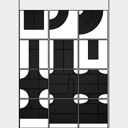

```JavaScript
const laneWidth = control('lane width', 3.5, 'input');
```

```JavaScript
const mm = 160 / 1000;
```

```JavaScript
const tileWidth = 64 * mm;
```

Each tile is 64mm

```JavaScript
const curve = await Line(laneWidth)
  .x(tileWidth / 2)
  .seq({ by: 1 / 32, to: 1 / 4 }, rz, ChainHull)
  .x(tileWidth / -2)
  .y(tileWidth / 2)
  .color('black')
  .tag('road_surface');
```

```JavaScript
const tightCurve = await Line(laneWidth)
  .x(tileWidth / 4)
  .seq({ by: 1 / 32, to: 1 / 4 }, rz, ChainHull)
  .x(tileWidth / -4)
  .y(tileWidth / 2)
  .color('black')
  .tag('road_surface');
```

```JavaScript
const doubleLaneCurve = await Line(laneWidth * 2)
  .x(tileWidth / 2)
  .seq({ by: 1 / 32, to: 1 / 4 }, rz, ChainHull)
  .x(tileWidth / -2)
  .y(tileWidth / 2)
  .color('black')
  .tag('road_surface');
```

```JavaScript
const doubleLaneCurveMarked = await doubleLaneCurve.fitTo(
  Box(0.2, 0.4)
    .x(tileWidth / 2)
    .color('white')
    .tag('road_marking')
    .seq({ from: 1 / 64, by: 1 / 32, to: 1 / 4 }, rz)
    .x(tileWidth / -2)
    .y(tileWidth / 2)
);
```

```JavaScript
const tile = await Box(tileWidth)
  .color('white')
  .tag('pavement')
  .and(outline().color('black'));
```

```JavaScript
const lane = await Box(laneWidth, [laneWidth / -2, tileWidth / 2])
  .color('black')
  .tag('road_surface');
```

```JavaScript
const doubleLane = await lane
  .x(laneWidth / -2, laneWidth / 2)
  .color('black')
  .tag('road_surface');
```

```JavaScript
const doubleLaneMarked = await doubleLane.fitTo(
  Box(0.2, 0.4)
    .color('white')
    .tag('road_marking')
    .seq({ from: laneWidth / -2 + 0.6, upto: tileWidth / 2 - 0.1, by: 0.8 }, y)
);
```

```JavaScript
const roadEndTile = await tile.fitTo(lane.rz(0 / 4)).as('road end');
```

```JavaScript
const doubleLaneRoadEndTile = await tile
  .fitTo(doubleLaneMarked.rz(0 / 4))
  .as('double lane road end');
```

```JavaScript
const curvedRoadTile = await tile.fitTo(curve).as('curved road');
```

```JavaScript
const doubleLaneCurvedRoadTile = await tile
  .fitTo(doubleLaneCurveMarked)
  .as('2 lane curved road');
```

```JavaScript
const roadCornerTile = await tile.fitTo(lane.rz(0 / 4, 1 / 4)).as('road corner');
```

```JavaScript
const threeWayIntersectionTile = await tile
  .fitTo(lane.rz(0 / 4, 1 / 4, 2 / 4))
  .as('3 way intersection');
```

```JavaScript
const curvedThreeWayIntersectionTile = await tile
  .fitTo(curve.rz(0 / 4, 1 / 4), lane.rz(1 / 4, 3 / 4))
  .as('curved 3 way intersection');
```

```JavaScript
const fourWayIntersectionTile = await tile
  .fitTo(lane.rz(0 / 4, 1 / 4, 2 / 4, 3 / 4))
  .as('4 way intersection');
```

```JavaScript
const curvedFourWayIntersectionTile = await tile
  .fitTo(
    curve.rz(0 / 4, 1 / 4, 2 / 4, 3 / 4),
    lane.rz(0 / 4, 1 / 4, 2 / 4, 3 / 4)
  )
  .as('curved 4 way intersection');
```

```JavaScript
const doubleLaneCurvedFourWayIntersectionTile = await tile
  .fitTo(
    doubleLaneCurve.rz(0 / 4, 1 / 4, 2 / 4, 3 / 4),
    doubleLane.rz(0 / 4, 1 / 4, 2 / 4, 3 / 4)
  )
  .as('2 lane curved 4 way intersection');
```

```JavaScript
const roadTile = await tile.fitTo(lane.rz(0 / 4, 2 / 4)).as('road');
```

```JavaScript
const doubleLaneRoadTile = await tile
  .fitTo(doubleLaneMarked.rz(0 / 4, 2 / 4))
  .as('double lane road');
```

```JavaScript
const doubleLaneCurvedThreeWayIntersectionTile = await tile
  .fitTo(doubleLaneCurve.rz(0 / 4, 1 / 4).join(doubleLane.rz(1 / 4, 3 / 4)))
  .fitTo(
    Box(0.2, 0.4)
      .color('white')
      .seq(
        { from: laneWidth / -2 + 0.6, upto: tileWidth / 2 - 0.1, by: 0.8 },
        y
      )
      .rz(1 / 4, 3 / 4)
  )
  .as('2 lane 3 way curved intersection');
```

```JavaScript
const doubleToSingleLaneCurvedThreeWayIntersectionTile = await tile
  .fitTo(
    curve
      .y(tileWidth / -2)
      .sy(0.5)
      .y(tileWidth / 2)
      .sx(1, -1)
      .color('black'),
    doubleLaneMarked.rz(1 / 4, 3 / 4)
  )
  .as('2 to 1 lane 3 way curved intersection');
```

```JavaScript
const doubleToSingleLaneCurvedFourWayIntersectionTile = await tile
  .fitTo(
    curve
      .y(tileWidth / -2)
      .sy(0.5)
      .y(tileWidth / 2)
      .sx(1, -1)
      .sy(1, -1)
      .color('black'),
    doubleLane.rz(1 / 4, 3 / 4)
  )
  .as('2 to 1 lane 4 way curved intersection');
```

```JavaScript
const extrudeTile = () => async (shape) => {
  console.log(`QQ/extrudeTile/shape: ${JSON.stringify(shape)}`);
  const result = await shape
    .on(getAll('user:road_marking'), ez(1.2 * mm))
    .on(getAll('user:road_surface'), ez(1 * mm))
    .on(getAll('user:pavement'), ez(2 * mm));
  console.log(`QQ/extrudeTile/result: ${JSON.stringify(result)}`);
  return result;
}
```


[3yd tiles.stl](road.3yd%20tiles.stl)


[3yd tiles_2.stl](road.3yd%20tiles_2.stl)


[3yd tiles_3.stl](road.3yd%20tiles_3.stl)


[3yd tiles_4.stl](road.3yd%20tiles_4.stl)

```JavaScript
await Group(roadTile, curvedRoadTile)
  .op(extrudeTile())
  .stl('3yd tiles', page('individual'));
```



[2d road tile.pdf](road.2d%20road%20tile.pdf)


[3d road tile.stl](road.3d%20road%20tile.stl)


[3d road tile_2.stl](road.3d%20road%20tile_2.stl)


[3d road tile_3.stl](road.3d%20road%20tile_3.stl)


[3d road tile_4.stl](road.3d%20road%20tile_4.stl)


[3d road tile_5.stl](road.3d%20road%20tile_5.stl)


[3d road tile_6.stl](road.3d%20road%20tile_6.stl)


[3d road tile_7.stl](road.3d%20road%20tile_7.stl)


[3d road tile_8.stl](road.3d%20road%20tile_8.stl)


[3d road tile_9.stl](road.3d%20road%20tile_9.stl)


[3d road tile_10.stl](road.3d%20road%20tile_10.stl)


[3d road tile_11.stl](road.3d%20road%20tile_11.stl)


[3d road tile_12.stl](road.3d%20road%20tile_12.stl)


[3d road tile_13.stl](road.3d%20road%20tile_13.stl)


[3d road tile_14.stl](road.3d%20road%20tile_14.stl)


[3d road tile_15.stl](road.3d%20road%20tile_15.stl)


[3d road tile_16.stl](road.3d%20road%20tile_16.stl)


[3d road tile_17.stl](road.3d%20road%20tile_17.stl)


[3d road tile_18.stl](road.3d%20road%20tile_18.stl)


[3d road tile_19.stl](road.3d%20road%20tile_19.stl)


[3d road tile_20.stl](road.3d%20road%20tile_20.stl)


[3d road tile_21.stl](road.3d%20road%20tile_21.stl)


[3d road tile_22.stl](road.3d%20road%20tile_22.stl)


[3d road tile_23.stl](road.3d%20road%20tile_23.stl)


[3d road tile_24.stl](road.3d%20road%20tile_24.stl)


[3d road tile_25.stl](road.3d%20road%20tile_25.stl)


[3d road tile_26.stl](road.3d%20road%20tile_26.stl)


[3d road tile_27.stl](road.3d%20road%20tile_27.stl)


[3d road tile_28.stl](road.3d%20road%20tile_28.stl)


[3d road tile_29.stl](road.3d%20road%20tile_29.stl)


[3d road tile_30.stl](road.3d%20road%20tile_30.stl)


[3d road tile_31.stl](road.3d%20road%20tile_31.stl)


[3d road tile_32.stl](road.3d%20road%20tile_32.stl)


[3d road tile_33.stl](road.3d%20road%20tile_33.stl)


[3d road tile_34.stl](road.3d%20road%20tile_34.stl)


[3d road tile_35.stl](road.3d%20road%20tile_35.stl)


[3d road tile_36.stl](road.3d%20road%20tile_36.stl)


[3d road tile_37.stl](road.3d%20road%20tile_37.stl)


[3d road tile_38.stl](road.3d%20road%20tile_38.stl)


[3d road tile_39.stl](road.3d%20road%20tile_39.stl)


[3d road tile_40.stl](road.3d%20road%20tile_40.stl)


[3d road tile_41.stl](road.3d%20road%20tile_41.stl)


[3d road tile_42.stl](road.3d%20road%20tile_42.stl)


[3d road tile_43.stl](road.3d%20road%20tile_43.stl)


[3d road tile_44.stl](road.3d%20road%20tile_44.stl)


[3d road tile_45.stl](road.3d%20road%20tile_45.stl)


[3d road tile_46.stl](road.3d%20road%20tile_46.stl)


[3d road tile_47.stl](road.3d%20road%20tile_47.stl)


[3d road tile_48.stl](road.3d%20road%20tile_48.stl)


[3d road tile_49.stl](road.3d%20road%20tile_49.stl)


[3d road tile_50.stl](road.3d%20road%20tile_50.stl)


[3d road tile_51.stl](road.3d%20road%20tile_51.stl)


[3d road tile_52.stl](road.3d%20road%20tile_52.stl)


[3d road tile_53.stl](road.3d%20road%20tile_53.stl)


[3d road tile_54.stl](road.3d%20road%20tile_54.stl)


[3d road tile_55.stl](road.3d%20road%20tile_55.stl)


[3d road tile_56.stl](road.3d%20road%20tile_56.stl)


[3d road tile_57.stl](road.3d%20road%20tile_57.stl)


[3d road tile_58.stl](road.3d%20road%20tile_58.stl)


[3d road tile_59.stl](road.3d%20road%20tile_59.stl)


[3d road tile_60.stl](road.3d%20road%20tile_60.stl)


[3d road tile_61.stl](road.3d%20road%20tile_61.stl)


[3d road tile_62.stl](road.3d%20road%20tile_62.stl)


[3d road tile_63.stl](road.3d%20road%20tile_63.stl)


[3d road tile_64.stl](road.3d%20road%20tile_64.stl)


[3d road tile_65.stl](road.3d%20road%20tile_65.stl)


[3d road tile_66.stl](road.3d%20road%20tile_66.stl)


[3d road tile_67.stl](road.3d%20road%20tile_67.stl)


[3d road tile_68.stl](road.3d%20road%20tile_68.stl)


[3d road tile_69.stl](road.3d%20road%20tile_69.stl)


[3d road tile_70.stl](road.3d%20road%20tile_70.stl)


[3d road tile_71.stl](road.3d%20road%20tile_71.stl)


[3d road tile_72.stl](road.3d%20road%20tile_72.stl)


[3d road tile_73.stl](road.3d%20road%20tile_73.stl)


[3d road tile_74.stl](road.3d%20road%20tile_74.stl)


[3d road tile_75.stl](road.3d%20road%20tile_75.stl)


[3d road tile_76.stl](road.3d%20road%20tile_76.stl)


[3d road tile_77.stl](road.3d%20road%20tile_77.stl)


[3d road tile_78.stl](road.3d%20road%20tile_78.stl)


[3d road tile_79.stl](road.3d%20road%20tile_79.stl)


[3d road tile_80.stl](road.3d%20road%20tile_80.stl)


[3d road tile_81.stl](road.3d%20road%20tile_81.stl)


[3d road tile_82.stl](road.3d%20road%20tile_82.stl)


[3d road tile_83.stl](road.3d%20road%20tile_83.stl)


[3d road tile_84.stl](road.3d%20road%20tile_84.stl)


[3d road tile_85.stl](road.3d%20road%20tile_85.stl)


[3d road tile_86.stl](road.3d%20road%20tile_86.stl)


[3d road tile_87.stl](road.3d%20road%20tile_87.stl)


[3d road tile_88.stl](road.3d%20road%20tile_88.stl)


[3d road tile_89.stl](road.3d%20road%20tile_89.stl)


[3d road tile_90.stl](road.3d%20road%20tile_90.stl)


[3d road tile_91.stl](road.3d%20road%20tile_91.stl)


[3d road tile_92.stl](road.3d%20road%20tile_92.stl)


[3d road tile_93.stl](road.3d%20road%20tile_93.stl)


[3d road tile_94.stl](road.3d%20road%20tile_94.stl)


[3d road tile_95.stl](road.3d%20road%20tile_95.stl)


[3d road tile_96.stl](road.3d%20road%20tile_96.stl)


[3d road tile_97.stl](road.3d%20road%20tile_97.stl)


[3d road tile_98.stl](road.3d%20road%20tile_98.stl)


[3d road tile_99.stl](road.3d%20road%20tile_99.stl)


[3d road tile_100.stl](road.3d%20road%20tile_100.stl)


[3d road tile_101.stl](road.3d%20road%20tile_101.stl)


[3d road tile_102.stl](road.3d%20road%20tile_102.stl)


[3d road tile_103.stl](road.3d%20road%20tile_103.stl)


[3d road tile_104.stl](road.3d%20road%20tile_104.stl)


[3d road tile_105.stl](road.3d%20road%20tile_105.stl)


[3d road tile_106.stl](road.3d%20road%20tile_106.stl)


[3d road tile_107.stl](road.3d%20road%20tile_107.stl)


[3d road tile_108.stl](road.3d%20road%20tile_108.stl)


[3d road tile_109.stl](road.3d%20road%20tile_109.stl)


[3d road tile_110.stl](road.3d%20road%20tile_110.stl)


[3d road tile_111.stl](road.3d%20road%20tile_111.stl)


[3d road tile_112.stl](road.3d%20road%20tile_112.stl)


[3d road tile_113.stl](road.3d%20road%20tile_113.stl)


[3d road tile_114.stl](road.3d%20road%20tile_114.stl)


[3d road tile_115.stl](road.3d%20road%20tile_115.stl)


[3d road tile_116.stl](road.3d%20road%20tile_116.stl)


[3d road tile_117.stl](road.3d%20road%20tile_117.stl)


[3d road tile_118.stl](road.3d%20road%20tile_118.stl)


[3d road tile_119.stl](road.3d%20road%20tile_119.stl)


[3d road tile_120.stl](road.3d%20road%20tile_120.stl)


[3d road tile_121.stl](road.3d%20road%20tile_121.stl)


[3d road tile_122.stl](road.3d%20road%20tile_122.stl)


[3d road tile_123.stl](road.3d%20road%20tile_123.stl)


[3d road tile_124.stl](road.3d%20road%20tile_124.stl)


[3d road tile_125.stl](road.3d%20road%20tile_125.stl)


[3d road tile_126.stl](road.3d%20road%20tile_126.stl)


[3d road tile_127.stl](road.3d%20road%20tile_127.stl)


[3d road tile_128.stl](road.3d%20road%20tile_128.stl)


[3d road tile_129.stl](road.3d%20road%20tile_129.stl)


[3d road tile_130.stl](road.3d%20road%20tile_130.stl)


[3d road tile_131.stl](road.3d%20road%20tile_131.stl)


[3d road tile_132.stl](road.3d%20road%20tile_132.stl)


[3d road tile_133.stl](road.3d%20road%20tile_133.stl)


[3d road tile_134.stl](road.3d%20road%20tile_134.stl)


[3d road tile_135.stl](road.3d%20road%20tile_135.stl)


[3d road tile_136.stl](road.3d%20road%20tile_136.stl)


[3d road tile_137.stl](road.3d%20road%20tile_137.stl)


[3d road tile_138.stl](road.3d%20road%20tile_138.stl)


[3d road tile_139.stl](road.3d%20road%20tile_139.stl)


[3d road tile_140.stl](road.3d%20road%20tile_140.stl)


[3d road tile_141.stl](road.3d%20road%20tile_141.stl)


[3d road tile_142.stl](road.3d%20road%20tile_142.stl)


[3d road tile_143.stl](road.3d%20road%20tile_143.stl)


[3d road tile_144.stl](road.3d%20road%20tile_144.stl)

```JavaScript
await Group(
  roadTile.copy(1),
  doubleLaneRoadTile.copy(1),
  roadEndTile.copy(1),
  doubleLaneRoadEndTile.copy(1),
  curvedRoadTile.copy(1),
  doubleLaneCurvedRoadTile.copy(1),
  curvedThreeWayIntersectionTile.copy(1),
  curvedFourWayIntersectionTile.copy(1),
  doubleLaneCurvedFourWayIntersectionTile.copy(1),
  doubleLaneCurvedThreeWayIntersectionTile.copy(1),
  doubleToSingleLaneCurvedThreeWayIntersectionTile.copy(1),
  doubleToSingleLaneCurvedFourWayIntersectionTile.copy(1)
)
  .scale(1000 / 160)
  .clean()
  .pdf('2d road tile', page('a4', 'pack'))
  .stl('3d road tile', op(extrudeTile()).page('individual'));
```
