```JavaScript
const Track = (length) =>
  Box(20, [length], [3])
    .fitTo(As('rail', Box(3, [length], [3, 1.5]).x(13 / 2, 13 / -2)).gap())
    .rz(1 / 4)
    .fitTo(peg)
    .align('x<')
    .fitTo(peg);
```

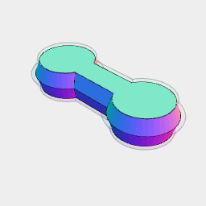

[peg.stl](train.peg.stl)

```JavaScript
const peg = Peg().stl('peg');
```

```JavaScript
const BasePeg = (play = 0) =>
  Arc(11.5 / 2 + play)
    .Loft(offset(0.5 + play), z(1.5 + play))
    .x(7 / 2)
    .join(
      Box(7 / 2 + play, 5 / 2 + play).Loft(offset(0.5 + play), z(1.5 + play))
    )
    .x(1.7)
    .join(sz(-1))
    .And(color('green'), color('blue').rz(1 / 2))
    .z(1.5)
    .fuse();
```

```JavaScript
const Peg = (play = 0.3) => As('peg', BasePeg(0).maskedBy(BasePeg(play)));
```

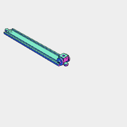

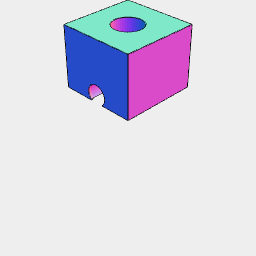

[chassis.stl](train.chassis.stl)

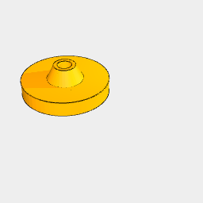

[wheel.stl](train.wheel.stl)

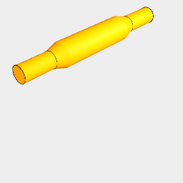

[axle.stl](train.axle.stl)

```JavaScript
const bogey = ArcY(12, 2, 12)
  .join(ArcY(5, 0, 5).y(1).hull(ArcY(3, 0, 3).y(3)))
  .y(13 / 2)
  .and(sy(-1))
  .and(As('axle', ArcY(2, 20, 2).and(ArcY(2, 12, 2).hull(ArcY(3, 9, 3)))))
  .align('z>')
  .z(1)
  .as('wheels')
  .fit(
    As(
      'chassis',
      Box(10, 10, [6, 14]).cut(Arc(4, 4, [6, 14]), Arc(5, 5, [10, 12]))
    )
  )
  .view(and(t141.align('z>')))
  .stl('chassis', get('chassis'))
  .stl(
    'wheel',
    get('wheels')
      .in()
      .getNot('axle')
      .color('orange')
      .n(0)
      .rx(1 / 4)
  )
  .stl('axle', get('wheels').in().get('axle').color('orange'))
  .v(2);
```

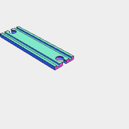

[t70.stl](train.t70.stl)

```JavaScript
const t70 = Track(70).stl('t70', getNot('peg'));
```

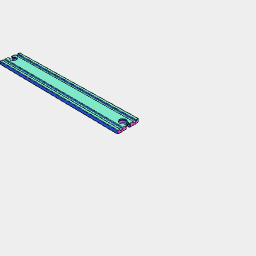

[t141.stl](train.t141.stl)

```JavaScript
const t141 = Track(141).stl('t141', getNot('peg'));
```

```JavaScript
const Curve = (diameter, segments = 1) =>
  Loop(
    Arc(diameter + 20, { start: -segments / 16, end: segments / 16 }),
    Arc(diameter - 20, {
      start: -segments / 16,
      end: segments / 16,
    }).link('reverse')
  )
    .fill()
    .ez([3])
    .fitTo(
      As(
        'rail',
        Loop(
          Arc(diameter + 13 + 3, { start: -segments / 16, end: segments / 16 }),
          Arc(diameter + 13 - 3, {
            start: -segments / 16,
            end: segments / 16,
          }).link('reverse')
        )
          .fill()
          .ez([1.5, 4])
      ).gap(),
      As(
        'rail',
        Loop(
          Arc(diameter - 13 + 3, { start: -segments / 16, end: segments / 16 }),
          Arc(diameter - 13 - 3, {
            start: -segments / 16,
            end: segments / 16,
          }).link('reverse')
        )
          .fill()
          .ez([1.5, 4])
      ).gap(),
      peg.y(diameter / 2).rz(segments / 16),
      peg
        .rz(1 / 2)
        .y(diameter / 2)
        .rz(-segments / 16)
    )
    .material('wood');
```

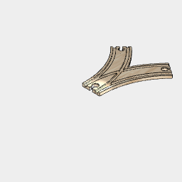

[j200.stl](train.j200.stl)

```JavaScript
const j200 = Curve(200)
  .getNot('peg')
  .rz(3 / 16)
  .x(-100)
  .and(sx(-1))
  .cut(get('rail'))
  .fuse()
  .material('wood')
  .stl('j200');
```

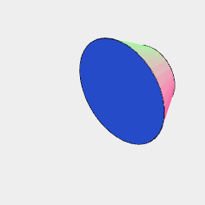

```JavaScript
ArcY(5, 0, 5).y(1).hull(ArcY(3, 0, 3).y(3)).view();
```

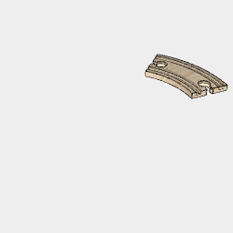

[c100.stl](train.c100.stl)

```JavaScript
const c100 = Curve(100).stl('c100', getNot('peg'));
```

```JavaScript
const Car = ({ length = 30, wheelBase = 15 } = {}) =>
  As(
    'body',
    Box(length, 21 / 2, [/*37*/ 6.5])
      .material('wood')
      .fitTo(
        Box(length - 2, 21 / 2 - 2, [4, 6.5])
          .as('hold')
          .gap()
      )
  )
    .z(11 / -4 + 1.75)
    .fitTo(
      wheel
        .material('wood')
        .and(
          As(
            'axle',
            ArcY(2.2)
              .e([3, -11 / 2])
              .material('steel')
          ),
          ArcY(2.5)
            .e([-1 / 4, -11 / 2])
            .gap()
        )
        .x(wheelBase / 2, wheelBase / -2)
        .y(11 / 2)
        .z(0.1)
        .and(rz(1 / 2))
    )
    .fitTo(
      peg
        //.rz(-1 / 4)
        .z(-1)
        .x(length / -2 - 2.5)
        .rz(0, 1 / 2)
    )
    .view()
    .stl('body', get('body').in().getNot('magnet'))
    .stl(
      'wheel',
      get('wheel')
        .n(0)
        .rx(1 / 4)
    );
```


```JavaScript
const wheel = As(
  'wheel',
  ArcY(20 / 2).Loft(
    inset(0.5),
    y(0.5),
    y(1.5),
    inset(0.5).y(2),
    inset(2).y(2),
    inset(3).y(3)
  )
).view();
```

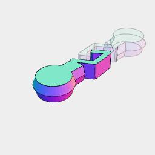

[hook2.stl](train.hook2.stl)

```JavaScript
const hook2 = Link(
  //Point(-5, 1.5),
  Point(-1, 0),
  Point(3.5 - 1.5, 2),
  Point(0.5 + 2 - 1, 7 - 1),
  //Point(3, 8),
  Point(-1.5 + 1 + 0.5, 5),
  Point(-1.5 + 1 - 0.5 + 0.5, 4 + 0.5)
)
  .grow(Arc(1))
  .ez([3])
  .and(peg.cut(YZ(0)).rz(1 / 4))
  .fuse()
  .stl(
    'hook2',
    and(
      rz(1 / 2)
        .y(8.5)
        .ghost()
    )
  );
```

```JavaScript
const hook = Link(Point(-7 + 4, 1), Point(-10 + 4, -2), Point(0))
  .grow(Arc(0.4))
  .ez([3])
  .align('x<')
  .x(1 / 8)
  .join(peg.cut(YZ(0)))
  .stl('hook');
```

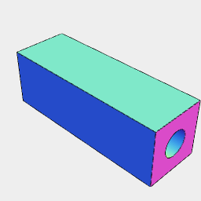

[jig.stl](train.jig.stl)

```JavaScript
const jig = Box(15, 5, 5).cut(ArcX(15, 2.3, 2.3)).stl('jig');
```

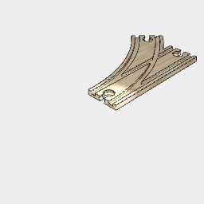

[b200a.stl](train.b200a.stl)


[b200b.stl](train.b200b.stl)

```JavaScript
const b200 = Curve(200)
  .getNot('peg')
  .rz(3 / 16)
  .x(-100)
  .and(Track(70).rz(1 / 4))
  .cut(get('rail'))
  .getNot('peg')
  .fuse()
  .material('wood')
  .stl('b200a')
  .stl('b200b', sx(-1));
```

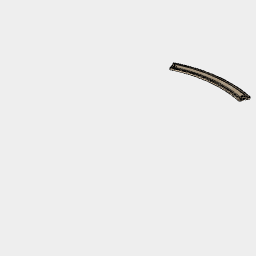

[c400.stl](train.c400.stl)

```JavaScript
const c400 = Curve(400).stl('c400', getNot('peg'));
```

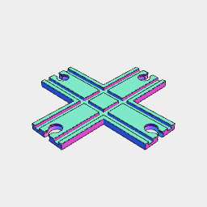

[x70.stl](train.x70.stl)

```JavaScript
const x70 = Track(70)
  .align('xyz')
  .rz(0, 1 / 4)
  .cut(get('rail'))
  .getNot('peg')
  .fuse()
  .stl('x70');
```

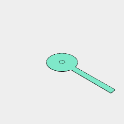

```JavaScript
And(
  Hexagon(2),
  Arc(10)
    .join(Box([20], 2))
    .y(20)
    .base()
).view();
```

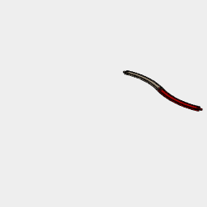

```JavaScript
And(
  c400.at(
    get('peg').n(0),
    and(
      c400.color('red').to(
        get('peg')
          .n(0)
          .origin()
          .rz(1 / 2)
      )
    )
  )
).view();
```

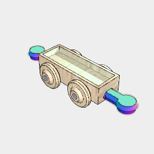

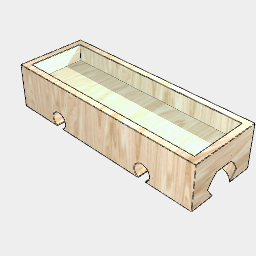

[body.stl](train.body.stl)

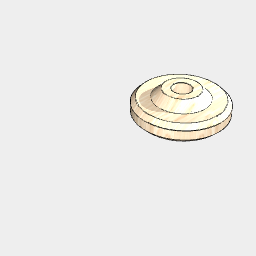

[wheel.stl](train.wheel.stl)

```JavaScript
const car = Car();
```

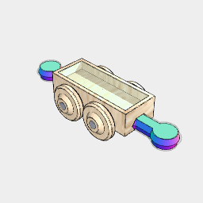

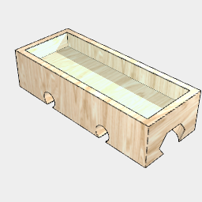

[body.stl](train.body.stl)

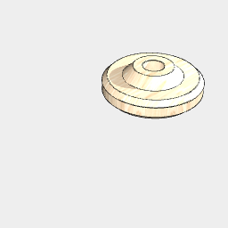

[wheel.stl](train.wheel.stl)

```JavaScript
const car26x11 = Car({ length: 26, wheelBase: 11 });
```

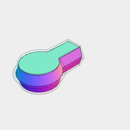

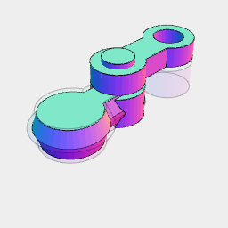

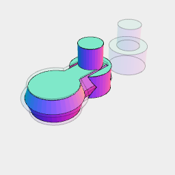

[hook4.stl](train.hook4.stl)

```JavaScript
const hook3 = Group(Arc(5).ez([3]), Arc(3).ez([3, 6]))
  .y(0.5)
  .and(
    rz(1 / 2)
      .y(8)
      .gap()
  )
  .and(
    Peg(0.3)
      .cut(YZ(-2))
      .rz(1 / 4)
      .view('peg 0.5')
  )
  .fit(
    As(
      'bar',
      And(Arc(2), Arc(2).y(7), LineY([6.5]))
        .y(0.5)
        .grow(Arc(3))
        .ez([3.5, 5.5])
    )
  )
  .view()
  .stl('hook4', getNot('bar'))
  .stl('bar4', get('bar'))
  .v(4);
```

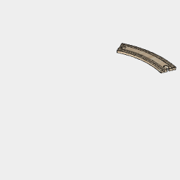

[c200.stl](train.c200.stl)

```JavaScript
const c200 = Curve(200).stl('c200', getNot('peg'));
```

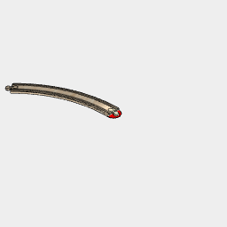

```JavaScript
c400
  .to(get('peg').n(0).origin())
  .and(Arc(20).color('red'), and(c400.get('peg').n(0).base()))
  .view();
```

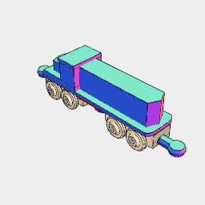

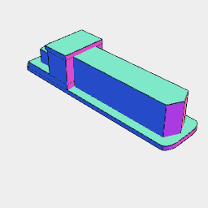

[locomotive_hull.stl](train.locomotive_hull.stl)

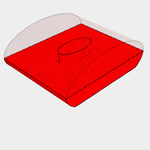

[locomotive_tank.stl](train.locomotive_tank.stl)


[locomotive_feet.stl](train.locomotive_feet.stl)

```JavaScript
const locomotive = As(
  'hull',
  Box([-55, 55], 13).inset(4).offset(4).ez([5, 7]),
  Box([-50, -15], 13).ez([7, 10]),
  Point(-46)
    .hull(Box([-44, -15], 8))
    .ez([10, 17]),
  Box([-30, -15], 13).ez([10, 22]),
  Box([-32, -15], 13).ez([22, 24]),
  Point(52)
    .hull(Box([48, -15], 8))
    .ez([7, 22])
  // Box(11).ez([4, 10]).x(-39, 39),
)
  .fitTo(
    ArcX(22, 13, [10, 0])
      .cut(XY(2))
      .clip(XY(5))
      .join(Arc(5, 5, [2.5 + 0.2, 7]))
      .color('red')
      .as('tank')
  )
  .sy(5 / 3)
  .sx(4 / 5)
  .scale(3 / 4)
  .fitTo(
    car26x11
      .and(
        Arc(5, 5, [2.5 + 0.2, 7])
          .join(Arc(6, 6, [7, 10]))
          .join(Box(24 - 0.2, 8.5 - 0.2, [2.5 + 0.2, 5]))
          .masking(
            Arc(4.5, 4.5, [2.5 + 0.2, 8])
              .join(Arc(5, 5, [8, 9]))
              .join(Box(24 - 0.2, 8.5 - 0.2, [2.5 + 0.2, 5]))
          )
          .as('feet')
          .color('green')
      )
      .x(-20, 20)
      .z(-2)
  )
  .view()
  .stl('locomotive_hull', get('hull'))
  .stl('locomotive_tank', get('tank'))
  .stl('locomotive_feet', get('feet').n(0));
```

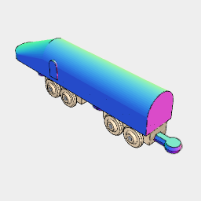

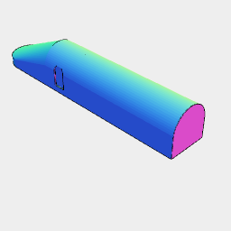

[express_hull.stl](train.express_hull.stl)


[express_feet.stl](train.express_feet.stl)

```JavaScript
const express = As(
  'hull',
  // Box([-33, 33], 16).inset(4).offset(4).ez([4.5, 7]),
  Hull(
    Arc(16)
      .join(Box([20], 16))
      .ez([3.5, 7])
      .x(-50),
    ArcX(0, 16, [3.5, 20])
      .join(Box(0, 16, [3.5, 25 / 2]))
      .e([-30, 33])
  )
)
  .fitTo(
    ArcY(5, 0, [15, 10])
      .join(Box(5, 0, [12.5, 6]))
      .e(1)
      .y(16 / 2, 16 / -2)
      .x(-22)
  )
  .fitTo(
    car26x11
      .and(
        Arc(5, 5, [2.5 + 0.2, 7])
          .join(Arc(6, 6, [7, 10]))
          .join(Box(24 - 0.2, 8.5 - 0.2, [2.5 + 0.2, 5]))
          .masking(
            //Arc(4.5, 4.5, [2.5 + 0.2, 8])
            //  .join(Arc(5, 5, [8, 9]))
            Loft(
              Arc(4.5).z(2.7),
              Arc(4.5).z(7.5),
              Arc(5.3).z(7.5),
              Arc(5).z(9)
            ).join(Box(24, 8.5).Hull(z(2.7).inset(0.1), z(5)))
          )
          .as('feet')
          .color('green')
      )
      .x(-20, 20)
      .z(-2)
  )
  .view()
  .stl('express_hull', get('hull'))
  .stl('express_feet', get('feet').n(0));
```

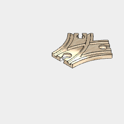

[j100.stl](train.j100.stl)

```JavaScript
const j100 = Curve(100)
  .getNot('peg')
  .rz(3 / 16)
  .x(-50)
  .and(sx(-1))
  .cut(get('rail'))
  .fuse()
  .material('wood')
  .stl('j100');
```

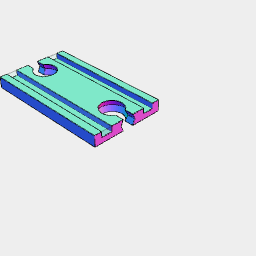

[t35.stl](train.t35.stl)

```JavaScript
const t35 = Track(35).stl('t35', getNot('peg'));
```

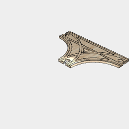

[y100.stl](train.y100.stl)

```JavaScript
const y100 = Curve(100, 2)
  .rz(-1 / 16)
  .rz(3 / 16)
  .x(-50)
  .and(sx(-1))
  .and(Track(100).y(50).x(50))
  .getNot('peg')
  .cut(get('rail'))
  .fuse()
  .material('wood')
  .stl('y100');
```

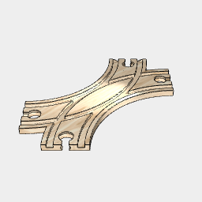

[s100.stl](train.s100.stl)

```JavaScript
const s100 = Curve(100, 2)
  .rz(1 / 16)
  .getNot('peg')
  .rz(3 / 16)
  .x(-50)
  .and(sx(-1))
  .cut(get('rail'))
  .fuse()
  .material('wood')
  .stl('s100');
```


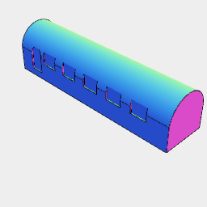

[carriage_hull.stl](train.carriage_hull.stl)

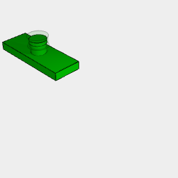

[carriage_feet.stl](train.carriage_feet.stl)

```JavaScript
const carriage = As(
  'hull',
  Box([-33, 33], 16).inset(4).offset(4).ez([3.5, 7]),
  ArcX(0, 16, [3.5, 20])
    .join(Box(0, 16, [3.5, 25 / 2]))
    .e([-33, 33])
)
  .fitTo(
    ArcY(5, 0, [15, 10])
      .join(Box(5, 0, [12.5, 6]))
      .e(1)
      .y(16 / 2, 16 / -2)
      .x(-25),
    Box([6], 0, [15, 10])
      .e(1)
      .y(16 / 2, 16 / -2)
      .x({ from: -21, to: 29, steps: 5 })
  )
  .fitTo(
    car26x11
      .and(
        Arc(5, 5, [2.5 + 0.2, 7])
          .join(Arc(6, 6, [7, 10]))
          .join(Box(24 - 0.2, 8.5 - 0.2, [2.5 + 0.2, 5]))
          .masking(
            Arc(4.5, 4.5, [2.5 + 0.2, 8])
              .join(Arc(5, 5, [8, 9]))
              .join(Box(24 - 0.2, 8.5 - 0.2, [2.5 + 0.2, 5]))
          )
          .as('feet')
          .color('green')
      )
      .x(-20, 20)
      .z(-2)
  )
  .view()
  .stl('carriage_hull', get('hull'))
  .stl('carriage_feet', get('feet').n(0));
```

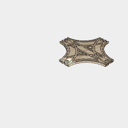

[yy100.stl](train.yy100.stl)

```JavaScript
const yy100 = Curve(100, 2)
  .rz(-1 / 16)
  .rz(3 / 16)
  .x(-50)
  .and(sx(-1))
  .and(sy(-1).y(100))
  .and(Track(100).y(50).x(50))
  .getNot('peg')
  .cut(get('rail'))
  .fuse()
  .material('wood')
  .stl('yy100');
```
