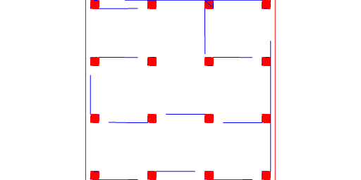

```JavaScript
Box(10)
  .seq({ from: -100, upto: 100, by: 60 }, y, Group)
  .seq({ from: -100, upto: 100, by: 60 }, x, Group)
  .by(align('xy'))
  .toolpath()
  .gcode('calibration');
```



[calibration_0.gcode](calibration.calibration_0.gcode)
