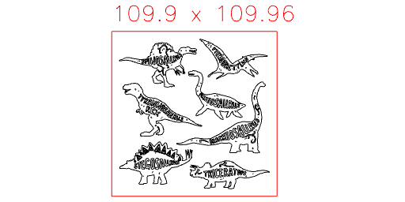

```JavaScript
(await readSvg('https://jsxcad.js.org/svg/dinosaur.svg', { fill: false }))
  .scale(10)
  .by(align('xy'))
  .and(toolpath())
  .gcode('dinosaur');
```



[dinosaur_0.gcode](dinosaur.dinosaur_0.gcode)
